# Awesome-Efficient-MoE

  
  
  
  
  
 

This repository collects research papers and resources about Mixture-of-Experts (MoE) models and their efficient variants. MoE is a machine learning technique that divides a complex task among multiple "expert" neural networks, each specializing in handling different aspects of the input space, coordinated by a gating network that decides which expert(s) to use for each input. The contents of papers are in both Chinese and English.

**You can treat it as a blog, and I will update it regularly. If you want me to add some papers, please submit an issue or pull request.**

MoE models have gained significant attention in recent years due to their:

- **Scalability**: Ability to scale model capacity without proportionally increasing computation
- **Efficiency**: Selective activation of only relevant experts for each input
- **Specialization**: Different experts can learn to handle different types of inputs
- **Adaptability**: Dynamic routing of inputs to the most appropriate experts

This collection focuses particularly on methods to make MoE models more efficient through various techniques like pruning, quantization, decomposition and acceleration, making them more practical for real-world applications.

## Table of Contents

- [Sparse Mixture-of-Experts](#sparse-moe)
- [MoE Compression](#moe-compression)
  - [MoE Pruning](#moe-pruning)
  - [MoE Quantization](#moe-quantization)
  - [MoE Decomposition](#moe-decomposition)
  - [MoE Acceleration](#moe-acceleration)
- [MoE Survey](#moe-survey)
- [MoE Resources](#moe-resources)
- [MoE FAQ](#moe-faq)
- [Contributing](#contributing)

## Sparse Mixture-of-Experts

- Adaptive Mixtures of Local Experts

  

    
  

  - URL: https://watermark.silverchair.com/neco.1991.3.1.79.pdf
  - Author: Robert A. Jacobs, Michael I. Jordan, Stevven J. Nowlan, Geoffrey E. Hinton
  - Pub: Neural Computation 1991
  - Summary: This paper introduces a supervised learning method for modular networks composed of multiple expert networks. Each network specializes in a subset of the task, controlled by a gating network. It bridges modular multilayer networks and competitive learning models. The methodology ensures task-specific specialization, reducing interference and improving generalization. A vowel recognition task demonstrates the system's efficacy, showing faster learning and robust performance compared to traditional backpropagation networks.
  - 摘要: 本文提出了一种用于模块化网络的新型监督学习方法，该网络由多个专家网络组成，每个网络专注于任务的一部分，由一个门控网络进行控制。这种方法将模块化多层网络与竞争学习模型相结合，通过减少干扰和提高泛化能力实现任务特定的专业化，与传统的反向传播网络相比，该系统学习更快，性能更加稳健。

- Mixtral 8x7B: A Sparse Mixture of Experts Language Model

  

    
  

  - Authors: Albert Q. Jiang, Alexandre Sablayrolles, Antoine Roux, Arthur Mensch, etc.
  - Link: https://arxiv.org/pdf/2401.04088
  - Code: https://github.com/mistralai/mistral-src
  - Summary: This paper introduces Mixtral 8x7B, a **Sparse Mixture of Experts (SMoE)** language model based on the Mistral 7B architecture. The key difference is that each layer in Mixtral employs 8 **feedforward blocks** (**experts**). A **router network** selects two experts per token at each layer, resulting in each token accessing only a subset (13B) of the total 47B parameters during inference. Despite this sparsity, Mixtral, trained with a 32k token context window, matches or surpasses the performance of Llama 2 70B and GPT-3.5 across various benchmarks. It significantly outperforms Llama 2 70B in **mathematics**, **code generation**, and **multilingual** tasks. A fine-tuned instruction-following version, Mixtral 8x7B – Instruct, surpasses GPT-3.5 Turbo, Claude-2.1, Gemini Pro, and Llama 2 70B – chat model in human evaluations, showing reduced bias and a more balanced sentiment profile. Both base and instruct models are released under the Apache 2.0 license. The model architecture details include: `dim: 4096`, `n_layers: 32`, `head_dim: 128`, `hidden_dim: 14336`, `n_heads: 32`, `n_kv_heads: 8`, `context_len: 32768`, `vocab_size: 32000`, `num_experts: 8`, `top_k_experts: 2`. The Mixture of Experts layer uses a softmax over the top-k logits of a linear layer to determine the weights for combining expert outputs.
  - 摘要：本文介绍了 Mixtral 8x7B，一个基于 Mistral 7B 架构的**稀疏专家混合 (SMoE)** 大型语言模型。其主要区别在于 Mixtral 的每一层都使用了 8 个**前馈块**（**专家**）。一个**路由网络**在每一层为每个 token 选择两个专家，导致每个 token 在推理过程中只访问总参数的子集（130 亿参数），而总参数为 470 亿。尽管如此，Mixtral 在 32k token 的上下文窗口下训练，在各种基准测试中其性能与 Llama 2 70B 和 GPT-3.5 相匹配甚至超越。在**数学**、**代码生成**和**多语言**任务方面，它显著优于 Llama 2 70B。经过微调的指令遵循版本 Mixtral 8x7B – Instruct 在人工评估基准测试中超越了 GPT-3.5 Turbo、Claude-2.1、Gemini Pro 和 Llama 2 70B——聊天模型，展现出减少的偏差和更平衡的情感特征。基础模型和指令遵循模型都以 Apache 2.0 许可证发布。模型架构细节包括：`dim: 4096`，`n_layers: 32`，`head_dim: 128`，`hidden_dim: 14336`，`n_heads: 32`，`n_kv_heads: 8`，`context_len: 32768`，`vocab_size: 32000`，`num_experts: 8`，`top_k_experts: 2`。专家混合层使用线性层的 top-k logits 上的 softmax 来确定组合专家输出的权重。

- DeepSeekMoE: Towards Ultimate Expert Specialization in Mixture-of-Experts Language Models

  

    
  

  - Authors: Damai Dai, Chengqi Deng, Chenggang Zhao, R.X. Xu, Huazuo Gao, Deli Chen, Jiashi Li, Wangding Zeng, Xingkai Yu, Y. Wu, Zhenda Xie, Y.K. Li, Panpan Huang, Fuli Luo, Chong Ruan, Zhifang Sui, Wenfeng Liang
  - Link: https://arxiv.org/pdf/2401.06066
  - Code: https://github.com/deepseek-ai/DeepSeek-MoE
  - Summary: This paper introduces DeepSeekMoE, a novel **Mixture-of-Experts (MoE)** architecture designed to improve **expert specialization** in large language models (LLMs). Existing MoE architectures, like GShard, suffer from **knowledge hybridity** (experts learning diverse, overlapping knowledge) and **knowledge redundancy** (multiple experts learning the same knowledge). DeepSeekMoE addresses these issues through two key strategies: (1) **finer expert segmentation**: instead of activating the top-K experts out of N, it finely segments experts into mN and activates mK, allowing for more flexible combinations; and (2) **shared expert isolation**: Ks experts are designated as shared experts to capture common knowledge, reducing redundancy in the routed experts. Experiments show that DeepSeekMoE 2B (2 billion parameters) achieves comparable performance to GShard 2.9B (with 1.5x more expert parameters and computation). Furthermore, DeepSeekMoE 2B nearly matches the performance of its dense counterpart with the same total parameters. Scaling DeepSeekMoE to 16B parameters shows comparable performance to LLaMA2 7B with only about 40% of the computation. Preliminary results with a 145B parameter model demonstrate significant advantages over GShard, achieving performance comparable to a 67B parameter DeepSeek model while using only 28.5% (potentially 18.2%) of the computation. The paper highlights DeepSeekMoE's ability to achieve strong performance with significantly reduced computational costs compared to existing MoE and dense models.

  - 摘要：本文介绍了 DeepSeekMoE，这是一种新颖的**混合专家（MoE）**架构，旨在提高大型语言模型（LLM）中的**专家专业化**。现有的 MoE 架构，如 GShard，存在**知识混合性**（专家学习多样化、重叠的知识）和**知识冗余**（多个专家学习相同的知识）的问题。DeepSeekMoE 通过两种主要策略解决了这些问题：（1）**更精细的专家分割**：它不是从 N 个专家中激活前 K 个，而是将专家细分为 mN 个，并激活 mK 个，从而允许更灵活的激活专家组合；（2）**共享专家隔离**：Ks 个专家被指定为共享专家，以捕捉共同知识，减少路由专家的冗余。实验表明，DeepSeekMoE 2B（20 亿参数）达到了与 GShard 2.9B（专家参数和计算量是其 1.5 倍）相当的性能。此外，DeepSeekMoE 2B 几乎达到了与其具有相同总参数量的密集型模型相当的性能。将 DeepSeekMoE 扩展到 160 亿参数，其性能与 LLaMA2 7B 相当，但计算量只有大约 40%。使用 1450 亿参数模型的初步结果表明，与 GShard 相比具有显著优势，其性能与 670 亿参数的 DeepSeek 模型相当，而计算量仅为 28.5%（可能为 18.2%）。本文强调了 DeepSeekMoE 能够以比现有 MoE 和密集模型低得多的计算成本实现强大的性能。

- Qwen1.5-MoE-A2.7B: Matching 7B Model Performance with 1/3 Activated Parameters

  

    
  

  - Link: https://qwenlm.github.io/blog/qwen-moe/
  - Code: https://github.com/QwenLM/Qwen1.5
  - Summary: This blog post introduces Qwen1.5-MoE-A2.7B, a **Mixture-of-Experts (MoE)** model with only 2.7 billion activated parameters. Despite its significantly smaller size (approximately one-third the size of Qwen1.5-7B, which has 6.5 billion non-embedding parameters and 2.0 billion for Qwen1.5-MoE-A2.7B), it achieves comparable performance to state-of-the-art 7B models like Mistral 7B and Qwen1.5-7B on various benchmarks. The model achieves a 75% reduction in training costs and a 1.74x speedup in inference. Key architectural improvements include: **fine-grained experts** (partitioning a single FFN into multiple experts), an "**upcycling**" **initialization** method using a pre-trained Qwen-1.8B model with added randomness, and a **routing mechanism** incorporating both shared and routing-specific experts (4 shared and 60 routing experts with 4 activated). Benchmark results across MMLU, GSM8K, HumanEval, and a multilingual evaluation show performance on par with or exceeding other 7B models, and even outperforming the larger DeepSeekMoE 16B model in some cases. A chat model variant was also evaluated using MT-Bench.
  - 摘要：这篇博文介绍了 Qwen1.5-MoE-A2.7B，这是一个仅具有 27 亿激活参数的**混合专家（MoE）**模型。尽管其规模显著较小（大约是具有 65 亿非嵌入参数的 Qwen1.5-7B 模型的三分之一，Qwen1.5-MoE-A2.7B 为 20 亿），但在各种基准测试中，其性能与 Mistral 7B 和 Qwen1.5-7B 等最先进的 7B 模型相当。该模型将训练成本降低了 75%，推理速度提高了 1.74 倍。关键的架构改进包括：**细粒度专家**（将单个 FFN 划分为多个专家）、使用预训练的 Qwen-1.8B 模型并添加随机性的“**升级**”**初始化**方法，以及包含共享和特定于路由的专家的**路由机制**（4 个共享专家和 60 个路由专家，激活 4 个）。在 MMLU、GSM8K、HumanEval 和多语言评估中的基准测试结果表明，其性能与其他 7B 模型相当甚至超过，在某些情况下甚至超过更大的 DeepSeekMoE 16B 模型。还使用 MT-Bench 评估了聊天模型变体。

- Outrageously Large Neural Networks: The Sparsely-Gated Mixture-of-Experts Layer

  

    
  

  - Authors: Noam Shazeer, Azalia Mirhoseini, Krzysztof Maziarz, Andy Davis, Quoc Le, Geoffrey Hinton, Jeff Dean
  - Link: https://openreview.net/pdf?id=B1ckMDqlg
  - Summary: This ICLR 2017 paper introduces a Sparsely-Gated Mixture-of-Experts (MoE) layer to significantly increase the capacity of neural networks without proportionally increasing computational costs. The MoE layer consists of thousands of feed-forward sub-networks (experts). A trainable gating network selects a sparse combination of these experts for each input example. The authors address challenges associated with conditional computation, such as the inefficiency of branching on GPUs, the need for large batch sizes, network bandwidth limitations, and the need for sparsity-inducing loss terms. They achieve over 1000x capacity improvements with only minor computational efficiency losses. Applying the MoE convolutionally between stacked LSTM layers in language modeling and machine translation tasks, models with up to 137 billion parameters achieved state-of-the-art results on large benchmarks at lower computational cost than previous methods. The paper highlights the successful application of conditional computation to address the scaling limitations of traditional neural networks, particularly in the context of large datasets. Key improvements include overcoming the limitations of branching on GPUs, handling large batch sizes efficiently, mitigating network bandwidth bottlenecks, and managing sparsity through careful design and training.
  - 摘要：这篇 2017 年 ICLR 会议论文介绍了一种稀疏门控专家混合层（Sparsely-Gated Mixture-of-Experts，MoE），它可以在不成比例地增加计算成本的情况下显著提高神经网络的容量。MoE 层由数千个前馈子网络（专家）组成。一个可训练的门控网络为每个输入示例选择这些专家的稀疏组合。作者解决了与条件计算相关的挑战，例如 GPU 上分支的低效性、对大批量大小的需求、网络带宽限制以及对诱导稀疏性的损失项的需求。他们实现了超过 1000 倍的容量改进，而计算效率损失很小。在语言建模和机器翻译任务中，在堆叠的 LSTM 层之间卷积地应用 MoE，具有多达 1370 亿个参数的模型在大型基准测试中取得了最先进的结果，计算成本低于以前的方法。本文重点介绍了条件计算在解决传统神经网络的扩展限制方面的成功应用，尤其是在大型数据集的背景下。关键改进包括克服 GPU 上分支的限制，高效地处理大批量大小，减轻网络带宽瓶颈，并通过精心设计和训练来管理稀疏性。

- CuMo: Scaling Multimodal LLM with Co-Upcycled Mixture-of-Experts
  

    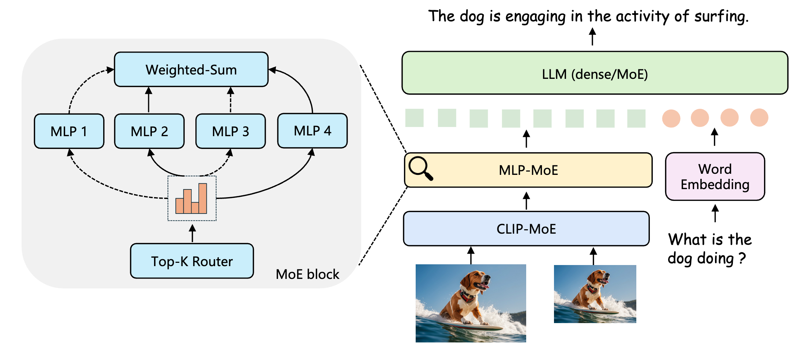
  

  - Authors: Jiachen Li, Xinyao Wang, Sijie Zhu, Chia-Wen Kuo, Lu Xu, Fan Chen, Jitesh Jain, Humphrey Shi, Longyin Wen
  - Link: https://arxiv.org/pdf/2405.05949
  - Code: https://github.com/SHI-Labs/CuMo
  - Summary: This paper introduces CuMo, a novel approach to scaling **multimodal Large Language Models (LLMs)** by incorporating **co-upcycled Top-K sparsely-gated Mixture-of-Experts (MoE)** blocks into both the **vision encoder** and the **MLP connector**. Unlike previous scaling methods that focus on increasing data or using larger models, CuMo efficiently improves model capabilities from the vision side with negligible additional activated parameters during inference. The method involves pre-training the MLP blocks and then initializing each expert in the MoE block from these pre-trained blocks during **visual instruction tuning**. Auxiliary losses are used to ensure balanced expert loading. CuMo achieves state-of-the-art performance on various **VQA** and **visual-instruction-following benchmarks** across different model size groups, using only open-sourced datasets. Experiments show CuMo outperforms models like Mini-Gemini, LLaVA-NeXT, and even a private MM1 model (Figure 1). The architecture (Figure 2) integrates the MoE blocks into the CLIP vision encoder and the MLP connector, utilizing a Top-K router for expert selection. The key innovation is the "co-upcycling" process, leveraging pre-trained MLP weights to initialize the MoE experts, enhancing efficiency and stability during training.
  - 摘要：本文介绍了 CuMo，一种通过在**视觉编码器**和**MLP 连接器**中结合**共循环 Top-K 稀疏门控专家混合(MoE)**块来扩展**多模态大型语言模型(LLM)**的新方法。与之前专注于增加数据或使用更大模型的扩展方法不同，CuMo 有效地提高了视觉方面的模型能力，在推理过程中几乎没有增加额外的激活参数。该方法包括预训练 MLP 块，然后在**视觉指令微调**期间利用这些预训练块初始化 MoE 块中的每个专家。辅助损失用于确保专家负载平衡。CuMo 在不同模型规模组的各种**VQA**和**视觉指令遵循基准测试**中实现了最先进的性能，仅使用开源数据集。实验表明，CuMo 优于 Mini-Gemini、LLaVA-NeXT，甚至私有的 MM1 模型（图 1）。该架构（图 2）将 MoE 块集成到 CLIP 视觉编码器和 MLP 连接器中，利用 Top-K 路由器进行专家选择。“共循环”过程是关键创新，它利用预训练的 MLP 权重来初始化 MoE 专家，从而提高训练效率和稳定性。

## MoE Compression

### MoE Pruning

- Not All Experts are Equal: Efficient Expert Pruning and Skipping for Mixture-of-Experts Large Language Models

  

    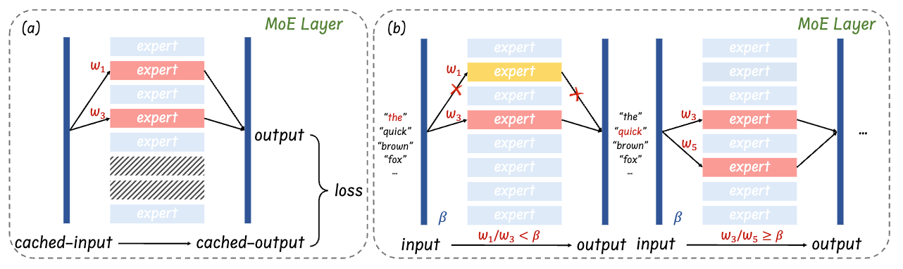
  

  - Authors: Xudong Lu, Qi Liu, Yuhui Xu, Aojun Zhou, Siyuan Huang, Bo Zhang, Junchi Yan, Hongsheng Li
  - Link: https://arxiv.org/pdf/2402.14800
  - Code: https://github.com/Lucky-Lance/Expert_Sparsity
  - Summary: This paper addresses the deployment challenges of Mixture-of-Experts (MoE) Large Language Models (LLMs) due to their large parameter size, even though they achieve high performance with fewer active parameters than traditional LLMs. Instead of relying on specialized hardware, the authors propose post-training expert-level sparsification techniques for improved deployment efficiency. They introduce two novel methods: **task-agnostic and task-specific expert pruning**, which permanently removes less important experts by minimizing token reconstruction loss layer-by-layer, and **dynamic expert skipping**, which allows for on-the-fly selection of active experts during inference to accelerate speed. The expert pruning method systematically explores combinations of experts to find the optimal set that minimizes loss. The dynamic skipping method complements pruning by further reducing active experts during inference. Experiments on Mixtral 8x7B (Instruct) models demonstrate significant reductions in memory usage and increases in inference speed while maintaining satisfactory performance. The paper claims to be the first to introduce task-specific expert pruning for MoE LLMs.
  - 摘要：本文解决了混合专家（MoE）大型语言模型（LLM）的部署挑战，尽管它们比传统的 LLM 使用更少的活动参数就能达到更高的性能，但其巨大的参数规模仍然难以部署。该论文没有依赖专门的硬件，而是提出了训练后专家级稀疏化技术，以提高部署效率。他们引入了两种新颖的方法：**任务无关和任务相关的专家剪枝**，通过逐层最小化标记重建损失来永久移除不太重要的专家；以及**动态专家跳过**，允许在推理过程中动态选择活动专家以加快速度。专家剪枝方法系统地探索专家的组合，以找到最小化损失的最佳集合。动态跳过方法通过在推理过程中进一步减少活动专家来补充剪枝。在 Mixtral 8x7B (Instruct) 模型上的实验表明，在保持令人满意的性能的同时，显着减少了内存使用量并提高了推理速度。本文声称是第一个为 MoE LLM 引入任务特定专家剪枝的论文。

- SEER-MoE: Sparse Expert Efficiency through Regularization for Mixture-of-Experts

  

    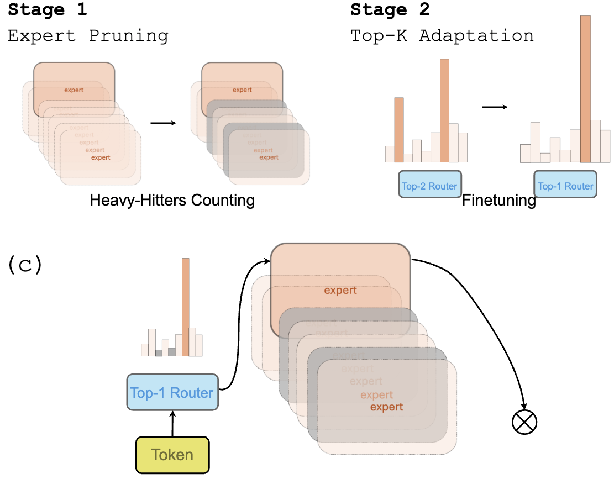
  

  - Authors: Alexandre Muzio, Alex Sun, Churan He
  - Link: https://arxiv.org/pdf/2404.05089
  - Summary: SEER-MoE is a two-stage framework designed to improve the memory and computational efficiency of pre-trained Mixture-of-Experts (MoE) models. The first stage employs expert pruning guided by a "heavy-hitters counting" strategy, identifying and removing less crucial experts to reduce the model's size. The second stage uses a regularization-based fine-tuning approach to mitigate accuracy loss from pruning and simultaneously decrease the number of activated experts during inference (reducing the Top-K). This fine-tuning adapts the top-K routing mechanism. The method is evaluated on the Mixtral 8x7b MoE model using SST-5 and MMLU benchmarks, demonstrating significant reductions in memory footprint and computational requirements with minimal accuracy degradation. The paper includes an ablation study analyzing design choices within each stage. The core innovation lies in the combined approach of heavy-hitters counting for pruning and regularization-based fine-tuning for Top-K adaptation, resulting in a more efficient and memory-friendly MoE model for inference.
  - 摘要：SEER-MoE 是一个两阶段框架，旨在提高预训练混合专家（MoE）模型的内存和计算效率。第一阶段采用专家剪枝，其指导策略为“高频计数”，识别并去除不太重要的专家以减小模型规模。第二阶段采用基于正则化的微调方法来减轻剪枝造成的精度损失，同时减少推理过程中激活的专家数量（减少 Top-K）。这种微调会调整 Top-K 路由机制。该方法在 Mixtral 8x7b MoE 模型上使用 SST-5 和 MMLU 基准进行了评估，证明了在内存占用和计算需求方面显著减少，同时精度下降最小。本文包括一个消融研究，分析了每个阶段的设计选择。核心创新在于将高频计数用于剪枝和基于正则化的微调用于 Top-K 自适应相结合的方法，从而产生一个更高效且更节省内存的 MoE 推理模型。

- MC-MoE: Mixture Compressor for Mixture-of-Experts LLMs Gains More
  

    
  

  - Authors: Wei Huang, Yue Liao, Jianhui Liu, Ruifei He, Haoru Tan, Shiming Zhang, Hongsheng Li, Si Liu, Xiaojuan Qi
  - Link: https://arxiv.org/html/2410.06270
  - Code: https://github.com/Aaronhuang-778/MC-MoE
  - Summary: This paper introduces MC-MoE, a training-free compression method for Mixture-of-Experts (MoE) Large Language Models (LLMs) that addresses the challenges of high memory consumption and computational overhead associated with MoE architectures. MC-MoE achieves extreme compression by leveraging the varying importance of experts and tokens. It employs a two-phase approach: 1) **Pre-Loading Mixed-Precision Quantization (PMQ):** This phase uses a Linear Programming (LP) problem to determine the optimal bit-width allocation for each expert based on factors reflecting their importance (activation reconstruction error, routing scores, and activated frequencies). This allows for efficient storage and loading of expert parameters. 2) **Online Dynamic Pruning (ODP):** During inference, ODP identifies and retains only the most important tokens, dynamically selecting activated experts for the remaining tokens. This further reduces the number of active parameters. Experiments show that MC-MoE achieves significant compression with minimal accuracy loss. For instance, at 2.54 bits per parameter, it compresses 76.6% of the model with only a 3.8% average accuracy drop. Dynamic inference further reduces activated parameters by 15% with less than a 0.6% performance decrease. Notably, MC-MoE even outperforms some 13B parameter dense LLMs, demonstrating the potential of mixture compression in surpassing both comparable and larger dense models.
  - 摘要：本文介绍了 MC-MoE，这是一种针对混合专家（MoE）大型语言模型（LLM）的免训练压缩方法，它解决了与 MoE 架构相关的内存消耗大和计算开销大的问题。MC-MoE 通过利用专家和标记的不同重要性来实现极端压缩。它采用两阶段方法：1) **预加载混合精度量化 (PMQ)：**此阶段使用线性规划 (LP) 问题来确定每个专家的最佳位宽分配，其依据是反映其重要性的因素（激活重建误差、路由分数和激活频率）。这允许高效地存储和加载专家参数。2) **在线动态剪枝 (ODP)：**在推理过程中，ODP 识别并仅保留最重要的标记，动态地为其余标记选择激活的专家。这进一步减少了活动参数的数量。实验表明，MC-MoE 在精度损失最小的前提下实现了显著的压缩。例如，在每个参数 2.54 位时，它压缩了 76.6% 的模型，平均精度仅下降了 3.8%。动态推理进一步将激活参数减少了 15%，性能下降不到 0.6%。值得注意的是，MC-MoE 甚至优于一些 130 亿参数的密集 LLM，这证明了混合压缩在超越同等规模和更大规模的密集模型方面的潜力。

- MoE-I2: Compressing Mixture of Experts Models through Inter-Expert Pruning and Intra-Expert Low-Rank Decomposition
  

    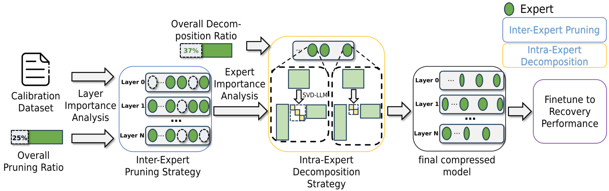
  

  - Authors: Cheng Yang, Yang Sui, Jinqi Xiao, Lingyi Huang, Yu Gong, Yuanlin Duan, Wenqi Jia, Miao Yin, Yu Cheng, Bo Yuan
  - Link: https://arxiv.org/abs/2411.01016
  - Code: https://github.com/xiaochengsky/MoEI-2
  - Summary: The emergence of Mixture of Experts (MoE) LLMs has significantly advanced the development of language models. Compared to traditional LLMs, MoE LLMs outperform traditional LLMs by achieving higher performance with considerably fewer activated parameters. Despite this efficiency, their enormous parameter size still leads to high deployment costs. In this paper, we introduce a two-stage compression method tailored for MoE to reduce the model size and decrease the computational cost. First, in the inter-expert pruning stage, we analyze the importance of each layer and propose the Layer-wise Genetic Search and Block-wise KT-Reception Field with the non-uniform pruning ratio to prune the individual expert. Second, in the intra-expert decomposition stage, we apply the low-rank decomposition to further compress the parameters within the remaining experts. Extensive experiments on Qwen1.5-MoE-A2.7B, DeepSeek-V2-Lite, and Mixtral-8×7B demonstrate that our proposed methods can both reduce the model size and enhance inference efficiency while maintaining performance in various zero-shot tasks.
  - 摘要：混合专家（MoE）大语言模型的出现显著推进了语言模型的发展。与传统的大语言模型相比，MoE 大语言模型通过较少的激活参数实现了更高的性能。尽管具有这种效率，但其庞大的参数规模仍然导致部署成本高昂。在本文中，我们引入了一种专门针对 MoE 的两阶段压缩方法，以减少模型大小并降低计算成本。首先，在专家间剪枝阶段，我们分析每一层的重要性，并提出了具有非均匀剪枝比率的层级遗传搜索和块级 KT 感受野，用于剪枝单个专家。其次，在专家内分解阶段，我们应用低秩分解进一步压缩剩余专家中的参数。在 Qwen1.5-MoE-A2.7B、DeepSeek-V2-Lite 和 Mixtral-8×7B 上的大量实验表明，我们提出的方法既可以减少模型大小，又可以提高推理效率，同时在各种零样本任务中保持性能。

- Demystifying the Compression of Mixture-of-Experts Through a Unified Framework
  

    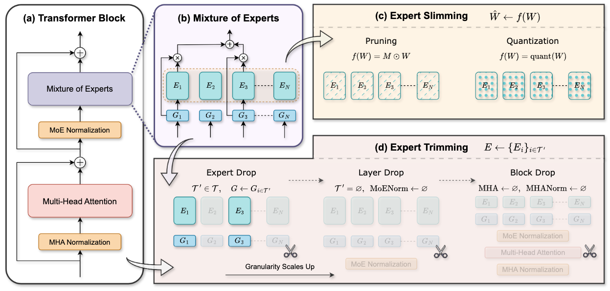
  

  - Authors: Shwai He, Daize Dong, Liang Ding, Ang Li
  - Link: https://arxiv.org/pdf/2406.02500
  - Code: https://github.com/DaizeDong/Unified-MoE-Compression
  - Summary: This paper proposes a unified framework for compressing **Mixture-of-Experts (MoE)** models in large language models (LLMs). The framework addresses the redundancy and computational overhead inherent in MoE by integrating two complementary compression strategies: **Expert Slimming** and **Expert Trimming**. **Expert Slimming** focuses on compressing individual experts using techniques like **network pruning** and **quantization**. **Expert Trimming** involves structurally removing entire experts or groups of experts. The authors introduce novel aggressive **Expert Trimming** methods: **Layer Drop** (removing entire MoE layers) and **Block Drop** (removing both attention and MoE layers within transformer blocks). These methods are motivated by the observation that communication overhead and computation within MoE layers are significant bottlenecks. The framework is evaluated on Mixtral-8x7B and DeepSeek-MoE-16B, demonstrating significant improvements. **Quantization** is shown to be the most effective **Expert Slimming** technique, while **Layer Drop** and **Block Drop** outperform **Expert Drop** (removing individual experts) in terms of speed and memory reduction. The combined approach achieves a 6.05x speedup and reduces memory usage to 20.0GB while maintaining over 92% of the original performance on Mixtral-8x7B. The paper provides a comprehensive recipe for effectively compressing MoE models.

  - 摘要：本文提出了一种用于压缩大型语言模型（LLM）中**混合专家（MoE）**模型的统一框架。该框架通过整合两种互补的压缩策略来解决 MoE 模型中固有的冗余和计算开销：**专家精简（Expert Slimming）**和**专家修剪（Expert Trimming）**。**专家精简**侧重于使用**网络剪枝**和**量化**等技术来压缩单个专家。**专家修剪**涉及结构化地移除整个专家或专家组。作者引入了新颖的积极**专家修剪**方法：**层丢弃（Layer Drop）**（移除整个 MoE 层）和**块丢弃（Block Drop）**（移除 Transformer 块中的注意力层和 MoE 层）。这些方法的动机是观察到 MoE 层中的通信开销和计算是重要的瓶颈。该框架在 Mixtral-8x7B 和 DeepSeek-MoE-16B 上进行了评估，证明了显著的改进。结果表明，**量化**是最有效的**专家精简**技术，而**层丢弃**和**块丢弃**在速度和内存减少方面优于**专家丢弃（Expert Drop）**（移除单个专家）。组合方法在 Mixtral-8x7B 上实现了 6.05 倍的加速，并将内存使用量减少到 20.0GB，同时保持了 92%以上的原始性能。本文提供了一个有效压缩 MoE 模型的综合方案。

- Merge, then compress: demystify efficient sparse mixture-of-experts with hints from its routing policy

  

    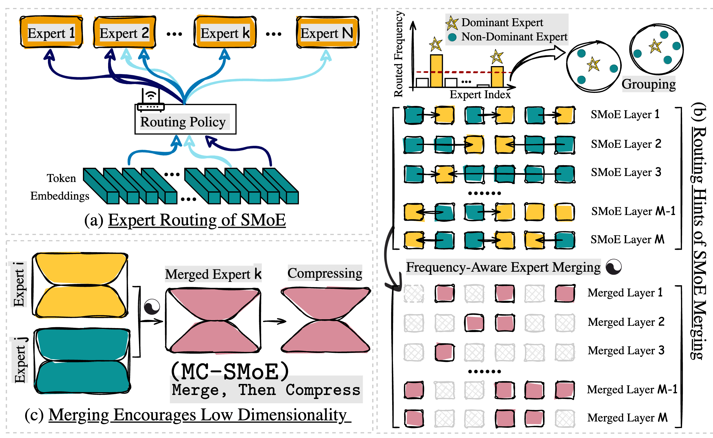
  

  - Authors: Pingzhi Li, Zhenyu Zhang, Prateek Yadav, Yi-Lin Sung, Yu Cheng, Mohit Bansal, Tianlong Chen
  - Link: https://arxiv.org/pdf/2310.01334
  - Code: https://github.com/UNITES-Lab/MC-SMoE
  - Summary: This paper addresses the limitations of **Sparse Mixture-of-Experts (SMoE)** models, namely high memory usage due to expert duplication and redundancy due to representational collapse in learning-based routing policies. The authors propose **MC-SMoE (Merge, then Compress SMoE)**, a novel method to create more compact and efficient SMoE models. MC-SMoE consists of two stages: **expert merging** and **compression**. The merging stage uses routing statistics to guide the consolidation of experts. It begins by aligning neurons across experts through permutation, then groups experts based on their routing policies, finally merging each group into a single expert weighted by activation frequency. This process reduces the impact of insignificant experts. Interestingly, this merging leads to a lower dimensionality in the merged expert's weight space, enabling further compression. The compression stage decomposes the merged experts using low-rank and structural sparse techniques. Experiments across 8 benchmarks show that MC-SMoE achieves up to **80% memory reduction** and **20% FLOPs reduction** with minimal performance loss. The paper highlights that conventional model merging techniques are ineffective for SMoE due to redundant information overshadowing critical experts and the lack of appropriate neuron permutation alignment. The authors demonstrate the effectiveness of their approach by comparing MC-SMoE to standard SMoE and other baselines, showcasing significant improvements in memory efficiency without sacrificing accuracy. The core innovation lies in leveraging routing statistics to intelligently merge experts, followed by a compression step that capitalizes on the lower dimensionality resulting from the merging process.

  - 摘要：本文解决了**稀疏专家混合模型 (SMoE)** 的局限性，即由于专家复制导致的高内存使用率以及基于学习的路由策略中由于表示崩溃导致的冗余。作者提出了**MC-SMoE（合并，然后压缩 SMoE）**，这是一种创建更紧凑和高效的 SMoE 模型的新方法。MC-SMoE 包括两个阶段：**专家合并**和**压缩**。合并阶段使用路由统计信息来指导专家的整合。它首先通过置换来对齐专家之间的神经元，然后根据其路由策略对专家进行分组，最后将每个组合并成一个由激活频率加权的单个专家。此过程减少了不重要专家的影响。有趣的是，这种合并导致合并专家权重空间的维数降低，从而实现进一步的压缩。压缩阶段使用低秩和结构化稀疏技术分解合并的专家。在 8 个基准测试中的实验表明，MC-SMoE 在性能损失最小的前提下，实现了高达**80% 的内存减少**和**20% 的 FLOPs 减少**。本文强调，由于冗余信息掩盖了关键专家以及缺乏适当的神经元置换对齐，因此传统的模型合并技术对于 SMoE 是无效的。作者通过将 MC-SMoE 与标准 SMoE 和其他基线进行比较，展示了其方法的有效性，在内存效率方面取得了显著改进，而不会牺牲准确性。核心创新在于利用路由统计信息智能地合并专家，然后进行压缩步骤，利用合并过程产生的较低维数。

### Quantization

- QMoE: Practical Sub-1-Bit Compression of Trillion-Parameter Models
  

    
  

  - Authors: Elias Frantar, Dan Alistarh
  - Link: https://arxiv.org/pdf/2310.16795
  - Code: github.com/IST-DASLab/qmoe
  - Summary: This paper introduces QMoE, a framework for compressing and efficiently inferencing massive Mixture-of-Experts (MoE) models to less than 1 bit per parameter. QMoE addresses the memory challenges of trillion-parameter models like SwitchTransformer-c2048, achieving 10-20x compression (e.g., compressing the 1.6 trillion parameter model to under 160GB) with minimal accuracy loss and runtime overhead (under 5%). This is accomplished through a scalable compression algorithm, a custom compression format, and bespoke GPU decoding kernels for fast inference. The framework enables running trillion-parameter models on affordable commodity hardware. QMoE also presents a cuda kernel for fast decoding. It also allows for the offloading execution, which can dynamically load and unload experts from the GPU memory.
  - 摘要：本文介绍了 QMoE，这是一个用于压缩和高效推理大型混合专家（MoE）模型的框架，其压缩率低于每参数 1 比特。QMoE 解决了像 SwitchTransformer-c2048 这样万亿参数模型的内存挑战，实现了 10-20 倍的压缩（例如，将 1.6 万亿参数模型压缩到 160GB 以下），同时精度损失和运行时间开销最小（低于 5%）。这是通过可扩展的压缩算法、自定义压缩格式和用于快速推理的定制 GPU 解码内核来实现的。该框架能够在价格合理的消费级硬件上运行万亿参数模型。QMoE 还提出了一个用于快速解码的 CUDA Kernel。它还允许执行的卸载，可以动态加载和卸载专家到 GPU 内存中。

- Examining Post-Training Quantization for Mixture-of-Experts: A Benchmark
  

    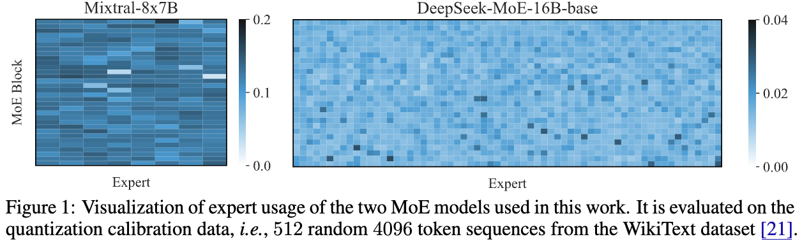
  

  - Authors: Pingzhi Li, Xiaolong Jin, Yu Cheng, Tianlong Chen
  - Link: https://arxiv.org/pdf/2406.08155
  - Code: https://github.com/UNITES-Lab/moe-quantization
  - Summary: This paper benchmarks post-training quantization techniques for Mixture-of-Experts (MoE) models, addressing the challenge of their high memory consumption despite computational efficiency. Direct application of existing quantization methods to MoE models yields suboptimal results due to the inherent sparsity of MoE's architecture. The authors explore several MoE structure-aware quantization heuristics with varying granularity (from MoE block to individual linear weights), finding that different MoE structures require different bit precisions for optimal performance. Key findings highlight that effective quantization necessitates considering the sparsity of MoE. The research introduces novel enhancements, a linear weight outlier scorer and an MoE block scorer, to better identify critical weights requiring higher bit allocation. Extensive benchmarking across two MoE models and six tasks validates these findings for both weight and activation quantization. Expert usage is a good heuristic to analyze the performance of MoE models. The authors also proposed a metric called `outlier-score` by estimating the relative importance of experts and then assigning different bit precisions to different experts.
  - 摘要：本文对混合专家（MoE）模型的训练后量化技术进行了基准测试，解决了尽管计算效率高但内存消耗大的挑战。由于 MoE 架构固有的稀疏性，直接将现有的量化方法应用于 MoE 模型会产生次优结果。作者探索了几种具有不同粒度的 MoE 结构感知量化启发式方法（从 MoE 块到单个线性权重），发现不同的 MoE 结构需要不同的位精度才能获得最佳性能。关键发现强调，有效的量化需要考虑 MoE 的稀疏性。该研究引入了新的增强功能，即线性权重异常值评分器和 MoE 块评分器，以更好地识别需要更高位分配的关键权重。在两个 MoE 模型和六个任务上的大量基准测试验证了这些发现对于权重量化和激活量化。专家使用情况是分析 MoE 模型性能的良好启发式方法。作者还提出了一种称为 `outlier-score` 的指标，通过估计专家的相对重要性并为其分配不同的位精度，从而更好地识别需要更高位分配的关键权重。

- MC-MoE: Mixture Compressor for Mixture-of-Experts LLMs Gains More
  

    
  

  - Authors: Wei Huang, Yue Liao, Jianhui Liu, Ruifei He, Haoru Tan, Shiming Zhang, Hongsheng Li, Si Liu, Xiaojuan Qi
  - Link: https://arxiv.org/html/2410.06270
  - Code: https://github.com/Aaronhuang-778/MC-MoE
  - Summary: This paper introduces MC-MoE, a training-free compression method for Mixture-of-Experts (MoE) Large Language Models (LLMs) that addresses the challenges of high memory consumption and computational overhead associated with MoE architectures. MC-MoE achieves extreme compression by leveraging the varying importance of experts and tokens. It employs a two-phase approach: 1) **Pre-Loading Mixed-Precision Quantization (PMQ):** This phase uses a Linear Programming (LP) problem to determine the optimal bit-width allocation for each expert based on factors reflecting their importance (activation reconstruction error, routing scores, and activated frequencies). This allows for efficient storage and loading of expert parameters. 2) **Online Dynamic Pruning (ODP):** During inference, ODP identifies and retains only the most important tokens, dynamically selecting activated experts for the remaining tokens. This further reduces the number of active parameters. Experiments show that MC-MoE achieves significant compression with minimal accuracy loss. For instance, at 2.54 bits per parameter, it compresses 76.6% of the model with only a 3.8% average accuracy drop. Dynamic inference further reduces activated parameters by 15% with less than a 0.6% performance decrease. Notably, MC-MoE even outperforms some 13B parameter dense LLMs, demonstrating the potential of mixture compression in surpassing both comparable and larger dense models.
  - 摘要：本文介绍了 MC-MoE，这是一种针对混合专家（MoE）大型语言模型（LLM）的免训练压缩方法，它解决了与 MoE 架构相关的内存消耗大和计算开销大的问题。MC-MoE 通过利用专家和标记的不同重要性来实现极端压缩。它采用两阶段方法：1) **预加载混合精度量化 (PMQ)：**此阶段使用线性规划 (LP) 问题来确定每个专家的最佳位宽分配，其依据是反映其重要性的因素（激活重建误差、路由分数和激活频率）。这允许高效地存储和加载专家参数。2) **在线动态剪枝 (ODP)：**在推理过程中，ODP 识别并仅保留最重要的标记，动态地为其余标记选择激活的专家。这进一步减少了活动参数的数量。实验表明，MC-MoE 在精度损失最小的前提下实现了显著的压缩。例如，在每个参数 2.54 位时，它压缩了 76.6% 的模型，平均精度仅下降了 3.8%。动态推理进一步将激活参数减少了 15%，性能下降不到 0.6%。值得注意的是，MC-MoE 甚至优于一些 130 亿参数的密集 LLM，这证明了混合压缩在超越同等规模和更大规模的密集模型方面的潜力。

### Decomposition

- MoE-I2: Compressing Mixture of Experts Models through Inter-Expert Pruning and Intra-Expert Low-Rank Decomposition
  

    
  

  - Authors: Cheng Yang, Yang Sui, Jinqi Xiao, Lingyi Huang, Yu Gong, Yuanlin Duan, Wenqi Jia, Miao Yin, Yu Cheng, Bo Yuan
  - Link: https://arxiv.org/abs/2411.01016
  - Code: https://github.com/xiaochengsky/MoEI-2
  - Summary: The emergence of Mixture of Experts (MoE) LLMs has significantly advanced the development of language models. Compared to traditional LLMs, MoE LLMs outperform traditional LLMs by achieving higher performance with considerably fewer activated parameters. Despite this efficiency, their enormous parameter size still leads to high deployment costs. In this paper, we introduce a two-stage compression method tailored for MoE to reduce the model size and decrease the computational cost. First, in the inter-expert pruning stage, we analyze the importance of each layer and propose the Layer-wise Genetic Search and Block-wise KT-Reception Field with the non-uniform pruning ratio to prune the individual expert. Second, in the intra-expert decomposition stage, we apply the low-rank decomposition to further compress the parameters within the remaining experts. Extensive experiments on Qwen1.5-MoE-A2.7B, DeepSeek-V2-Lite, and Mixtral-8×7B demonstrate that our proposed methods can both reduce the model size and enhance inference efficiency while maintaining performance in various zero-shot tasks.
  - 摘要：混合专家（MoE）大语言模型的出现显著推进了语言模型的发展。与传统的大语言模型相比，MoE 大语言模型通过较少的激活参数实现了更高的性能。尽管具有这种效率，但其庞大的参数规模仍然导致部署成本高昂。在本文中，我们引入了一种专门针对 MoE 的两阶段压缩方法，以减少模型大小并降低计算成本。首先，在专家间剪枝阶段，我们分析每一层的重要性，并提出了具有非均匀剪枝比率的层级遗传搜索和块级 KT 感受野，用于剪枝单个专家。其次，在专家内分解阶段，我们应用低秩分解进一步压缩剩余专家中的参数。在 Qwen1.5-MoE-A2.7B、DeepSeek-V2-Lite 和 Mixtral-8×7B 上的大量实验表明，我们提出的方法既可以减少模型大小，又可以提高推理效率，同时在各种零样本任务中保持性能。

- Merge, then compress: demystify efficient sparse mixture-of-experts with hints from its routing policy

  

    
  

  - Authors: Pingzhi Li, Zhenyu Zhang, Prateek Yadav, Yi-Lin Sung, Yu Cheng, Mohit Bansal, Tianlong Chen
  - Link: https://arxiv.org/pdf/2310.01334
  - Code: https://github.com/UNITES-Lab/MC-SMoE
  - Summary: This paper addresses the limitations of **Sparse Mixture-of-Experts (SMoE)** models, namely high memory usage due to expert duplication and redundancy due to representational collapse in learning-based routing policies. The authors propose **MC-SMoE (Merge, then Compress SMoE)**, a novel method to create more compact and efficient SMoE models. MC-SMoE consists of two stages: **expert merging** and **compression**. The merging stage uses routing statistics to guide the consolidation of experts. It begins by aligning neurons across experts through permutation, then groups experts based on their routing policies, finally merging each group into a single expert weighted by activation frequency. This process reduces the impact of insignificant experts. Interestingly, this merging leads to a lower dimensionality in the merged expert's weight space, enabling further compression. The compression stage decomposes the merged experts using low-rank and structural sparse techniques. Experiments across 8 benchmarks show that MC-SMoE achieves up to **80% memory reduction** and **20% FLOPs reduction** with minimal performance loss. The paper highlights that conventional model merging techniques are ineffective for SMoE due to redundant information overshadowing critical experts and the lack of appropriate neuron permutation alignment. The authors demonstrate the effectiveness of their approach by comparing MC-SMoE to standard SMoE and other baselines, showcasing significant improvements in memory efficiency without sacrificing accuracy. The core innovation lies in leveraging routing statistics to intelligently merge experts, followed by a compression step that capitalizes on the lower dimensionality resulting from the merging process.

  - 摘要：本文解决了**稀疏专家混合模型 (SMoE)** 的局限性，即由于专家复制导致的高内存使用率以及基于学习的路由策略中由于表示崩溃导致的冗余。作者提出了**MC-SMoE（合并，然后压缩 SMoE）**，这是一种创建更紧凑和高效的 SMoE 模型的新方法。MC-SMoE 包括两个阶段：**专家合并**和**压缩**。合并阶段使用路由统计信息来指导专家的整合。它首先通过置换来对齐专家之间的神经元，然后根据其路由策略对专家进行分组，最后将每个组合并成一个由激活频率加权的单个专家。此过程减少了不重要专家的影响。有趣的是，这种合并导致合并专家权重空间的维数降低，从而实现进一步的压缩。压缩阶段使用低秩和结构化稀疏技术分解合并的专家。在 8 个基准测试中的实验表明，MC-SMoE 在性能损失最小的前提下，实现了高达**80% 的内存减少**和**20% 的 FLOPs 减少**。本文强调，由于冗余信息掩盖了关键专家以及缺乏适当的神经元置换对齐，因此传统的模型合并技术对于 SMoE 是无效的。作者通过将 MC-SMoE 与标准 SMoE 和其他基线进行比较，展示了其方法的有效性，在内存效率方面取得了显著改进，而不会牺牲准确性。核心创新在于利用路由统计信息智能地合并专家，然后进行压缩步骤，利用合并过程产生的较低维数。

## Distillation

- One Student Knows All Experts Know: From Sparse to Dense
  

    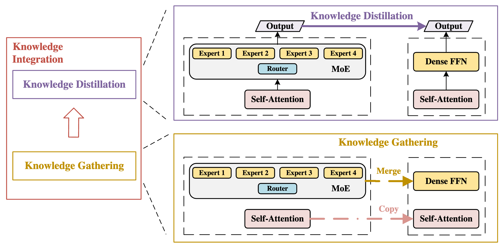
  

  - Authors: Fuzhao Xue, Xiaoxin He, Xiaozhe Ren, Yuxuan Lou, Yang You
  - Link: https://arxiv.org/pdf/2201.10890
  - Code: Not available
  - Summary: This paper proposes a novel method for training a **dense** student model that matches the performance of a **sparse Mixture-of-Experts (MoE)** model. Inspired by the human education system where a student learns from multiple experts, the authors introduce a **knowledge integration** framework. This framework consists of two stages: **knowledge gathering** and **knowledge distillation**. In the knowledge gathering stage, four methods are explored to extract knowledge from the pre-trained MoE experts: summation, averaging, **Top-K Knowledge Gathering (Top-KG)**, and **Singular Value Decomposition Knowledge Gathering (SVD-KG)**. Top-KG and SVD-KG aim to select the most crucial knowledge from each expert. The gathered knowledge is then used to initialize the feed-forward network (FFN) layers of a dense student model. Subsequently, **knowledge distillation** is employed to refine the student model using the entire MoE as a teacher, mitigating noise introduced during the knowledge gathering phase. Experiments on ImageNet and four natural language processing datasets demonstrate that the resulting OneS (One Student) model achieves significant performance gains compared to dense baselines, retaining a substantial portion of the MoE's performance (61.7% on ImageNet and 88.2% on NLP datasets) while offering a 3.7x inference speedup due to its **hardware-friendly** dense architecture. The OneS model significantly outperforms the best baseline by 51.7% on NLP tasks with the same architecture and training data.
  - 摘要：本文提出了一种新颖的方法，用于训练一个能够匹敌**稀疏专家混合模型 (MoE)** 性能的**稠密**学生模型。受人类教育体系（学生向多个专家学习）的启发，作者提出了一个**知识整合**框架。该框架包含两个阶段：**知识收集**和**知识蒸馏**。在知识收集阶段，探索了四种从预训练的 MoE 专家中提取知识的方法：求和、平均、**Top-K 知识收集 (Top-KG)** 和**奇异值分解知识收集 (SVD-KG)**。Top-KG 和 SVD-KG 旨在从每个专家中选择最关键的知识。然后，收集到的知识用于初始化稠密学生模型的前馈网络 (FFN) 层。随后，使用整个 MoE 作为教师进行**知识蒸馏**，以改进学生模型，减轻知识收集阶段引入的噪声。在 ImageNet 和四个自然语言处理数据集上的实验表明，生成的 OneS（一位学生）模型与稠密基线相比取得了显著的性能提升，保留了 MoE 很大一部分性能（ImageNet 上为 61.7%，NLP 数据集上为 88.2%），同时由于其**硬件友好型**稠密架构，推理速度提高了 3.7 倍。OneS 模型在 NLP 任务上使用相同的架构和训练数据，比最佳基线高出 51.7%。

- LLaVA-MoD: Making LLaVA Tiny via MoE-Knowledge Distillation
  

    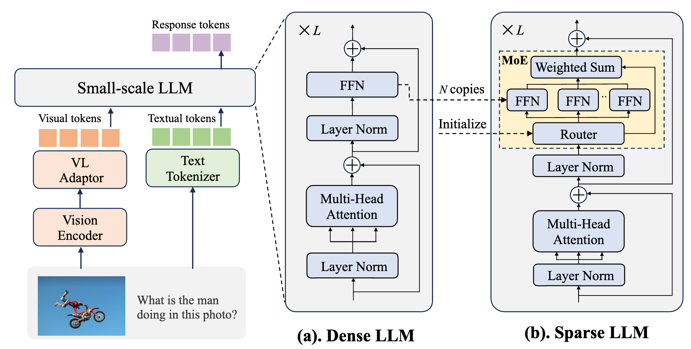
  

  

    
  

  - Authors: Fangxun Shu, Yue Liao, Le Zhuo, Chenning Xu, Lei Zhang, Guanghao Zhang, Haonan Shi, Long Chen, Tao Zhong, Wanggui He, Siming Fu, Haoyuan Li, Bolin Li, Zhelun Yu, Si Liu, Hongsheng Li, Hao Jiang
  - Link: https://arxiv.org/pdf/2408.15881
  - Code: https://github.com/shufangxun/LLaVA-MoD
  - Summary: This paper introduces LLaVA-MoD, a novel framework for efficiently training **small-scale Multimodal Language Models (s-MLLMs)** by distilling knowledge from a **large-scale MLLM (l-MLLM)**. LLaVA-MoD addresses two key challenges in MLLM distillation: architecture design and effective knowledge transfer. To address the architectural challenge, it integrates a **sparse Mixture of Experts (MoE)** architecture into the s-MLLM, balancing computational efficiency with model expressiveness. Multiple feedforward networks (FFNs) act as experts, and a linear gate dynamically selects the top-k experts for optimal knowledge transfer. For effective knowledge transfer, LLaVA-MoD employs a **progressive knowledge transfer strategy**. This begins with **mimic distillation**, minimizing the Kullback-Leibler (KL) divergence between the output distributions of the s-MLLM and l-MLLM. It then proceeds to **preference distillation** using **Preference Optimization (PO)**, treating the l-MLLM as a reference model. This enhances the s-MLLM's ability to discriminate between good and bad examples, often surpassing the l-MLLM's performance, particularly in hallucination benchmarks. Experiments show LLaVA-MoD outperforms existing methods across various benchmarks with minimal activated parameters and low computational costs. Specifically, LLaVA-MoD-2B surpasses Qwen-VL-Chat-7B by an average of 8.8% using only 0.3% of the training data and 23% of the trainable parameters. The results highlight LLaVA-MoD's effectiveness in distilling knowledge from a teacher model, enabling the development of efficient MLLMs.
  - 摘要：本文介绍了 LLaVA-MoD，这是一个新颖的框架，通过从大型多模态语言模型（**l-MLLM**）中蒸馏知识来高效训练**小型多模态语言模型（s-MLLMs）**。LLaVA-MoD 解决了 MLLM 蒸馏中的两个关键挑战：架构设计和有效的知识转移。为了解决架构挑战，它将**稀疏专家混合（MoE）**架构集成到 s-MLLM 中，平衡了计算效率和模型表达能力。多个前馈网络（FFNs）充当专家，线性门动态选择前 k 个专家以实现最佳的知识转移。为了有效地转移知识，LLaVA-MoD 采用**渐进式知识转移策略**。这从**模仿蒸馏**开始，最小化 s-MLLM 和 l-MLLM 输出分布之间的 Kullback-Leibler (KL) 散度。然后，它继续使用**偏好优化（PO）**进行**偏好蒸馏**，将 l-MLLM 作为参考模型。这增强了 s-MLLM 区分好坏示例的能力，通常超过 l-MLLM 的性能，尤其是在幻觉基准测试中。实验表明，LLaVA-MoD 在各种基准测试中都优于现有方法，同时具有最少的激活参数和较低的计算成本。具体而言，LLaVA-MoD-2B 使用仅 0.3%的训练数据和 23%的可训练参数，其性能优于 Qwen-VL-Chat-7B，平均提高了 8.8%。结果突出了 LLaVA-MoD 在从教师模型中蒸馏知识方面的有效性，从而能够开发高效的 MLLMs。

- Dense Training, Sparse Inference: Rethinking Training of Mixture-of-Experts Language Models
  

    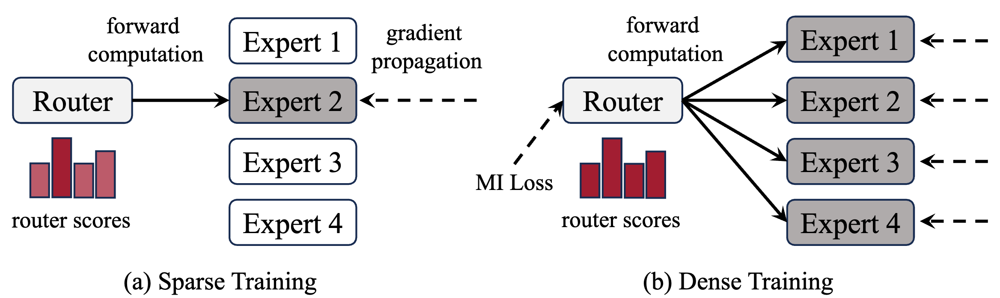
  

  - Authors: Bowen Pan, Yikang Shen, Haokun Liu, Mayank Mishra, Gaoyuan Zhang, Aude Oliva, Colin Raffel, Rameswar Panda
  - Link: https://arxiv.org/html/2404.05567
  - Code: Not available
  - Summary: This paper proposes a novel hybrid training framework, **DS-MoE (Dense training, Sparse Inference Mixture-of-Experts)**, for Mixture-of-Experts (MoE) language models to improve both **computational** and **parameter efficiency**. Unlike traditional sparse MoE training which only activates a subset of experts during training, DS-MoE utilizes **dense computation** across all experts during training, followed by **sparse inference**. This approach addresses the issue of MoE models requiring 2-4x more parameters than dense models for comparable performance, a problem particularly pronounced in I/O-bounded scenarios like autoregressive generation. The authors incorporate a **Mutual Information (MI) loss** to balance expert usage and encourage sparse activation during inference. During inference, the top K experts (either a fixed number or dynamically determined by a threshold) are activated per layer based on router scores. Experimental results demonstrate that DS-MoE achieves performance comparable to dense models of the same size, while activating only 30-40% of the parameters during inference. Specifically, the DS-MoE-6B model shows a speedup of up to 1.86x compared to Mistral-7B and 1.50x to 1.71x compared to DeepSeekMoE-16B and Qwen1.5-MoE-A2.7B, showcasing significant improvements in inference speed and parameter efficiency. The paper highlights that this method effectively bridges the gap between dense and sparse MoE models, offering a more efficient and practical solution for large language model training and deployment.

  - 摘要：本文提出了一种新颖的混合训练框架**DS-MoE（密集训练，稀疏推理混合专家）**，用于混合专家（MoE）大型语言模型，以提高**计算**和**参数效率**。与传统稀疏 MoE 训练只在训练期间激活一部分专家不同，DS-MoE 在训练期间对所有专家使用**密集计算**，然后进行**稀疏推理**。这种方法解决了 MoE 模型为了获得可比的性能而需要比密集模型多 2-4 倍参数的问题，这个问题在像自回归生成这样的 I/O 受限场景中尤其突出。作者引入了**互信息（MI）损失**来平衡专家使用，并在推理过程中鼓励稀疏激活。在推理过程中，根据路由器分数，每层激活前 K 个专家（固定数量或由阈值动态确定）。实验结果表明，DS-MoE 实现了与相同大小的密集模型相当的性能，同时在推理过程中只激活了 30%-40%的参数。具体来说，DS-MoE-6B 模型与 Mistral-7B 相比速度提高了高达 1.86 倍，与 DeepSeekMoE-16B 和 Qwen1.5-MoE-A2.7B 相比速度提高了 1.50 倍到 1.71 倍，展示了推理速度和参数效率的显著改进。本文强调，这种方法有效地弥合了密集型和稀疏型 MoE 模型之间的差距，为大型语言模型的训练和部署提供了一种更有效和实用的解决方案。

### System Optimization

- Fast Inference of Mixture-of-Experts Language Models with Offloading
  

    
  

  - Authors: Artyom Eliseev, Denis Mazur
  - Link: https://arxiv.org/pdf/2312.17238
  - Code: Not available in the provided text.
  - Summary: This paper addresses the challenge of running large Mixture-of-Experts (MoE) language models on consumer hardware with limited GPU memory. MoE models, while offering faster token generation than dense models, are significantly larger due to their multiple "expert" layers. The authors focus on improving inference speed (token generation) for Mixtral-8x7B-Instruct, a MoE-based chat assistant, on desktop-grade hardware. Their approach leverages two key observations about MoE LLM behavior: 1) expert reuse between adjacent tokens, and 2) early layers' hidden states predicting subsequent layer expert usage. Based on these observations, they propose a novel offloading strategy that incorporates an LRU cache to minimize GPU-RAM communication and a predictive mechanism to overlap expert loading with computation. This strategy, combined with mixed quantization, enables interactive inference (2-3 tokens per second) of Mixtral-8x7B-Instruct on hardware like a T4, RTX 3060, and RTX 3080 Mobile. The paper details the implementation and its performance on various hardware configurations.
  - 摘要：本文解决了在具有有限 GPU 内存的消费级硬件上运行大型混合专家（MoE）语言模型的挑战。MoE 模型虽然比密集模型具有更快的令牌生成速度，但由于其多个“专家”层而规模显著更大。作者专注于提高 Mixtral-8x7B-Instruct（一个基于 MoE 的聊天助手）在桌面级硬件上的推理速度（令牌生成）。他们的方法利用了对 MoE LLM 行为的两个关键观察结果：1）相邻令牌之间专家重用，以及 2）早期层的隐藏状态预测后续层的专家使用情况。基于这些观察结果，他们提出了一种新颖的卸载策略，该策略结合了 LRU 缓存以最大限度地减少 GPU-RAM 通信，以及一种预测机制以将专家加载与计算重叠。这种策略与混合量化相结合，使得能够在 T4、RTX 3060 和 RTX 3080 Mobile 等硬件上进行交互式推理（每秒 2-3 个令牌）。本文详细介绍了该实现及其在各种硬件配置上的性能。

- MoNDE: Mixture of Near-Data Experts for Large-Scale Sparse Models
  

    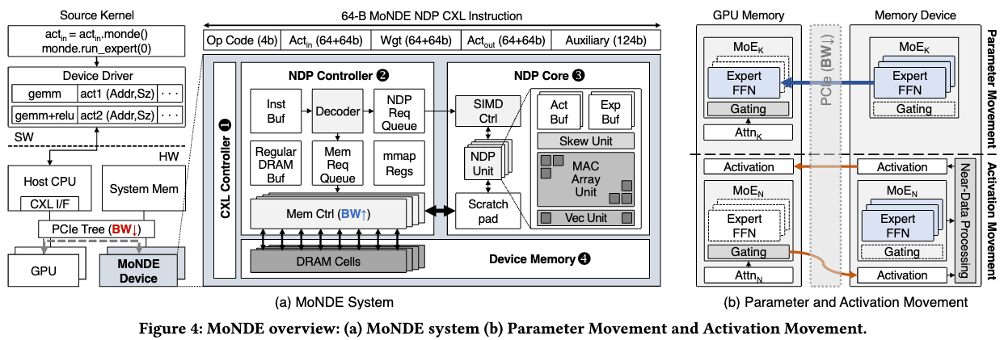
  

  - Authors: Taehyun Kim, Kwanseok Choi, Youngmock Cho, Jaehoon Cho, Hyuk-Jae Lee, Jaewoong Sim
  - Link: https://arxiv.org/pdf/2405.18832
  - Code: Not available
  - Pub: DAC2024
  - Summary: This paper introduces Mixture of Near-Data Experts (MoNDE), a near-data processing (NDP) solution designed to improve the inference efficiency of Mixture-of-Experts (MoE) large language models (LLMs). MoE LLMs often suffer from excessive memory requirements, forcing costly parameter transfers between secondary memory (CPU or SSD) and the GPU. MoNDE addresses this by transferring only the "hot" experts (frequently used) to the GPU, while processing "cold" experts (infrequently used) within the host memory's MoNDE NDP units. This shifts the data movement from large expert parameter transfers to smaller activation transfers, significantly reducing communication overhead. MoNDE employs an "Activation Movement" paradigm, where instead of moving entire expert parameters, only the activations from the attention layers are transferred to the MoNDE units for computation. The results are then transferred back to the GPU. A novel GPU-MoNDE load-balancing scheme further enhances performance by concurrently executing expert computations on both the GPU and MoNDE, exploiting the skewed activation distribution inherent in MoE. Experimental results demonstrate that MoNDE outperforms existing parameter offloading frameworks by up to 7.5x and 3.7x for encoder and decoder operations respectively, with a reported area overhead of 3.0 mm² for the MoNDE NDP units. The key is leveraging the observation that many experts process few tokens, making activation transfer far more efficient than parameter transfer in these cases.
  - 摘要：本文介绍了混合近数据专家（MoNDE），这是一种近数据处理（NDP）解决方案，旨在提高混合专家（MoE）大型语言模型（LLM）的推理效率。MoE LLM 通常存在内存需求过大的问题，导致在辅助内存（CPU 或 SSD）和 GPU 之间进行代价高昂的参数传输。MoNDE 通过仅将“热门”专家（频繁使用）传输到 GPU 来解决这个问题，同时在主机内存的 MoNDE NDP 单元中处理“冷门”专家（不频繁使用）。这将数据移动从大型专家参数传输转移到较小的激活传输，从而显著减少了通信开销。MoNDE 采用“激活移动”范例，其中，它不移动整个专家参数，而只将来自注意力层的激活传输到 MoNDE 单元进行计算。然后将结果传输回 GPU。一种新颖的 GPU-MoNDE 负载平衡方案通过同时在 GPU 和 MoNDE 上执行专家计算来进一步提高性能，利用了 MoE 中固有的倾斜激活分布。实验结果表明，MoNDE 在编码器和解码器操作方面的性能分别比现有的参数卸载框架高出 7.5 倍和 3.7 倍，MoNDE NDP 单元的面积开销为 3.0 mm²。关键在于利用这样的观察结果：许多专家处理的标记数量很少，在这种情况下，激活传输比参数传输效率高得多。

### Upcycling

- Branch-Train-MiX: Mixing Expert LLMs into a Mixture-of-Experts LLM
  

    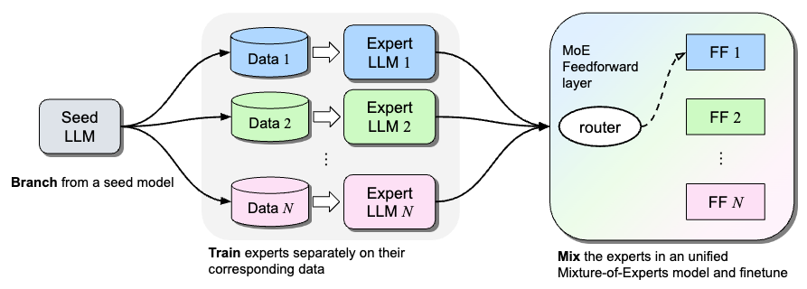
  

  - Authors: Sainbayar Sukhbaatar, Olga Golovneva, Vasu Sharma, Hu Xu, Xi Victoria Lin, Baptiste Rozière, Jacob Kahn, Daniel Li, Wen-tau Yih, Jason Weston, Xian Li
  - Link: https://arxiv.org/pdf/2403.07816v1
  - Code: Not available
  - Summary: This paper introduces **Branch-Train-MiX (BTX)**, a novel method for training **Large Language Models (LLMs)** with expertise in multiple specialized domains (e.g., coding, math reasoning, world knowledge). BTX leverages the advantages of both **Branch-Train-Merge (BTM)** and **Mixture-of-Experts (MoE)** approaches while mitigating their drawbacks. The method begins by branching from a **seed LLM**, creating multiple copies that are trained asynchronously and in parallel on different datasets, resulting in specialized **expert LLMs**. Unlike BTM, which simply merges these experts, BTX integrates the expert LLMs' **feedforward (FF)** parameters into a single MoE layer, averaging the remaining parameters (e.g., self-attention layers). A subsequent MoE-finetuning stage optimizes the **token-level routing** within the MoE layer. This approach achieves efficient training due to the embarrassingly parallel nature of expert training, reducing communication costs and improving throughput. Furthermore, the resulting unified model allows for further **supervised fine-tuning (SFT)** or **reinforcement learning from human feedback (RLHF)**, which are typically impossible with the BTM approach. The authors claim BTX achieves the best **accuracy-efficiency tradeoff** compared to alternative methods.
  - 摘要：本文介绍了一种新颖的训练大型语言模型（LLM）的方法，名为**Branch-Train-MiX (BTX)**，该方法旨在使 LLM 具备多个专业领域的专业知识（例如，编码、数学推理、世界知识）。BTX 结合了**Branch-Train-Merge (BTM)**和**Mixture-of-Experts (MoE)**方法的优点，同时减轻了它们的缺点。该方法首先从一个**种子 LLM**开始分支，创建多个副本，这些副本在不同的数据集上异步并行训练，从而产生专门的**专家 LLM**。与简单地合并这些专家的 BTM 不同，BTX 将专家 LLM 的**前馈(FF)**参数集成到单个 MoE 层中，对其余参数（例如，自注意力层）进行平均。随后的 MoE 微调阶段优化了 MoE 层中的**令牌级路由**。这种方法由于专家训练的并行性而实现了高效的训练，降低了通信成本并提高了吞吐量。此外，生成的统一模型允许进行进一步的**监督微调(SFT)**或**来自人类反馈的强化学习(RLHF)**，而这在 BTM 方法中通常是不可能的。作者声称，与其他方法相比，BTX 实现了最佳的**精度-效率权衡**。

- Branch-Train-Merge (BTM): Embarrassingly Parallel Training of Expert Language Models
  

    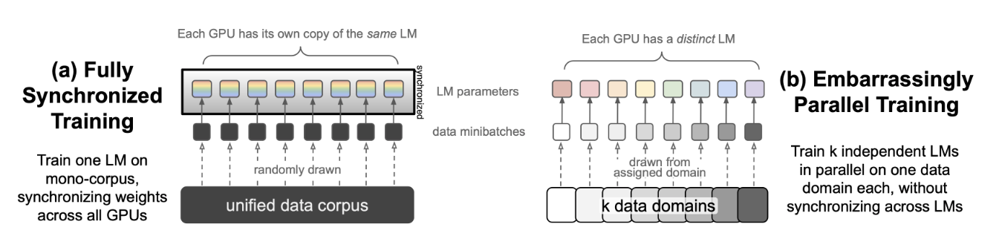
  

  

    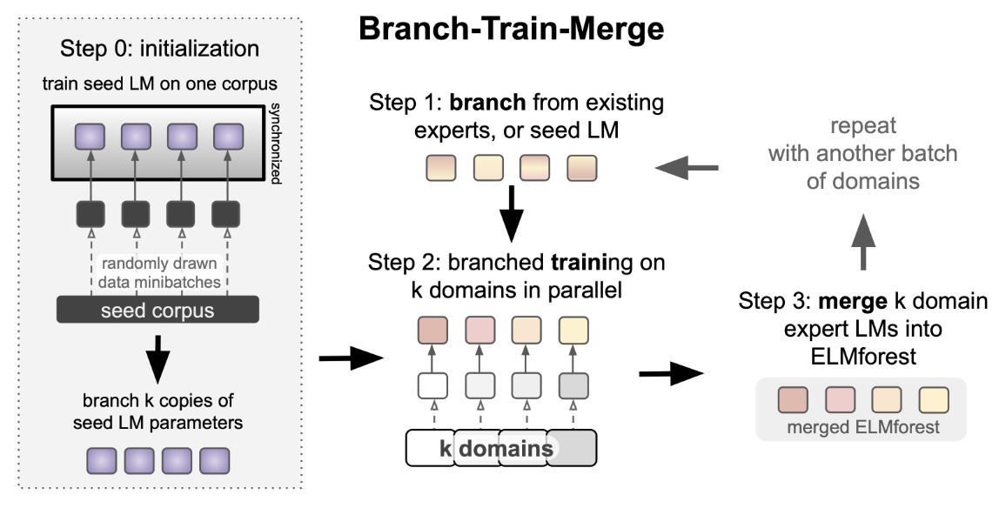
  

  - Authors: Margaret Li, Suchin Gururangan, Tim Dettmers, Mike Lewis, Tim Althoff, Noah A. Smith, Luke Zettlemoyer
  - Link: https://arxiv.org/pdf/2208.03306
  - Code: Not available
  - Summary: This paper introduces **Branch-Train-Merge (BTM)**, a communication-efficient algorithm for training large language models (LLMs) in an **embarrassingly parallel** manner. Instead of training a single monolithic model, BTM trains a collection of independent **Expert Language Models (ELMs)**, each specialized in a different textual domain (e.g., scientific or legal text). These ELMs are trained independently on different subsets of data, eliminating the need for massive multi-node synchronization typical in traditional LLM training. The BTM process involves three steps: **Branching**, where a new ELM is initialized using a weighted average of parameters from existing, relevant ELMs; **Training**, where the new ELM is trained on data from its specialized domain using standard cross-entropy loss; and **Merging**, where the newly trained ELM is added to the existing set of ELMs. This allows for incremental model expansion and adaptation to new domains. The resulting model, termed **ELM FOREST**, can be used as an ensemble, averaging the predictions of all ELMs, or through parameter averaging to create a single, efficient inference model. Experiments demonstrate that ELM FORESTs trained with BTM outperform GPT-style Transformer LMs in both in-domain and out-of-domain perplexity, while controlling for training cost. The improvements are more pronounced in ELM FOREST ensembles but are also present when using parameter averaging. The study also highlights the importance of domain specialization; random data splits do not yield good results. Scaling BTM to 64 domains (192B tokens) resulted in a 22.4B parameter model that performed comparably to a Transformer LM trained with 2.5x more compute, suggesting significant potential for scaling to even larger models with increased parallelism. The paper includes detailed ablation studies analyzing different aspects of BTM and ELM initialization.

  - 摘要：本文介绍了**Branch-Train-Merge (BTM)**，一种用于以**高度并行**方式训练大型语言模型 (LLM) 的通信效率高的算法。BTM 不训练单个整体模型，而是训练一系列独立的**专家语言模型 (ELM)**，每个模型专门处理不同的文本领域（例如，科学或法律文本）。这些 ELM 在数据的不同子集上独立训练，消除了传统 LLM 训练中通常需要的海量多节点同步。BTM 过程包括三个步骤：**分支 (Branching)**，其中使用现有相关 ELM 的参数加权平均值来初始化新的 ELM；**训练 (Training)**，其中使用标准交叉熵损失在新 ELM 的专业领域数据上训练新 ELM；以及**合并 (Merging)**，其中将新训练的 ELM 添加到现有的 ELM 集中。这允许对模型进行增量扩展并适应新的领域。生成的模型，称为**ELM FOREST**，可以用作集成模型，平均所有 ELM 的预测，或者通过参数平均来创建单个高效的推理模型。实验表明，使用 BTM 训练的 ELM FOREST 在域内和域外困惑度方面都优于 GPT 风格的 Transformer LLM，同时控制了训练成本。改进在 ELM FOREST 集成模型中更为明显，但在使用参数平均时也存在。该研究还强调了领域专业化的重要性；随机数据分割不会产生良好的结果。将 BTM 扩展到 64 个领域（192B 个标记）产生了 22.4B 参数的模型，其性能与使用 2.5 倍计算量训练的 Transformer LLM 相当，这表明了通过增加并行性扩展到更大模型的巨大潜力。本文还包括详细的消融研究，分析了 BTM 和 ELM 初始化的不同方面。

- Skywork-MoE: A Deep Dive into Training Techniques for Mixture-of-Experts Language Models
  

    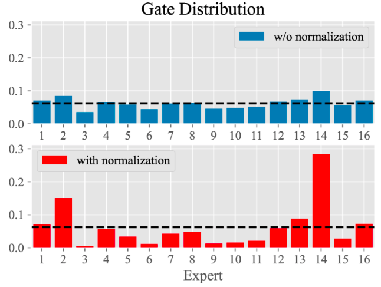
  

  - Authors: Tianwen Wei, Bo Zhu, Liang Zhao, Cheng Cheng, Biye Li, Weiwei Lü, Peng Cheng, Jianhao Zhang, Xiaoyu Zhang, Liang Zeng, Xiaokun Wang, Yutuan Ma, Rui Hu, Shuicheng Yan, Han Fang, Yahui Zhou   Skywork Team, Kunlun Inc
  - Link: https://arxiv.org/html/2406.06563v1
  - Summary: This technical report details the training methodologies behind Skywork-MoE, a 146-billion parameter **Mixture-of-Experts (MoE)** large language model (LLM) with 16 experts. The model is **upcycled** from the authors' pre-existing Skywork-13B model, and the paper explores the comparative advantages of upcycling versus training from scratch. The authors find that the optimal approach depends on both the performance of the existing dense checkpoints and the available training budget. Two key novel training techniques are introduced: **gating logit normalization**, which improves expert diversification, and **adaptive auxiliary loss coefficients**, enabling layer-specific adjustment of auxiliary losses. Skywork-MoE was trained on a condensed subset of the SkyPile corpus and demonstrates strong performance across various benchmarks, showcasing the effectiveness of the proposed techniques. The architecture builds upon the **Switch Transformer** design, utilizing MoE to replace some or all feed-forward networks (FFNs) within the transformer architecture. The **gating mechanism**, employing a softmax function, dynamically routes tokens to the most relevant experts based on their embeddings.
  - 摘要：这份技术报告详细介绍了 Skywork-MoE 的训练方法，Skywork-MoE 是一个具有 1460 亿参数和 16 个专家的高性能**混合专家（MoE）**大型语言模型（LLM）。该模型是从作者先前开发的 Skywork-13B 模型**升级**而来的，本文探讨了升级与从头开始训练的比较优势。作者发现，最佳方法取决于现有密集检查点的性能和可用的训练预算。报告介绍了两种关键的新型训练技术：**门控 logit 归一化**，它提高了专家的多样性，以及**自适应辅助损失系数**，它能够对不同层的辅助损失进行特定层的调整。Skywork-MoE 在 SkyPile 语料库的精简子集上进行了训练，并在各种基准测试中表现出强大的性能，这展示了所提出技术的有效性。该架构建立在**Switch Transformer**设计的基礎上，利用 MoE 替换 Transformer 架构中部分或全部的前馈神经网络（FFNs）。**门控机制**采用 softmax 函数，根据词嵌入动态地将词元路由到最相关的专家。

- Sparse Upcycling: Training Mixture-of-Experts from Dense Checkpoints
  

    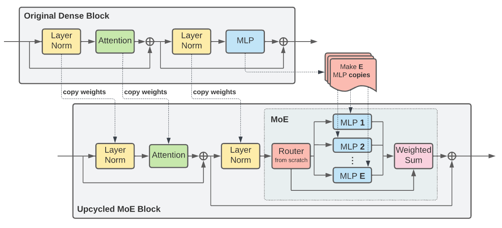
  

  - Authors: Aran Komatsuzaki, Joan Puigcerver, James Lee-Thorp, Carlos Riquelme, Basil Mustafa, Joshua Ainslie, Yi Tay, Mostafa Dehghani, Neil Houlsby
  - Link: https://arxiv.org/pdf/2212.05055
  - Code: https://github.com/google-research/vmoe (Vision) and https://github.com/google-research/t5x/tree/main/t5x/contrib/moe (Language)
  - Summary: This paper introduces **sparse upcycling**, a method for efficiently training **Mixture-of-Experts (MoE)** models by initializing them from pre-trained **dense** checkpoints. Instead of training large models from scratch, which is computationally expensive, this technique leverages the knowledge embedded in existing dense models to significantly reduce training costs. The authors demonstrate that by upcycling pre-trained T5 (**language**) and Vision Transformer (**vision**) models, they achieve superior performance compared to both their dense counterparts and sparse models trained from scratch, using only approximately 50% of the original training cost. The method involves a "model surgery" process to effectively transfer knowledge from the dense model to the sparse MoE architecture, mitigating the performance drop typically associated with architectural changes. Experiments on SuperGLUE (language) and ImageNet (vision) benchmarks show substantial performance gains with a modest increase in training budget (between 10% and 60% of the original training cost). This technique is particularly beneficial when resources are limited or when exploring the trade-offs between dense and MoE models, allowing for efficient exploration of large-scale model architectures.
  - 摘要：本文介绍了一种高效训练**混合专家（MoE）**模型的方法——**稀疏升级**，该方法通过从预训练的**密集**检查点初始化 MoE 模型来实现。与从头开始训练大型模型（计算成本很高）相比，这种技术利用现有密集模型中嵌入的知识来显著降低训练成本。作者证明，通过升级预训练的 T5（**语言**）和 Vision Transformer（**视觉**）模型，他们实现了优于其密集对应模型和从头开始训练的稀疏模型的性能，而仅使用了大约 50% 的原始训练成本。该方法涉及一个“模型手术”过程，以有效地将知识从密集模型转移到稀疏 MoE 架构，从而减轻通常与架构更改相关的性能下降。在 SuperGLUE（语言）和 ImageNet（视觉）基准测试上的实验表明，在适度增加训练预算的情况下（原始训练成本的 10% 到 60% 之间），性能有了显著提高。当资源有限或探索密集模型和 MoE 模型之间的权衡时，这种技术特别有用，允许高效地探索大型模型架构。

- LLaMA-MoE: Building Mixture-of-Experts from LLaMA with Continual Pre-training
  

    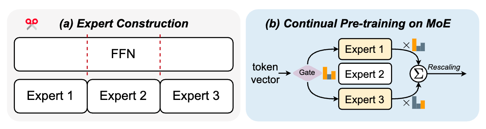
  

  - Authors: Tong Zhu, Xiaoye Qu, Daize Dong, Jiacheng Ruan, Jingqi Tong, Conghui He, Yu Cheng
  - Link: https://arxiv.org/pdf/2406.16554
  - Code: https://github.com/pjlab-sys4nlp/llama-moe
  - Pub: EMNLP 2024 main
  - Summary: This paper presents LLaMA-MoE, a novel approach to building **Mixture-of-Experts (MoE)** models from existing dense large language models (LLMs), specifically using the LLaMA-2 7B model as a base. Instead of training an MoE model from scratch, which is computationally expensive and unstable, the authors propose a two-stage process: (1) **Expert Construction**, where the **Feed-Forward Networks (FFNs)** of the LLaMA model are partitioned into multiple **experts**, and (2) **Continual Pre-training**, where the resulting MoE model and additional **gate networks** (which route input tokens to the appropriate experts) are further trained on a large dataset (200B tokens). The paper explores various methods for expert construction, focusing on different **splitting methods** for the FFNs (including non-overlapping random splitting, which proved most effective), and different **data sampling strategies** for continual pre-training (comparing **dynamic** and **static** approaches, with static domain weight proportion proving superior). The resulting LLaMA-MoE models, such as LLaMA-MoE-3.5B, achieve performance superior to dense models with a similar number of activated parameters, demonstrating the effectiveness of this approach to building efficient and powerful MoE LLMs. The key innovation lies in adapting MoE to a decoder-only architecture (like LLaMA) and employing continual pre-training to overcome the performance drop often associated with converting a dense model to a sparse MoE model.

  - 摘要：本文提出了 LLaMA-MoE，一种从现有的稠密大型语言模型（LLM）构建**混合专家（MoE）**模型的新方法，特别地，使用 LLaMA-2 7B 模型作为基础。该方法并非从头开始训练 MoE 模型（这在计算上代价高昂且不稳定），而是提出了一个两阶段的过程：（1）**专家构建**，其中 LLaMA 模型的**前馈网络（FFN）**被划分为多个**专家**；（2）**持续预训练**，其中生成的 MoE 模型和额外的**门网络**（将输入 token 路由到合适的专家）在大型数据集（2000 亿个 token）上进行进一步训练。本文探讨了各种专家构建方法，重点关注 FFN 的不同**分割方法**（包括非重叠随机分割，证明最有效），以及持续预训练的不同**数据采样策略**（比较**动态**和**静态**方法，静态域权重比例证明更优）。生成的 LLaMA-MoE 模型，例如 LLaMA-MoE-3.5B，其性能优于具有相似激活参数数量的稠密模型，证明了这种构建高效强大 MoE LLM 的方法的有效性。关键创新在于将 MoE 应用于解码器专用架构（如 LLaMA）并采用持续预训练来克服将稠密模型转换为稀疏 MoE 模型时经常出现的性能下降。

- Upcycling Large Language Models into Mixture of Experts
  

    
  

  - Authors: Ethan He, Abhinav Khattar, Ryan Prenger, Vijay Korthikanti, Zijie Yan, Tong Liu, Shiqing Fan, Ashwath Aithal, Mohammad Shoeybi, Bryan Catanzaro
  - Link: https://arxiv.org/html/2410.07524
  - Code: Not available
  - Summary: This paper explores efficient methods for **upcycling** pre-trained dense large language models (LLMs) into sparse **Mixture-of-Experts (MoE)** models. The authors conduct a large-scale study on billion-parameter LLMs, focusing on optimizing upcycling techniques and hyperparameters. Key contributions include: a novel "**virtual group**" initialization scheme and weight scaling approach improving loss by 1.5%; a comparison of **softmax-then-topK** and **topK-then-softmax** expert routing methods, favoring the former; an analysis of the benefits of higher granularity MoEs and higher topK values; and a demonstration that upcycling outperforms continued dense model training. Specifically, upcycling the Nemotron-4 15B model on 1 trillion tokens yielded a 67.6% MMLU score, surpassing the 65.3% achieved by continued training of the same model on the same data. The work utilizes Megatron-LM4 for upcycling and training, focusing on MoEs applied to the transformer's MLP layer to maximize efficiency. The paper provides practical recommendations and best practices for upcycling billion-parameter LLMs, contributing to the advancement of large-scale MoE model development.
  - 摘要：本文探讨了将预训练的密集型大型语言模型（LLM）高效地升级到稀疏**混合专家（MoE）**模型的方法。作者对数十亿参数的 LLM 进行了大规模研究，重点是优化升级技术和超参数。主要贡献包括：一种新颖的“**虚拟组**”初始化方案和权重缩放方法，将损失提高了 1.5%；比较了**softmax-then-topK**和**topK-then-softmax**专家路由方法，前者更胜一筹；分析了更高粒度 MoE 和更高 topK 值的优势；以及证明了升级优于持续密集模型训练。具体来说，在 1 万亿个 token 上对 Nemotron-4 15B 模型进行升级，获得了 67.6%的 MMLU 分数，超过了在相同数据上持续训练该模型所获得的 65.3%。这项工作利用 Megatron-LM4 进行升级和训练，重点是应用于 Transformer 的 MLP 层的 MoE，以最大限度地提高效率。本文为升级数十亿参数的 LLM 提供了实用建议和最佳实践，推动了大规模 MoE 模型发展。

- LLaVA-MoD: Making LLaVA Tiny via MoE-Knowledge Distillation
  

    
  

  - Authors: Fangxun Shu, Yue Liao, Le Zhuo, Chenning Xu, Lei Zhang, Guanghao Zhang, Haonan Shi, Long Chen, Tao Zhong, Wanggui He, Siming Fu, Haoyuan Li, Bolin Li, Zhelun Yu, Si Liu, Hongsheng Li, Hao Jiang
  - Link: https://arxiv.org/pdf/2408.15881
  - Code: https://github.com/shufangxun/LLaVA-MoD
  - Summary: This paper introduces LLaVA-MoD, a novel framework for efficiently training **small-scale Multimodal Language Models (s-MLLMs)** by distilling knowledge from a **large-scale MLLM (l-MLLM)**. LLaVA-MoD addresses two key challenges in MLLM distillation: architecture design and effective knowledge transfer. To address the architectural challenge, it integrates a **sparse Mixture of Experts (MoE)** architecture into the s-MLLM, balancing computational efficiency with model expressiveness. Multiple feedforward networks (FFNs) act as experts, and a linear gate dynamically selects the top-k experts for optimal knowledge transfer. For effective knowledge transfer, LLaVA-MoD employs a **progressive knowledge transfer strategy**. This begins with **mimic distillation**, minimizing the Kullback-Leibler (KL) divergence between the output distributions of the s-MLLM and l-MLLM. It then proceeds to **preference distillation** using **Preference Optimization (PO)**, treating the l-MLLM as a reference model. This enhances the s-MLLM's ability to discriminate between good and bad examples, often surpassing the l-MLLM's performance, particularly in hallucination benchmarks. Experiments show LLaVA-MoD outperforms existing methods across various benchmarks with minimal activated parameters and low computational costs. Specifically, LLaVA-MoD-2B surpasses Qwen-VL-Chat-7B by an average of 8.8% using only 0.3% of the training data and 23% of the trainable parameters. The results highlight LLaVA-MoD's effectiveness in distilling knowledge from a teacher model, enabling the development of efficient MLLMs.
  - 摘要：本文介绍了 LLaVA-MoD，这是一个新颖的框架，通过从大型多模态语言模型（**l-MLLM**）中蒸馏知识来高效训练**小型多模态语言模型（s-MLLMs）**。LLaVA-MoD 解决了 MLLM 蒸馏中的两个关键挑战：架构设计和有效的知识转移。为了解决架构挑战，它将**稀疏专家混合（MoE）**架构集成到 s-MLLM 中，平衡了计算效率和模型表达能力。多个前馈网络（FFNs）充当专家，线性门动态选择前 k 个专家以实现最佳的知识转移。为了有效地转移知识，LLaVA-MoD 采用**渐进式知识转移策略**。这从**模仿蒸馏**开始，最小化 s-MLLM 和 l-MLLM 输出分布之间的 Kullback-Leibler (KL) 散度。然后，它继续使用**偏好优化（PO）**进行**偏好蒸馏**，将 l-MLLM 作为参考模型。这增强了 s-MLLM 区分好坏示例的能力，通常超过 l-MLLM 的性能，尤其是在幻觉基准测试中。实验表明，LLaVA-MoD 在各种基准测试中都优于现有方法，同时具有最少的激活参数和较低的计算成本。具体而言，LLaVA-MoD-2B 使用仅 0.3%的训练数据和 23%的可训练参数，其性能优于 Qwen-VL-Chat-7B，平均提高了 8.8%。结果突出了 LLaVA-MoD 在从教师模型中蒸馏知识方面的有效性，从而能够开发高效的 MLLMs。

## MoE Survey

- [A Survey on Mixture of Experts](https://arxiv.org/pdf/2407.06204)

## MoE Resources

- [Mixture of Experts (MoE) Explained](https://huggingface.co/blog/moe): A blog post from Hugging Face explaining MoE.
- [Awesome list of MoE](https://github.com/withinmiaov/A-Survey-on-Mixture-of-Experts): A survey on Mixture of Experts.
- [ICML 2024 Tutorial on MoE](https://icml.cc/media/icml-2024/Slides/35222_1r94S59.pdf): A tutorial on Mixture of Experts from ICML 2024.

  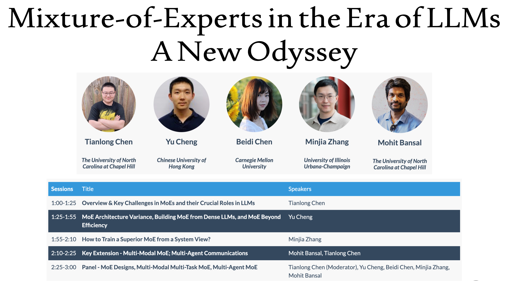

## FAQ

> Q: What is a Mixture of Experts (MoE) model?

A: A MoE model is a machine learning architecture that combines multiple "expert" neural networks, each specializing in different aspects of a task, with a gating network that routes inputs to the most appropriate experts.

> Q: What are the main advantages of MoE models?

A: Key advantages include:

- **Pretrained faster than dense model**
- Have **faster inference** compared to a model with the same number of parameters
- Increased model **capacity** without proportional compute costs
- Better task **specialization** through expert specialization
- **Faster training** and **better inference** under high-load scenarios

> Q: What are the challenges in implementing MoE models?

A: Common challenges include:

- Require high VRAM as all experts are loaded in memory
- Complex routing mechanisms and load balancing
- Training instability
- Communication overhead in distributed settings

> Q: How do MoE models compare to dense transformers?

A: MoE models can achieve better performance with similar or lower computational costs, but require more memory and have more complex training dynamics.

> Q: Why MoE can be pretrained faster than dense model?

A: From my experience in NAS, MoE can be treated as a way to decouple the weights. The more weights shared, the faster the model can be pretrained. Additionally, decoupling the weights can increase the model capacity.

> Q: How to choose the number of experts?

A: TBD

> Q: Why MoE is suitable for high-load scenarios? How does it work when inference?

A: TBD

## Contributing

We welcome contributions to this repository! If you have any resources, papers, or insights related to Mixture-of-Experts (MoE) models and their efficient variants, please consider contributing to this repository.

To contribute, please follow these steps:

1. Fork the repository.
2. Create a new branch for your changes.
3. Make your changes and ensure they are well-documented.
4. Submit a pull request with your changes.
