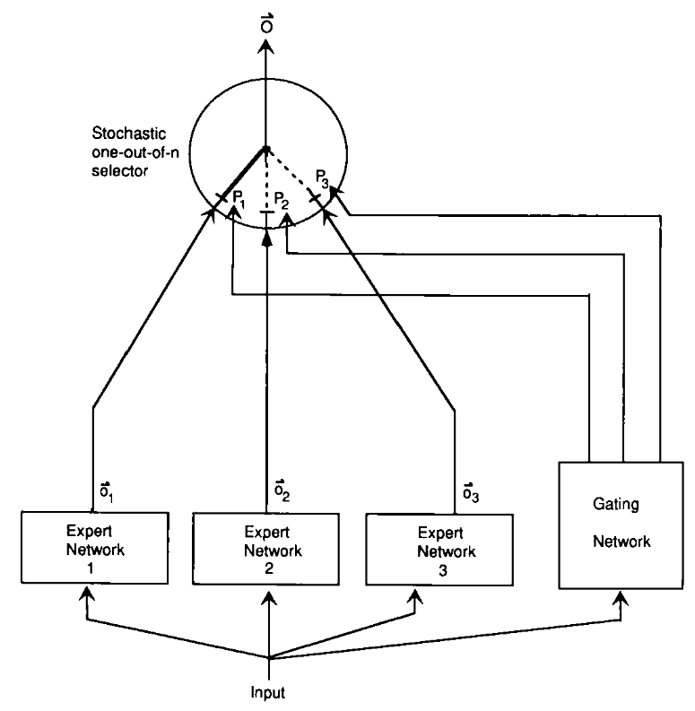
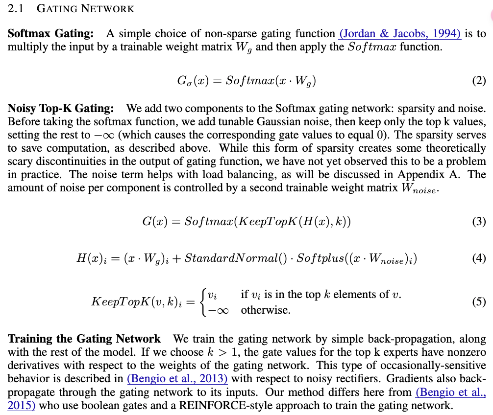
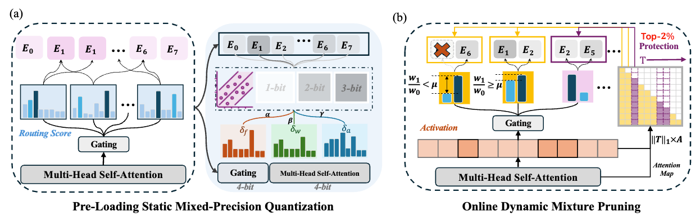
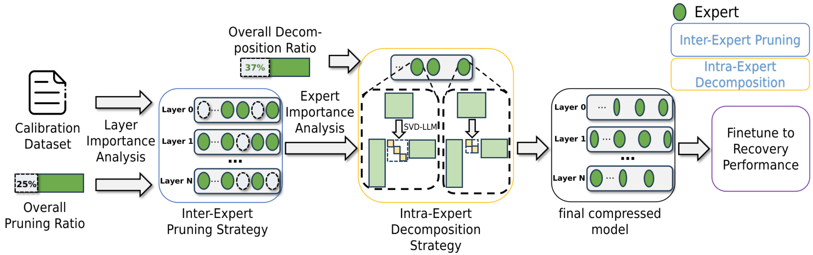
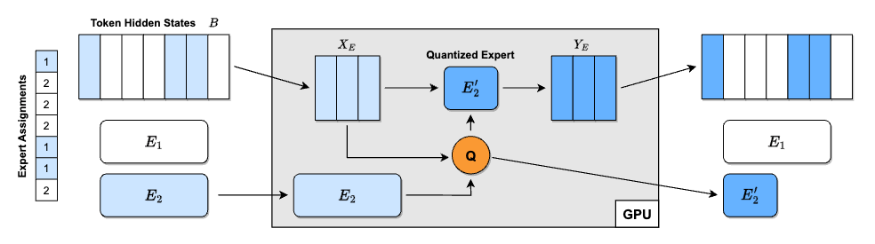
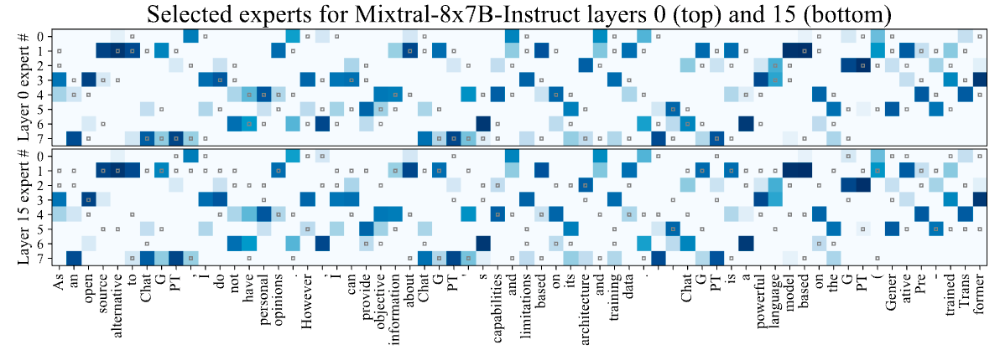

# Awesome-Efficient-MoE

  
  
  
  
  
 

This repository collects research papers and resources about Mixture-of-Experts (MoE) models and their efficient variants. MoE is a machine learning technique that divides a complex task among multiple "expert" neural networks, each specializing in handling different aspects of the input space, coordinated by a gating network that decides which expert(s) to use for each input. The contents of papers are in both Chinese and English.

MoE models have gained significant attention in recent years due to their:

- **Scalability**: Ability to scale model capacity without proportionally increasing computation
- **Efficiency**: Selective activation of only relevant experts for each input
- **Specialization**: Different experts can learn to handle different types of inputs
- **Adaptability**: Dynamic routing of inputs to the most appropriate experts

This collection focuses particularly on methods to make MoE models more efficient through various techniques like pruning, quantization, decomposition and acceleration, making them more practical for real-world applications.

## Table of Contents

- [Sparse Mixture-of-Experts](#sparse-moe)
- [MoE Compression](#moe-compression)
  - [MoE Pruning](#moe-pruning)
  - [MoE Quantization](#moe-quantization)
  - [MoE Decomposition](#moe-decomposition)
  - [MoE Acceleration](#moe-acceleration)
- [MoE Survey](#moe-survey)
- [MoE Resources](#moe-resources)
- [MoE FAQ](#moe-faq)
- [Contributing](#contributing)

### Sparse Mixture-of-Experts

- Adaptive Mixtures of Local Experts

  

  - URL: https://watermark.silverchair.com/neco.1991.3.1.79.pdf
  - Author: Robert A. Jacobs, Michael I. Jordan, Stevven J. Nowlan, Geoffrey E. Hinton
  - Pub: Neural Computation 1991
  - Summary: This paper introduces a supervised learning method for modular networks composed of multiple expert networks. Each network specializes in a subset of the task, controlled by a gating network. It bridges modular multilayer networks and competitive learning models. The methodology ensures task-specific specialization, reducing interference and improving generalization. A vowel recognition task demonstrates the system's efficacy, showing faster learning and robust performance compared to traditional backpropagation networks.
  - 摘要: 本文提出了一种用于模块化网络的新型监督学习方法，该网络由多个专家网络组成，每个网络专注于任务的一部分，由一个门控网络进行控制。这种方法将模块化多层网络与竞争学习模型相结合，通过减少干扰和提高泛化能力实现任务特定的专业化，与传统的反向传播网络相比，该系统学习更快，性能更加稳健。

- Outrageously Large Neural Networks: The Sparsely-Gated Mixture-of-Experts Layer

  

  - Authors: Noam Shazeer, Azalia Mirhoseini, Krzysztof Maziarz, Andy Davis, Quoc Le, Geoffrey Hinton, Jeff Dean
  - Link: https://openreview.net/pdf?id=B1ckMDqlg
  - Summary: This ICLR 2017 paper introduces a Sparsely-Gated Mixture-of-Experts (MoE) layer to significantly increase the capacity of neural networks without proportionally increasing computational costs. The MoE layer consists of thousands of feed-forward sub-networks (experts). A trainable gating network selects a sparse combination of these experts for each input example. The authors address challenges associated with conditional computation, such as the inefficiency of branching on GPUs, the need for large batch sizes, network bandwidth limitations, and the need for sparsity-inducing loss terms. They achieve over 1000x capacity improvements with only minor computational efficiency losses. Applying the MoE convolutionally between stacked LSTM layers in language modeling and machine translation tasks, models with up to 137 billion parameters achieved state-of-the-art results on large benchmarks at lower computational cost than previous methods. The paper highlights the successful application of conditional computation to address the scaling limitations of traditional neural networks, particularly in the context of large datasets. Key improvements include overcoming the limitations of branching on GPUs, handling large batch sizes efficiently, mitigating network bandwidth bottlenecks, and managing sparsity through careful design and training.
  - 摘要：这篇 2017 年 ICLR 会议论文介绍了一种稀疏门控专家混合层（Sparsely-Gated Mixture-of-Experts，MoE），它可以在不成比例地增加计算成本的情况下显著提高神经网络的容量。MoE 层由数千个前馈子网络（专家）组成。一个可训练的门控网络为每个输入示例选择这些专家的稀疏组合。作者解决了与条件计算相关的挑战，例如 GPU 上分支的低效性、对大批量大小的需求、网络带宽限制以及对诱导稀疏性的损失项的需求。他们实现了超过 1000 倍的容量改进，而计算效率损失很小。在语言建模和机器翻译任务中，在堆叠的 LSTM 层之间卷积地应用 MoE，具有多达 1370 亿个参数的模型在大型基准测试中取得了最先进的结果，计算成本低于以前的方法。本文重点介绍了条件计算在解决传统神经网络的扩展限制方面的成功应用，尤其是在大型数据集的背景下。关键改进包括克服 GPU 上分支的限制，高效地处理大批量大小，减轻网络带宽瓶颈，并通过精心设计和训练来管理稀疏性。

### MoE Compression

#### MoE Pruning

- MC-MoE: Mixture Compressor for Mixture-of-Experts LLMs Gains More
  

  - Label:  
  - Authors: Wei Huang, Yue Liao, Jianhui Liu, Ruifei He, Haoru Tan, Shiming Zhang, Hongsheng Li, Si Liu, Xiaojuan Qi
  - Link: https://arxiv.org/html/2410.06270
  - Code: https://github.com/Aaronhuang-778/MC-MoE
  - Summary: This paper introduces MC-MoE, a training-free compression method for Mixture-of-Experts (MoE) Large Language Models (LLMs) that addresses the challenges of high memory consumption and computational overhead associated with MoE architectures. MC-MoE achieves extreme compression by leveraging the varying importance of experts and tokens. It employs a two-phase approach: 1) **Pre-Loading Mixed-Precision Quantization (PMQ):** This phase uses a Linear Programming (LP) problem to determine the optimal bit-width allocation for each expert based on factors reflecting their importance (activation reconstruction error, routing scores, and activated frequencies). This allows for efficient storage and loading of expert parameters. 2) **Online Dynamic Pruning (ODP):** During inference, ODP identifies and retains only the most important tokens, dynamically selecting activated experts for the remaining tokens. This further reduces the number of active parameters. Experiments show that MC-MoE achieves significant compression with minimal accuracy loss. For instance, at 2.54 bits per parameter, it compresses 76.6% of the model with only a 3.8% average accuracy drop. Dynamic inference further reduces activated parameters by 15% with less than a 0.6% performance decrease. Notably, MC-MoE even outperforms some 13B parameter dense LLMs, demonstrating the potential of mixture compression in surpassing both comparable and larger dense models.

  - 摘要：本文介绍了 MC-MoE，这是一种针对混合专家（MoE）大型语言模型（LLM）的免训练压缩方法，它解决了与 MoE 架构相关的内存消耗大和计算开销大的问题。MC-MoE 通过利用专家和标记的不同重要性来实现极端压缩。它采用两阶段方法：1) **预加载混合精度量化 (PMQ)：**此阶段使用线性规划 (LP) 问题来确定每个专家的最佳位宽分配，其依据是反映其重要性的因素（激活重建误差、路由分数和激活频率）。这允许高效地存储和加载专家参数。2) **在线动态剪枝 (ODP)：**在推理过程中，ODP 识别并仅保留最重要的标记，动态地为其余标记选择激活的专家。这进一步减少了活动参数的数量。实验表明，MC-MoE 在精度损失最小的前提下实现了显著的压缩。例如，在每个参数 2.54 位时，它压缩了 76.6% 的模型，平均精度仅下降了 3.8%。动态推理进一步将激活参数减少了 15%，性能下降不到 0.6%。值得注意的是，MC-MoE 甚至优于一些 130 亿参数的密集 LLM，这证明了混合压缩在超越同等规模和更大规模的密集模型方面的潜力。

- MoE-I2: Compressing Mixture of Experts Models through Inter-Expert Pruning and Intra-Expert Low-Rank Decomposition
  
  - Authors: Cheng Yang, Yang Sui, Jinqi Xiao, Lingyi Huang, Yu Gong, Yuanlin Duan, Wenqi Jia, Miao Yin, Yu Cheng, Bo Yuan
  - Link: https://arxiv.org/abs/2411.01016
  - Code: https://github.com/xiaochengsky/MoEI-2
  - Summary: The emergence of Mixture of Experts (MoE) LLMs has significantly advanced the development of language models. Compared to traditional LLMs, MoE LLMs outperform traditional LLMs by achieving higher performance with considerably fewer activated parameters. Despite this efficiency, their enormous parameter size still leads to high deployment costs. In this paper, we introduce a two-stage compression method tailored for MoE to reduce the model size and decrease the computational cost. First, in the inter-expert pruning stage, we analyze the importance of each layer and propose the Layer-wise Genetic Search and Block-wise KT-Reception Field with the non-uniform pruning ratio to prune the individual expert. Second, in the intra-expert decomposition stage, we apply the low-rank decomposition to further compress the parameters within the remaining experts. Extensive experiments on Qwen1.5-MoE-A2.7B, DeepSeek-V2-Lite, and Mixtral-8×7B demonstrate that our proposed methods can both reduce the model size and enhance inference efficiency while maintaining performance in various zero-shot tasks.
  - 摘要：混合专家（MoE）大语言模型的出现显著推进了语言模型的发展。与传统的大语言模型相比，MoE 大语言模型通过较少的激活参数实现了更高的性能。尽管具有这种效率，但其庞大的参数规模仍然导致部署成本高昂。在本文中，我们引入了一种专门针对 MoE 的两阶段压缩方法，以减少模型大小并降低计算成本。首先，在专家间剪枝阶段，我们分析每一层的重要性，并提出了具有非均匀剪枝比率的层级遗传搜索和块级 KT 感受野，用于剪枝单个专家。其次，在专家内分解阶段，我们应用低秩分解进一步压缩剩余专家中的参数。在 Qwen1.5-MoE-A2.7B、DeepSeek-V2-Lite 和 Mixtral-8×7B 上的大量实验表明，我们提出的方法既可以减少模型大小，又可以提高推理效率，同时在各种零样本任务中保持性能。

#### Quantization

- QMoE: Practical Sub-1-Bit Compression of Trillion-Parameter Models
  

  - Authors: Elias Frantar, Dan Alistarh
  - Link: https://arxiv.org/pdf/2310.16795
  - Code: github.com/IST-DASLab/qmoe
  - Summary: This paper introduces QMoE, a framework for compressing and efficiently inferencing massive Mixture-of-Experts (MoE) models to less than 1 bit per parameter. QMoE addresses the memory challenges of trillion-parameter models like SwitchTransformer-c2048, achieving 10-20x compression (e.g., compressing the 1.6 trillion parameter model to under 160GB) with minimal accuracy loss and runtime overhead (under 5%). This is accomplished through a scalable compression algorithm, a custom compression format, and bespoke GPU decoding kernels for fast inference. The framework enables running trillion-parameter models on affordable commodity hardware. QMoE also presents a cuda kernel for fast decoding. It also allows for the offloading execution, which can dynamically load and unload experts from the GPU memory.
  - 摘要：本文介绍了 QMoE，这是一个用于压缩和高效推理大型混合专家（MoE）模型的框架，其压缩率低于每参数 1 比特。QMoE 解决了像 SwitchTransformer-c2048 这样万亿参数模型的内存挑战，实现了 10-20 倍的压缩（例如，将 1.6 万亿参数模型压缩到 160GB 以下），同时精度损失和运行时间开销最小（低于 5%）。这是通过可扩展的压缩算法、自定义压缩格式和用于快速推理的定制 GPU 解码内核来实现的。该框架能够在价格合理的消费级硬件上运行万亿参数模型。QMoE 还提出了一个用于快速解码的 CUDA Kernel。它还允许执行的卸载，可以动态加载和卸载专家到 GPU 内存中。

- Examining Post-Training Quantization for Mixture-of-Experts: A Benchmark
  

  - Authors: Pingzhi Li, Xiaolong Jin, Yu Cheng, Tianlong Chen
  - Link: https://arxiv.org/pdf/2406.08155
  - Code: https://github.com/UNITES-Lab/moe-quantization
  - Summary: This paper benchmarks post-training quantization techniques for Mixture-of-Experts (MoE) models, addressing the challenge of their high memory consumption despite computational efficiency. Direct application of existing quantization methods to MoE models yields suboptimal results due to the inherent sparsity of MoE's architecture. The authors explore several MoE structure-aware quantization heuristics with varying granularity (from MoE block to individual linear weights), finding that different MoE structures require different bit precisions for optimal performance. Key findings highlight that effective quantization necessitates considering the sparsity of MoE. The research introduces novel enhancements, a linear weight outlier scorer and an MoE block scorer, to better identify critical weights requiring higher bit allocation. Extensive benchmarking across two MoE models and six tasks validates these findings for both weight and activation quantization. Expert usage is a good heuristic to analyze the performance of MoE models. The authors also proposed a metric called `outlier-score` by estimating the relative importance of experts and then assigning different bit precisions to different experts.
  - 摘要：本文对混合专家（MoE）模型的训练后量化技术进行了基准测试，解决了尽管计算效率高但内存消耗大的挑战。由于 MoE 架构固有的稀疏性，直接将现有的量化方法应用于 MoE 模型会产生次优结果。作者探索了几种具有不同粒度的 MoE 结构感知量化启发式方法（从 MoE 块到单个线性权重），发现不同的 MoE 结构需要不同的位精度才能获得最佳性能。关键发现强调，有效的量化需要考虑 MoE 的稀疏性。该研究引入了新的增强功能，即线性权重异常值评分器和 MoE 块评分器，以更好地识别需要更高位分配的关键权重。在两个 MoE 模型和六个任务上的大量基准测试验证了这些发现对于权重量化和激活量化。专家使用情况是分析 MoE 模型性能的良好启发式方法。作者还提出了一种称为 `outlier-score` 的指标，通过估计专家的相对重要性并为其分配不同的位精度，从而更好地识别需要更高位分配的关键权重。

- MC-MoE: Mixture Compressor for Mixture-of-Experts LLMs Gains More
  

  - Label:  
  - Authors: Wei Huang, Yue Liao, Jianhui Liu, Ruifei He, Haoru Tan, Shiming Zhang, Hongsheng Li, Si Liu, Xiaojuan Qi
  - Link: https://arxiv.org/html/2410.06270
  - Code: https://github.com/Aaronhuang-778/MC-MoE
  - Summary: This paper introduces MC-MoE, a training-free compression method for Mixture-of-Experts (MoE) Large Language Models (LLMs) that addresses the challenges of high memory consumption and computational overhead associated with MoE architectures. MC-MoE achieves extreme compression by leveraging the varying importance of experts and tokens. It employs a two-phase approach: 1) **Pre-Loading Mixed-Precision Quantization (PMQ):** This phase uses a Linear Programming (LP) problem to determine the optimal bit-width allocation for each expert based on factors reflecting their importance (activation reconstruction error, routing scores, and activated frequencies). This allows for efficient storage and loading of expert parameters. 2) **Online Dynamic Pruning (ODP):** During inference, ODP identifies and retains only the most important tokens, dynamically selecting activated experts for the remaining tokens. This further reduces the number of active parameters. Experiments show that MC-MoE achieves significant compression with minimal accuracy loss. For instance, at 2.54 bits per parameter, it compresses 76.6% of the model with only a 3.8% average accuracy drop. Dynamic inference further reduces activated parameters by 15% with less than a 0.6% performance decrease. Notably, MC-MoE even outperforms some 13B parameter dense LLMs, demonstrating the potential of mixture compression in surpassing both comparable and larger dense models.

  - 摘要：本文介绍了 MC-MoE，这是一种针对混合专家（MoE）大型语言模型（LLM）的免训练压缩方法，它解决了与 MoE 架构相关的内存消耗大和计算开销大的问题。MC-MoE 通过利用专家和标记的不同重要性来实现极端压缩。它采用两阶段方法：1) **预加载混合精度量化 (PMQ)：**此阶段使用线性规划 (LP) 问题来确定每个专家的最佳位宽分配，其依据是反映其重要性的因素（激活重建误差、路由分数和激活频率）。这允许高效地存储和加载专家参数。2) **在线动态剪枝 (ODP)：**在推理过程中，ODP 识别并仅保留最重要的标记，动态地为其余标记选择激活的专家。这进一步减少了活动参数的数量。实验表明，MC-MoE 在精度损失最小的前提下实现了显著的压缩。例如，在每个参数 2.54 位时，它压缩了 76.6% 的模型，平均精度仅下降了 3.8%。动态推理进一步将激活参数减少了 15%，性能下降不到 0.6%。值得注意的是，MC-MoE 甚至优于一些 130 亿参数的密集 LLM，这证明了混合压缩在超越同等规模和更大规模的密集模型方面的潜力。

#### Decomposition

- MoE-I2: Compressing Mixture of Experts Models through Inter-Expert Pruning and Intra-Expert Low-Rank Decomposition
  
  - Authors: Cheng Yang, Yang Sui, Jinqi Xiao, Lingyi Huang, Yu Gong, Yuanlin Duan, Wenqi Jia, Miao Yin, Yu Cheng, Bo Yuan
  - Link: https://arxiv.org/abs/2411.01016
  - Code: https://github.com/xiaochengsky/MoEI-2
  - Summary: The emergence of Mixture of Experts (MoE) LLMs has significantly advanced the development of language models. Compared to traditional LLMs, MoE LLMs outperform traditional LLMs by achieving higher performance with considerably fewer activated parameters. Despite this efficiency, their enormous parameter size still leads to high deployment costs. In this paper, we introduce a two-stage compression method tailored for MoE to reduce the model size and decrease the computational cost. First, in the inter-expert pruning stage, we analyze the importance of each layer and propose the Layer-wise Genetic Search and Block-wise KT-Reception Field with the non-uniform pruning ratio to prune the individual expert. Second, in the intra-expert decomposition stage, we apply the low-rank decomposition to further compress the parameters within the remaining experts. Extensive experiments on Qwen1.5-MoE-A2.7B, DeepSeek-V2-Lite, and Mixtral-8×7B demonstrate that our proposed methods can both reduce the model size and enhance inference efficiency while maintaining performance in various zero-shot tasks.
  - 摘要：混合专家（MoE）大语言模型的出现显著推进了语言模型的发展。与传统的大语言模型相比，MoE 大语言模型通过较少的激活参数实现了更高的性能。尽管具有这种效率，但其庞大的参数规模仍然导致部署成本高昂。在本文中，我们引入了一种专门针对 MoE 的两阶段压缩方法，以减少模型大小并降低计算成本。首先，在专家间剪枝阶段，我们分析每一层的重要性，并提出了具有非均匀剪枝比率的层级遗传搜索和块级 KT 感受野，用于剪枝单个专家。其次，在专家内分解阶段，我们应用低秩分解进一步压缩剩余专家中的参数。在 Qwen1.5-MoE-A2.7B、DeepSeek-V2-Lite 和 Mixtral-8×7B 上的大量实验表明，我们提出的方法既可以减少模型大小，又可以提高推理效率，同时在各种零样本任务中保持性能。

#### System Optimization

- Fast Inference of Mixture-of-Experts Language Models with Offloading
  
  - Authors: Artyom Eliseev, Denis Mazur
  - Link: https://arxiv.org/pdf/2312.17238
  - Code: Not available in the provided text.
  - Summary: This paper addresses the challenge of running large Mixture-of-Experts (MoE) language models on consumer hardware with limited GPU memory. MoE models, while offering faster token generation than dense models, are significantly larger due to their multiple "expert" layers. The authors focus on improving inference speed (token generation) for Mixtral-8x7B-Instruct, a MoE-based chat assistant, on desktop-grade hardware. Their approach leverages two key observations about MoE LLM behavior: 1) expert reuse between adjacent tokens, and 2) early layers' hidden states predicting subsequent layer expert usage. Based on these observations, they propose a novel offloading strategy that incorporates an LRU cache to minimize GPU-RAM communication and a predictive mechanism to overlap expert loading with computation. This strategy, combined with mixed quantization, enables interactive inference (2-3 tokens per second) of Mixtral-8x7B-Instruct on hardware like a T4, RTX 3060, and RTX 3080 Mobile. The paper details the implementation and its performance on various hardware configurations.
  - 摘要：本文解决了在具有有限 GPU 内存的消费级硬件上运行大型混合专家（MoE）语言模型的挑战。MoE 模型虽然比密集模型具有更快的令牌生成速度，但由于其多个“专家”层而规模显著更大。作者专注于提高 Mixtral-8x7B-Instruct（一个基于 MoE 的聊天助手）在桌面级硬件上的推理速度（令牌生成）。他们的方法利用了对 MoE LLM 行为的两个关键观察结果：1）相邻令牌之间专家重用，以及 2）早期层的隐藏状态预测后续层的专家使用情况。基于这些观察结果，他们提出了一种新颖的卸载策略，该策略结合了 LRU 缓存以最大限度地减少 GPU-RAM 通信，以及一种预测机制以将专家加载与计算重叠。这种策略与混合量化相结合，使得能够在 T4、RTX 3060 和 RTX 3080 Mobile 等硬件上进行交互式推理（每秒 2-3 个令牌）。本文详细介绍了该实现及其在各种硬件配置上的性能。

### MoE Survey

### MoE Resources

- [Mixture of Experts (MoE) Explained](https://huggingface.co/blog/moe): A blog post from Hugging Face explaining MoE.
- [Survey on MoE](https://github.com/withinmiaov/A-Survey-on-Mixture-of-Experts): A survey on Mixture of Experts.

### MoE FAQ

> Q: What is a Mixture of Experts (MoE) model?

A: A MoE model is a machine learning architecture that combines multiple "expert" neural networks, each specializing in different aspects of a task, with a gating network that routes inputs to the most appropriate experts.

> Q: What are the main advantages of MoE models?

A: Key advantages include:

- **Pretrained faster than dense model**
- Have **faster inference** compared to a model with the same number of parameters
- Increased model **capacity** without proportional compute costs
- Better task **specialization** through expert specialization
- **Faster training** and **better inference** under high-load scenarios

> Q: What are the challenges in implementing MoE models?

A: Common challenges include:

- Require high VRAM as all experts are loaded in memory
- Complex routing mechanisms and load balancing
- Training instability
- Communication overhead in distributed settings

> Q: How do MoE models compare to dense transformers?

A: MoE models can achieve better performance with similar or lower computational costs, but require more memory and have more complex training dynamics.

> Q: Why MoE can be pretrained faster than dense model?

A: From my experience in NAS, MoE can be treated as a way to decouple the weights. The more weights shared, the faster the model can be pretrained. Additionally, decoupling the weights can increase the model capacity.

> Q: How to choose the number of experts?

A: TBD

> Q: Why MoE is suitable for high-load scenarios? How does it work when inference?

A: TBD

### Contributing

We welcome contributions to this repository! If you have any resources, papers, or insights related to Mixture-of-Experts (MoE) models and their efficient variants, please consider contributing to this repository.

To contribute, please follow these steps:

1. Fork the repository.
2. Create a new branch for your changes.
3. Make your changes and ensure they are well-documented.
4. Submit a pull request with your changes.
