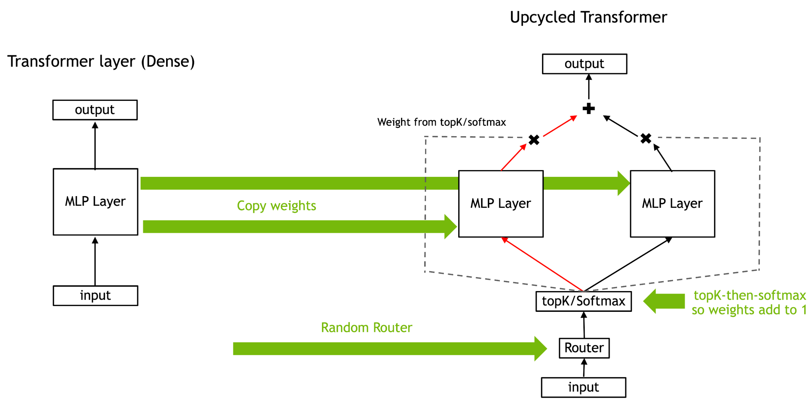

# Awesome-Efficient-MoE

  
  
  
  
  
 

This repository collects research papers and resources about Mixture-of-Experts (MoE) models and their efficient variants. MoE is a machine learning technique that divides a complex task among multiple "expert" neural networks, each specializing in handling different aspects of the input space, coordinated by a gating network that decides which expert(s) to use for each input. The contents of papers are in both Chinese and English.

MoE models have gained significant attention in recent years due to their:

- **Scalability**: Ability to scale model capacity without proportionally increasing computation
- **Efficiency**: Selective activation of only relevant experts for each input
- **Specialization**: Different experts can learn to handle different types of inputs
- **Adaptability**: Dynamic routing of inputs to the most appropriate experts

This collection focuses particularly on methods to make MoE models more efficient through various techniques like pruning, quantization, decomposition and acceleration, making them more practical for real-world applications.

## Table of Contents

- [Sparse Mixture-of-Experts](#sparse-moe)
- [MoE Compression](#moe-compression)
  - [MoE Pruning](#moe-pruning)
  - [MoE Quantization](#moe-quantization)
  - [MoE Decomposition](#moe-decomposition)
  - [MoE Acceleration](#moe-acceleration)
- [MoE Survey](#moe-survey)
- [MoE Resources](#moe-resources)
- [MoE FAQ](#moe-faq)
- [Contributing](#contributing)

## Sparse Mixture-of-Experts

- Adaptive Mixtures of Local Experts

  

  - URL: https://watermark.silverchair.com/neco.1991.3.1.79.pdf
  - Author: Robert A. Jacobs, Michael I. Jordan, Stevven J. Nowlan, Geoffrey E. Hinton
  - Pub: Neural Computation 1991
  - Summary: This paper introduces a supervised learning method for modular networks composed of multiple expert networks. Each network specializes in a subset of the task, controlled by a gating network. It bridges modular multilayer networks and competitive learning models. The methodology ensures task-specific specialization, reducing interference and improving generalization. A vowel recognition task demonstrates the system's efficacy, showing faster learning and robust performance compared to traditional backpropagation networks.
  - 摘要: 本文提出了一种用于模块化网络的新型监督学习方法，该网络由多个专家网络组成，每个网络专注于任务的一部分，由一个门控网络进行控制。这种方法将模块化多层网络与竞争学习模型相结合，通过减少干扰和提高泛化能力实现任务特定的专业化，与传统的反向传播网络相比，该系统学习更快，性能更加稳健。

- Outrageously Large Neural Networks: The Sparsely-Gated Mixture-of-Experts Layer

  

  - Authors: Noam Shazeer, Azalia Mirhoseini, Krzysztof Maziarz, Andy Davis, Quoc Le, Geoffrey Hinton, Jeff Dean
  - Link: https://openreview.net/pdf?id=B1ckMDqlg
  - Summary: This ICLR 2017 paper introduces a Sparsely-Gated Mixture-of-Experts (MoE) layer to significantly increase the capacity of neural networks without proportionally increasing computational costs. The MoE layer consists of thousands of feed-forward sub-networks (experts). A trainable gating network selects a sparse combination of these experts for each input example. The authors address challenges associated with conditional computation, such as the inefficiency of branching on GPUs, the need for large batch sizes, network bandwidth limitations, and the need for sparsity-inducing loss terms. They achieve over 1000x capacity improvements with only minor computational efficiency losses. Applying the MoE convolutionally between stacked LSTM layers in language modeling and machine translation tasks, models with up to 137 billion parameters achieved state-of-the-art results on large benchmarks at lower computational cost than previous methods. The paper highlights the successful application of conditional computation to address the scaling limitations of traditional neural networks, particularly in the context of large datasets. Key improvements include overcoming the limitations of branching on GPUs, handling large batch sizes efficiently, mitigating network bandwidth bottlenecks, and managing sparsity through careful design and training.
  - 摘要：这篇 2017 年 ICLR 会议论文介绍了一种稀疏门控专家混合层（Sparsely-Gated Mixture-of-Experts，MoE），它可以在不成比例地增加计算成本的情况下显著提高神经网络的容量。MoE 层由数千个前馈子网络（专家）组成。一个可训练的门控网络为每个输入示例选择这些专家的稀疏组合。作者解决了与条件计算相关的挑战，例如 GPU 上分支的低效性、对大批量大小的需求、网络带宽限制以及对诱导稀疏性的损失项的需求。他们实现了超过 1000 倍的容量改进，而计算效率损失很小。在语言建模和机器翻译任务中，在堆叠的 LSTM 层之间卷积地应用 MoE，具有多达 1370 亿个参数的模型在大型基准测试中取得了最先进的结果，计算成本低于以前的方法。本文重点介绍了条件计算在解决传统神经网络的扩展限制方面的成功应用，尤其是在大型数据集的背景下。关键改进包括克服 GPU 上分支的限制，高效地处理大批量大小，减轻网络带宽瓶颈，并通过精心设计和训练来管理稀疏性。

## MoE Compression

### MoE Pruning

- Not All Experts are Equal: Efficient Expert Pruning and Skipping for Mixture-of-Experts Large Language Models
  

  - Authors: Xudong Lu, Qi Liu, Yuhui Xu, Aojun Zhou, Siyuan Huang, Bo Zhang, Junchi Yan, Hongsheng Li
  - Link: https://arxiv.org/pdf/2402.14800
  - Code: https://github.com/Lucky-Lance/Expert_Sparsity
  - Summary: This paper addresses the deployment challenges of Mixture-of-Experts (MoE) Large Language Models (LLMs) due to their large parameter size, even though they achieve high performance with fewer active parameters than traditional LLMs. Instead of relying on specialized hardware, the authors propose post-training expert-level sparsification techniques for improved deployment efficiency. They introduce two novel methods: **task-agnostic and task-specific expert pruning**, which permanently removes less important experts by minimizing token reconstruction loss layer-by-layer, and **dynamic expert skipping**, which allows for on-the-fly selection of active experts during inference to accelerate speed. The expert pruning method systematically explores combinations of experts to find the optimal set that minimizes loss. The dynamic skipping method complements pruning by further reducing active experts during inference. Experiments on Mixtral 8x7B (Instruct) models demonstrate significant reductions in memory usage and increases in inference speed while maintaining satisfactory performance. The paper claims to be the first to introduce task-specific expert pruning for MoE LLMs.
  - 摘要：本文解决了混合专家（MoE）大型语言模型（LLM）的部署挑战，尽管它们比传统的 LLM 使用更少的活动参数就能达到更高的性能，但其巨大的参数规模仍然难以部署。该论文没有依赖专门的硬件，而是提出了训练后专家级稀疏化技术，以提高部署效率。他们引入了两种新颖的方法：**任务无关和任务相关的专家剪枝**，通过逐层最小化标记重建损失来永久移除不太重要的专家；以及**动态专家跳过**，允许在推理过程中动态选择活动专家以加快速度。专家剪枝方法系统地探索专家的组合，以找到最小化损失的最佳集合。动态跳过方法通过在推理过程中进一步减少活动专家来补充剪枝。在 Mixtral 8x7B (Instruct) 模型上的实验表明，在保持令人满意的性能的同时，显着减少了内存使用量并提高了推理速度。本文声称是第一个为 MoE LLM 引入任务特定专家剪枝的论文。

- SEER-MoE: Sparse Expert Efficiency through Regularization for Mixture-of-Experts

  

  - Authors: Alexandre Muzio, Alex Sun, Churan He
  - Link: https://arxiv.org/pdf/2404.05089
  - Summary: SEER-MoE is a two-stage framework designed to improve the memory and computational efficiency of pre-trained Mixture-of-Experts (MoE) models. The first stage employs expert pruning guided by a "heavy-hitters counting" strategy, identifying and removing less crucial experts to reduce the model's size. The second stage uses a regularization-based fine-tuning approach to mitigate accuracy loss from pruning and simultaneously decrease the number of activated experts during inference (reducing the Top-K). This fine-tuning adapts the top-K routing mechanism. The method is evaluated on the Mixtral 8x7b MoE model using SST-5 and MMLU benchmarks, demonstrating significant reductions in memory footprint and computational requirements with minimal accuracy degradation. The paper includes an ablation study analyzing design choices within each stage. The core innovation lies in the combined approach of heavy-hitters counting for pruning and regularization-based fine-tuning for Top-K adaptation, resulting in a more efficient and memory-friendly MoE model for inference.
  - 摘要：SEER-MoE 是一个两阶段框架，旨在提高预训练混合专家（MoE）模型的内存和计算效率。第一阶段采用专家剪枝，其指导策略为“高频计数”，识别并去除不太重要的专家以减小模型规模。第二阶段采用基于正则化的微调方法来减轻剪枝造成的精度损失，同时减少推理过程中激活的专家数量（减少 Top-K）。这种微调会调整 Top-K 路由机制。该方法在 Mixtral 8x7b MoE 模型上使用 SST-5 和 MMLU 基准进行了评估，证明了在内存占用和计算需求方面显著减少，同时精度下降最小。本文包括一个消融研究，分析了每个阶段的设计选择。核心创新在于将高频计数用于剪枝和基于正则化的微调用于 Top-K 自适应相结合的方法，从而产生一个更高效且更节省内存的 MoE 推理模型。

- MC-MoE: Mixture Compressor for Mixture-of-Experts LLMs Gains More
  

  - Label: `` ``
  - Authors: Wei Huang, Yue Liao, Jianhui Liu, Ruifei He, Haoru Tan, Shiming Zhang, Hongsheng Li, Si Liu, Xiaojuan Qi
  - Link: https://arxiv.org/html/2410.06270
  - Code: https://github.com/Aaronhuang-778/MC-MoE
  - Summary: This paper introduces MC-MoE, a training-free compression method for Mixture-of-Experts (MoE) Large Language Models (LLMs) that addresses the challenges of high memory consumption and computational overhead associated with MoE architectures. MC-MoE achieves extreme compression by leveraging the varying importance of experts and tokens. It employs a two-phase approach: 1) **Pre-Loading Mixed-Precision Quantization (PMQ):** This phase uses a Linear Programming (LP) problem to determine the optimal bit-width allocation for each expert based on factors reflecting their importance (activation reconstruction error, routing scores, and activated frequencies). This allows for efficient storage and loading of expert parameters. 2) **Online Dynamic Pruning (ODP):** During inference, ODP identifies and retains only the most important tokens, dynamically selecting activated experts for the remaining tokens. This further reduces the number of active parameters. Experiments show that MC-MoE achieves significant compression with minimal accuracy loss. For instance, at 2.54 bits per parameter, it compresses 76.6% of the model with only a 3.8% average accuracy drop. Dynamic inference further reduces activated parameters by 15% with less than a 0.6% performance decrease. Notably, MC-MoE even outperforms some 13B parameter dense LLMs, demonstrating the potential of mixture compression in surpassing both comparable and larger dense models.
  - 摘要：本文介绍了 MC-MoE，这是一种针对混合专家（MoE）大型语言模型（LLM）的免训练压缩方法，它解决了与 MoE 架构相关的内存消耗大和计算开销大的问题。MC-MoE 通过利用专家和标记的不同重要性来实现极端压缩。它采用两阶段方法：1) **预加载混合精度量化 (PMQ)：**此阶段使用线性规划 (LP) 问题来确定每个专家的最佳位宽分配，其依据是反映其重要性的因素（激活重建误差、路由分数和激活频率）。这允许高效地存储和加载专家参数。2) **在线动态剪枝 (ODP)：**在推理过程中，ODP 识别并仅保留最重要的标记，动态地为其余标记选择激活的专家。这进一步减少了活动参数的数量。实验表明，MC-MoE 在精度损失最小的前提下实现了显著的压缩。例如，在每个参数 2.54 位时，它压缩了 76.6% 的模型，平均精度仅下降了 3.8%。动态推理进一步将激活参数减少了 15%，性能下降不到 0.6%。值得注意的是，MC-MoE 甚至优于一些 130 亿参数的密集 LLM，这证明了混合压缩在超越同等规模和更大规模的密集模型方面的潜力。

- MoE-I2: Compressing Mixture of Experts Models through Inter-Expert Pruning and Intra-Expert Low-Rank Decomposition
  

  - Authors: Cheng Yang, Yang Sui, Jinqi Xiao, Lingyi Huang, Yu Gong, Yuanlin Duan, Wenqi Jia, Miao Yin, Yu Cheng, Bo Yuan
  - Link: https://arxiv.org/abs/2411.01016
  - Code: https://github.com/xiaochengsky/MoEI-2
  - Summary: The emergence of Mixture of Experts (MoE) LLMs has significantly advanced the development of language models. Compared to traditional LLMs, MoE LLMs outperform traditional LLMs by achieving higher performance with considerably fewer activated parameters. Despite this efficiency, their enormous parameter size still leads to high deployment costs. In this paper, we introduce a two-stage compression method tailored for MoE to reduce the model size and decrease the computational cost. First, in the inter-expert pruning stage, we analyze the importance of each layer and propose the Layer-wise Genetic Search and Block-wise KT-Reception Field with the non-uniform pruning ratio to prune the individual expert. Second, in the intra-expert decomposition stage, we apply the low-rank decomposition to further compress the parameters within the remaining experts. Extensive experiments on Qwen1.5-MoE-A2.7B, DeepSeek-V2-Lite, and Mixtral-8×7B demonstrate that our proposed methods can both reduce the model size and enhance inference efficiency while maintaining performance in various zero-shot tasks.
  - 摘要：混合专家（MoE）大语言模型的出现显著推进了语言模型的发展。与传统的大语言模型相比，MoE 大语言模型通过较少的激活参数实现了更高的性能。尽管具有这种效率，但其庞大的参数规模仍然导致部署成本高昂。在本文中，我们引入了一种专门针对 MoE 的两阶段压缩方法，以减少模型大小并降低计算成本。首先，在专家间剪枝阶段，我们分析每一层的重要性，并提出了具有非均匀剪枝比率的层级遗传搜索和块级 KT 感受野，用于剪枝单个专家。其次，在专家内分解阶段，我们应用低秩分解进一步压缩剩余专家中的参数。在 Qwen1.5-MoE-A2.7B、DeepSeek-V2-Lite 和 Mixtral-8×7B 上的大量实验表明，我们提出的方法既可以减少模型大小，又可以提高推理效率，同时在各种零样本任务中保持性能。

- Demystifying the Compression of Mixture-of-Experts Through a Unified Framework
  

  - Authors: Shwai He, Daize Dong, Liang Ding, Ang Li
  - Link: https://arxiv.org/pdf/2406.02500
  - Code: https://github.com/DaizeDong/Unified-MoE-Compression
  - Summary: This paper proposes a unified framework for compressing **Mixture-of-Experts (MoE)** models in large language models (LLMs). The framework addresses the redundancy and computational overhead inherent in MoE by integrating two complementary compression strategies: **Expert Slimming** and **Expert Trimming**. **Expert Slimming** focuses on compressing individual experts using techniques like **network pruning** and **quantization**. **Expert Trimming** involves structurally removing entire experts or groups of experts. The authors introduce novel aggressive **Expert Trimming** methods: **Layer Drop** (removing entire MoE layers) and **Block Drop** (removing both attention and MoE layers within transformer blocks). These methods are motivated by the observation that communication overhead and computation within MoE layers are significant bottlenecks. The framework is evaluated on Mixtral-8x7B and DeepSeek-MoE-16B, demonstrating significant improvements. **Quantization** is shown to be the most effective **Expert Slimming** technique, while **Layer Drop** and **Block Drop** outperform **Expert Drop** (removing individual experts) in terms of speed and memory reduction. The combined approach achieves a 6.05x speedup and reduces memory usage to 20.0GB while maintaining over 92% of the original performance on Mixtral-8x7B. The paper provides a comprehensive recipe for effectively compressing MoE models.

  - 摘要：本文提出了一种用于压缩大型语言模型（LLM）中**混合专家（MoE）**模型的统一框架。该框架通过整合两种互补的压缩策略来解决 MoE 模型中固有的冗余和计算开销：**专家精简（Expert Slimming）**和**专家修剪（Expert Trimming）**。**专家精简**侧重于使用**网络剪枝**和**量化**等技术来压缩单个专家。**专家修剪**涉及结构化地移除整个专家或专家组。作者引入了新颖的积极**专家修剪**方法：**层丢弃（Layer Drop）**（移除整个 MoE 层）和**块丢弃（Block Drop）**（移除 Transformer 块中的注意力层和 MoE 层）。这些方法的动机是观察到 MoE 层中的通信开销和计算是重要的瓶颈。该框架在 Mixtral-8x7B 和 DeepSeek-MoE-16B 上进行了评估，证明了显著的改进。结果表明，**量化**是最有效的**专家精简**技术，而**层丢弃**和**块丢弃**在速度和内存减少方面优于**专家丢弃（Expert Drop）**（移除单个专家）。组合方法在 Mixtral-8x7B 上实现了 6.05 倍的加速，并将内存使用量减少到 20.0GB，同时保持了 92%以上的原始性能。本文提供了一个有效压缩 MoE 模型的综合方案。

### Quantization

- QMoE: Practical Sub-1-Bit Compression of Trillion-Parameter Models
  

  - Authors: Elias Frantar, Dan Alistarh
  - Link: https://arxiv.org/pdf/2310.16795
  - Code: github.com/IST-DASLab/qmoe
  - Summary: This paper introduces QMoE, a framework for compressing and efficiently inferencing massive Mixture-of-Experts (MoE) models to less than 1 bit per parameter. QMoE addresses the memory challenges of trillion-parameter models like SwitchTransformer-c2048, achieving 10-20x compression (e.g., compressing the 1.6 trillion parameter model to under 160GB) with minimal accuracy loss and runtime overhead (under 5%). This is accomplished through a scalable compression algorithm, a custom compression format, and bespoke GPU decoding kernels for fast inference. The framework enables running trillion-parameter models on affordable commodity hardware. QMoE also presents a cuda kernel for fast decoding. It also allows for the offloading execution, which can dynamically load and unload experts from the GPU memory.
  - 摘要：本文介绍了 QMoE，这是一个用于压缩和高效推理大型混合专家（MoE）模型的框架，其压缩率低于每参数 1 比特。QMoE 解决了像 SwitchTransformer-c2048 这样万亿参数模型的内存挑战，实现了 10-20 倍的压缩（例如，将 1.6 万亿参数模型压缩到 160GB 以下），同时精度损失和运行时间开销最小（低于 5%）。这是通过可扩展的压缩算法、自定义压缩格式和用于快速推理的定制 GPU 解码内核来实现的。该框架能够在价格合理的消费级硬件上运行万亿参数模型。QMoE 还提出了一个用于快速解码的 CUDA Kernel。它还允许执行的卸载，可以动态加载和卸载专家到 GPU 内存中。

- Examining Post-Training Quantization for Mixture-of-Experts: A Benchmark
  

  - Authors: Pingzhi Li, Xiaolong Jin, Yu Cheng, Tianlong Chen
  - Link: https://arxiv.org/pdf/2406.08155
  - Code: https://github.com/UNITES-Lab/moe-quantization
  - Summary: This paper benchmarks post-training quantization techniques for Mixture-of-Experts (MoE) models, addressing the challenge of their high memory consumption despite computational efficiency. Direct application of existing quantization methods to MoE models yields suboptimal results due to the inherent sparsity of MoE's architecture. The authors explore several MoE structure-aware quantization heuristics with varying granularity (from MoE block to individual linear weights), finding that different MoE structures require different bit precisions for optimal performance. Key findings highlight that effective quantization necessitates considering the sparsity of MoE. The research introduces novel enhancements, a linear weight outlier scorer and an MoE block scorer, to better identify critical weights requiring higher bit allocation. Extensive benchmarking across two MoE models and six tasks validates these findings for both weight and activation quantization. Expert usage is a good heuristic to analyze the performance of MoE models. The authors also proposed a metric called `outlier-score` by estimating the relative importance of experts and then assigning different bit precisions to different experts.
  - 摘要：本文对混合专家（MoE）模型的训练后量化技术进行了基准测试，解决了尽管计算效率高但内存消耗大的挑战。由于 MoE 架构固有的稀疏性，直接将现有的量化方法应用于 MoE 模型会产生次优结果。作者探索了几种具有不同粒度的 MoE 结构感知量化启发式方法（从 MoE 块到单个线性权重），发现不同的 MoE 结构需要不同的位精度才能获得最佳性能。关键发现强调，有效的量化需要考虑 MoE 的稀疏性。该研究引入了新的增强功能，即线性权重异常值评分器和 MoE 块评分器，以更好地识别需要更高位分配的关键权重。在两个 MoE 模型和六个任务上的大量基准测试验证了这些发现对于权重量化和激活量化。专家使用情况是分析 MoE 模型性能的良好启发式方法。作者还提出了一种称为 `outlier-score` 的指标，通过估计专家的相对重要性并为其分配不同的位精度，从而更好地识别需要更高位分配的关键权重。

- MC-MoE: Mixture Compressor for Mixture-of-Experts LLMs Gains More
  

  - Label: `` ``
  - Authors: Wei Huang, Yue Liao, Jianhui Liu, Ruifei He, Haoru Tan, Shiming Zhang, Hongsheng Li, Si Liu, Xiaojuan Qi
  - Link: https://arxiv.org/html/2410.06270
  - Code: https://github.com/Aaronhuang-778/MC-MoE
  - Summary: This paper introduces MC-MoE, a training-free compression method for Mixture-of-Experts (MoE) Large Language Models (LLMs) that addresses the challenges of high memory consumption and computational overhead associated with MoE architectures. MC-MoE achieves extreme compression by leveraging the varying importance of experts and tokens. It employs a two-phase approach: 1) **Pre-Loading Mixed-Precision Quantization (PMQ):** This phase uses a Linear Programming (LP) problem to determine the optimal bit-width allocation for each expert based on factors reflecting their importance (activation reconstruction error, routing scores, and activated frequencies). This allows for efficient storage and loading of expert parameters. 2) **Online Dynamic Pruning (ODP):** During inference, ODP identifies and retains only the most important tokens, dynamically selecting activated experts for the remaining tokens. This further reduces the number of active parameters. Experiments show that MC-MoE achieves significant compression with minimal accuracy loss. For instance, at 2.54 bits per parameter, it compresses 76.6% of the model with only a 3.8% average accuracy drop. Dynamic inference further reduces activated parameters by 15% with less than a 0.6% performance decrease. Notably, MC-MoE even outperforms some 13B parameter dense LLMs, demonstrating the potential of mixture compression in surpassing both comparable and larger dense models.
  - 摘要：本文介绍了 MC-MoE，这是一种针对混合专家（MoE）大型语言模型（LLM）的免训练压缩方法，它解决了与 MoE 架构相关的内存消耗大和计算开销大的问题。MC-MoE 通过利用专家和标记的不同重要性来实现极端压缩。它采用两阶段方法：1) **预加载混合精度量化 (PMQ)：**此阶段使用线性规划 (LP) 问题来确定每个专家的最佳位宽分配，其依据是反映其重要性的因素（激活重建误差、路由分数和激活频率）。这允许高效地存储和加载专家参数。2) **在线动态剪枝 (ODP)：**在推理过程中，ODP 识别并仅保留最重要的标记，动态地为其余标记选择激活的专家。这进一步减少了活动参数的数量。实验表明，MC-MoE 在精度损失最小的前提下实现了显著的压缩。例如，在每个参数 2.54 位时，它压缩了 76.6% 的模型，平均精度仅下降了 3.8%。动态推理进一步将激活参数减少了 15%，性能下降不到 0.6%。值得注意的是，MC-MoE 甚至优于一些 130 亿参数的密集 LLM，这证明了混合压缩在超越同等规模和更大规模的密集模型方面的潜力。

### Decomposition

- MoE-I2: Compressing Mixture of Experts Models through Inter-Expert Pruning and Intra-Expert Low-Rank Decomposition
  
  - Authors: Cheng Yang, Yang Sui, Jinqi Xiao, Lingyi Huang, Yu Gong, Yuanlin Duan, Wenqi Jia, Miao Yin, Yu Cheng, Bo Yuan
  - Link: https://arxiv.org/abs/2411.01016
  - Code: https://github.com/xiaochengsky/MoEI-2
  - Summary: The emergence of Mixture of Experts (MoE) LLMs has significantly advanced the development of language models. Compared to traditional LLMs, MoE LLMs outperform traditional LLMs by achieving higher performance with considerably fewer activated parameters. Despite this efficiency, their enormous parameter size still leads to high deployment costs. In this paper, we introduce a two-stage compression method tailored for MoE to reduce the model size and decrease the computational cost. First, in the inter-expert pruning stage, we analyze the importance of each layer and propose the Layer-wise Genetic Search and Block-wise KT-Reception Field with the non-uniform pruning ratio to prune the individual expert. Second, in the intra-expert decomposition stage, we apply the low-rank decomposition to further compress the parameters within the remaining experts. Extensive experiments on Qwen1.5-MoE-A2.7B, DeepSeek-V2-Lite, and Mixtral-8×7B demonstrate that our proposed methods can both reduce the model size and enhance inference efficiency while maintaining performance in various zero-shot tasks.
  - 摘要：混合专家（MoE）大语言模型的出现显著推进了语言模型的发展。与传统的大语言模型相比，MoE 大语言模型通过较少的激活参数实现了更高的性能。尽管具有这种效率，但其庞大的参数规模仍然导致部署成本高昂。在本文中，我们引入了一种专门针对 MoE 的两阶段压缩方法，以减少模型大小并降低计算成本。首先，在专家间剪枝阶段，我们分析每一层的重要性，并提出了具有非均匀剪枝比率的层级遗传搜索和块级 KT 感受野，用于剪枝单个专家。其次，在专家内分解阶段，我们应用低秩分解进一步压缩剩余专家中的参数。在 Qwen1.5-MoE-A2.7B、DeepSeek-V2-Lite 和 Mixtral-8×7B 上的大量实验表明，我们提出的方法既可以减少模型大小，又可以提高推理效率，同时在各种零样本任务中保持性能。

### System Optimization

- Fast Inference of Mixture-of-Experts Language Models with Offloading
  

  - Authors: Artyom Eliseev, Denis Mazur
  - Link: https://arxiv.org/pdf/2312.17238
  - Code: Not available in the provided text.
  - Summary: This paper addresses the challenge of running large Mixture-of-Experts (MoE) language models on consumer hardware with limited GPU memory. MoE models, while offering faster token generation than dense models, are significantly larger due to their multiple "expert" layers. The authors focus on improving inference speed (token generation) for Mixtral-8x7B-Instruct, a MoE-based chat assistant, on desktop-grade hardware. Their approach leverages two key observations about MoE LLM behavior: 1) expert reuse between adjacent tokens, and 2) early layers' hidden states predicting subsequent layer expert usage. Based on these observations, they propose a novel offloading strategy that incorporates an LRU cache to minimize GPU-RAM communication and a predictive mechanism to overlap expert loading with computation. This strategy, combined with mixed quantization, enables interactive inference (2-3 tokens per second) of Mixtral-8x7B-Instruct on hardware like a T4, RTX 3060, and RTX 3080 Mobile. The paper details the implementation and its performance on various hardware configurations.
  - 摘要：本文解决了在具有有限 GPU 内存的消费级硬件上运行大型混合专家（MoE）语言模型的挑战。MoE 模型虽然比密集模型具有更快的令牌生成速度，但由于其多个“专家”层而规模显著更大。作者专注于提高 Mixtral-8x7B-Instruct（一个基于 MoE 的聊天助手）在桌面级硬件上的推理速度（令牌生成）。他们的方法利用了对 MoE LLM 行为的两个关键观察结果：1）相邻令牌之间专家重用，以及 2）早期层的隐藏状态预测后续层的专家使用情况。基于这些观察结果，他们提出了一种新颖的卸载策略，该策略结合了 LRU 缓存以最大限度地减少 GPU-RAM 通信，以及一种预测机制以将专家加载与计算重叠。这种策略与混合量化相结合，使得能够在 T4、RTX 3060 和 RTX 3080 Mobile 等硬件上进行交互式推理（每秒 2-3 个令牌）。本文详细介绍了该实现及其在各种硬件配置上的性能。

- MoNDE: Mixture of Near-Data Experts for Large-Scale Sparse Models
  
  - Authors: Taehyun Kim, Kwanseok Choi, Youngmock Cho, Jaehoon Cho, Hyuk-Jae Lee, Jaewoong Sim
  - Link: https://arxiv.org/pdf/2405.18832
  - Code: Not available
  - Pub: DAC2024
  - Summary: This paper introduces Mixture of Near-Data Experts (MoNDE), a near-data processing (NDP) solution designed to improve the inference efficiency of Mixture-of-Experts (MoE) large language models (LLMs). MoE LLMs often suffer from excessive memory requirements, forcing costly parameter transfers between secondary memory (CPU or SSD) and the GPU. MoNDE addresses this by transferring only the "hot" experts (frequently used) to the GPU, while processing "cold" experts (infrequently used) within the host memory's MoNDE NDP units. This shifts the data movement from large expert parameter transfers to smaller activation transfers, significantly reducing communication overhead. MoNDE employs an "Activation Movement" paradigm, where instead of moving entire expert parameters, only the activations from the attention layers are transferred to the MoNDE units for computation. The results are then transferred back to the GPU. A novel GPU-MoNDE load-balancing scheme further enhances performance by concurrently executing expert computations on both the GPU and MoNDE, exploiting the skewed activation distribution inherent in MoE. Experimental results demonstrate that MoNDE outperforms existing parameter offloading frameworks by up to 7.5x and 3.7x for encoder and decoder operations respectively, with a reported area overhead of 3.0 mm² for the MoNDE NDP units. The key is leveraging the observation that many experts process few tokens, making activation transfer far more efficient than parameter transfer in these cases.
  - 摘要：本文介绍了混合近数据专家（MoNDE），这是一种近数据处理（NDP）解决方案，旨在提高混合专家（MoE）大型语言模型（LLM）的推理效率。MoE LLM 通常存在内存需求过大的问题，导致在辅助内存（CPU 或 SSD）和 GPU 之间进行代价高昂的参数传输。MoNDE 通过仅将“热门”专家（频繁使用）传输到 GPU 来解决这个问题，同时在主机内存的 MoNDE NDP 单元中处理“冷门”专家（不频繁使用）。这将数据移动从大型专家参数传输转移到较小的激活传输，从而显著减少了通信开销。MoNDE 采用“激活移动”范例，其中，它不移动整个专家参数，而只将来自注意力层的激活传输到 MoNDE 单元进行计算。然后将结果传输回 GPU。一种新颖的 GPU-MoNDE 负载平衡方案通过同时在 GPU 和 MoNDE 上执行专家计算来进一步提高性能，利用了 MoE 中固有的倾斜激活分布。实验结果表明，MoNDE 在编码器和解码器操作方面的性能分别比现有的参数卸载框架高出 7.5 倍和 3.7 倍，MoNDE NDP 单元的面积开销为 3.0 mm²。关键在于利用这样的观察结果：许多专家处理的标记数量很少，在这种情况下，激活传输比参数传输效率高得多。

### Upcycling

- Branch-Train-MiX: Mixing Expert LLMs into a Mixture-of-Experts LLM
  

  - Authors: Sainbayar Sukhbaatar, Olga Golovneva, Vasu Sharma, Hu Xu, Xi Victoria Lin, Baptiste Rozière, Jacob Kahn, Daniel Li, Wen-tau Yih, Jason Weston, Xian Li
  - Link: https://arxiv.org/pdf/2403.07816v1
  - Code: Not available
  - Summary: This paper introduces **Branch-Train-MiX (BTX)**, a novel method for training **Large Language Models (LLMs)** with expertise in multiple specialized domains (e.g., coding, math reasoning, world knowledge). BTX leverages the advantages of both **Branch-Train-Merge (BTM)** and **Mixture-of-Experts (MoE)** approaches while mitigating their drawbacks. The method begins by branching from a **seed LLM**, creating multiple copies that are trained asynchronously and in parallel on different datasets, resulting in specialized **expert LLMs**. Unlike BTM, which simply merges these experts, BTX integrates the expert LLMs' **feedforward (FF)** parameters into a single MoE layer, averaging the remaining parameters (e.g., self-attention layers). A subsequent MoE-finetuning stage optimizes the **token-level routing** within the MoE layer. This approach achieves efficient training due to the embarrassingly parallel nature of expert training, reducing communication costs and improving throughput. Furthermore, the resulting unified model allows for further **supervised fine-tuning (SFT)** or **reinforcement learning from human feedback (RLHF)**, which are typically impossible with the BTM approach. The authors claim BTX achieves the best **accuracy-efficiency tradeoff** compared to alternative methods.
  - 摘要：本文介绍了一种新颖的训练大型语言模型（LLM）的方法，名为**Branch-Train-MiX (BTX)**，该方法旨在使 LLM 具备多个专业领域的专业知识（例如，编码、数学推理、世界知识）。BTX 结合了**Branch-Train-Merge (BTM)**和**Mixture-of-Experts (MoE)**方法的优点，同时减轻了它们的缺点。该方法首先从一个**种子 LLM**开始分支，创建多个副本，这些副本在不同的数据集上异步并行训练，从而产生专门的**专家 LLM**。与简单地合并这些专家的 BTM 不同，BTX 将专家 LLM 的**前馈(FF)**参数集成到单个 MoE 层中，对其余参数（例如，自注意力层）进行平均。随后的 MoE 微调阶段优化了 MoE 层中的**令牌级路由**。这种方法由于专家训练的并行性而实现了高效的训练，降低了通信成本并提高了吞吐量。此外，生成的统一模型允许进行进一步的**监督微调(SFT)**或**来自人类反馈的强化学习(RLHF)**，而这在 BTM 方法中通常是不可能的。作者声称，与其他方法相比，BTX 实现了最佳的**精度-效率权衡**。

- Branch-Train-Merge (BTM): Embarrassingly Parallel Training of Expert Language Models
  
  

  - Authors: Margaret Li, Suchin Gururangan, Tim Dettmers, Mike Lewis, Tim Althoff, Noah A. Smith, Luke Zettlemoyer
  - Link: https://arxiv.org/pdf/2208.03306
  - Code: Not available
  - Summary: This paper introduces **Branch-Train-Merge (BTM)**, a communication-efficient algorithm for training large language models (LLMs) in an **embarrassingly parallel** manner. Instead of training a single monolithic model, BTM trains a collection of independent **Expert Language Models (ELMs)**, each specialized in a different textual domain (e.g., scientific or legal text). These ELMs are trained independently on different subsets of data, eliminating the need for massive multi-node synchronization typical in traditional LLM training. The BTM process involves three steps: **Branching**, where a new ELM is initialized using a weighted average of parameters from existing, relevant ELMs; **Training**, where the new ELM is trained on data from its specialized domain using standard cross-entropy loss; and **Merging**, where the newly trained ELM is added to the existing set of ELMs. This allows for incremental model expansion and adaptation to new domains. The resulting model, termed **ELM FOREST**, can be used as an ensemble, averaging the predictions of all ELMs, or through parameter averaging to create a single, efficient inference model. Experiments demonstrate that ELM FORESTs trained with BTM outperform GPT-style Transformer LMs in both in-domain and out-of-domain perplexity, while controlling for training cost. The improvements are more pronounced in ELM FOREST ensembles but are also present when using parameter averaging. The study also highlights the importance of domain specialization; random data splits do not yield good results. Scaling BTM to 64 domains (192B tokens) resulted in a 22.4B parameter model that performed comparably to a Transformer LM trained with 2.5x more compute, suggesting significant potential for scaling to even larger models with increased parallelism. The paper includes detailed ablation studies analyzing different aspects of BTM and ELM initialization.

  - 摘要：本文介绍了**Branch-Train-Merge (BTM)**，一种用于以**高度并行**方式训练大型语言模型 (LLM) 的通信效率高的算法。BTM 不训练单个整体模型，而是训练一系列独立的**专家语言模型 (ELM)**，每个模型专门处理不同的文本领域（例如，科学或法律文本）。这些 ELM 在数据的不同子集上独立训练，消除了传统 LLM 训练中通常需要的海量多节点同步。BTM 过程包括三个步骤：**分支 (Branching)**，其中使用现有相关 ELM 的参数加权平均值来初始化新的 ELM；**训练 (Training)**，其中使用标准交叉熵损失在新 ELM 的专业领域数据上训练新 ELM；以及**合并 (Merging)**，其中将新训练的 ELM 添加到现有的 ELM 集中。这允许对模型进行增量扩展并适应新的领域。生成的模型，称为**ELM FOREST**，可以用作集成模型，平均所有 ELM 的预测，或者通过参数平均来创建单个高效的推理模型。实验表明，使用 BTM 训练的 ELM FOREST 在域内和域外困惑度方面都优于 GPT 风格的 Transformer LLM，同时控制了训练成本。改进在 ELM FOREST 集成模型中更为明显，但在使用参数平均时也存在。该研究还强调了领域专业化的重要性；随机数据分割不会产生良好的结果。将 BTM 扩展到 64 个领域（192B 个标记）产生了 22.4B 参数的模型，其性能与使用 2.5 倍计算量训练的 Transformer LLM 相当，这表明了通过增加并行性扩展到更大模型的巨大潜力。本文还包括详细的消融研究，分析了 BTM 和 ELM 初始化的不同方面。

- Skywork-MoE: A Deep Dive into Training Techniques for Mixture-of-Experts Language Models
  

  - Authors: Tianwen Wei, Bo Zhu, Liang Zhao, Cheng Cheng, Biye Li, Weiwei Lü, Peng Cheng, Jianhao Zhang, Xiaoyu Zhang, Liang Zeng, Xiaokun Wang, Yutuan Ma, Rui Hu, Shuicheng Yan, Han Fang, Yahui Zhou   Skywork Team, Kunlun Inc
  - Link: https://arxiv.org/html/2406.06563v1
  - Summary: This technical report details the training methodologies behind Skywork-MoE, a 146-billion parameter **Mixture-of-Experts (MoE)** large language model (LLM) with 16 experts. The model is **upcycled** from the authors' pre-existing Skywork-13B model, and the paper explores the comparative advantages of upcycling versus training from scratch. The authors find that the optimal approach depends on both the performance of the existing dense checkpoints and the available training budget. Two key novel training techniques are introduced: **gating logit normalization**, which improves expert diversification, and **adaptive auxiliary loss coefficients**, enabling layer-specific adjustment of auxiliary losses. Skywork-MoE was trained on a condensed subset of the SkyPile corpus and demonstrates strong performance across various benchmarks, showcasing the effectiveness of the proposed techniques. The architecture builds upon the **Switch Transformer** design, utilizing MoE to replace some or all feed-forward networks (FFNs) within the transformer architecture. The **gating mechanism**, employing a softmax function, dynamically routes tokens to the most relevant experts based on their embeddings.
  - 摘要：这份技术报告详细介绍了 Skywork-MoE 的训练方法，Skywork-MoE 是一个具有 1460 亿参数和 16 个专家的高性能**混合专家（MoE）**大型语言模型（LLM）。该模型是从作者先前开发的 Skywork-13B 模型**升级**而来的，本文探讨了升级与从头开始训练的比较优势。作者发现，最佳方法取决于现有密集检查点的性能和可用的训练预算。报告介绍了两种关键的新型训练技术：**门控 logit 归一化**，它提高了专家的多样性，以及**自适应辅助损失系数**，它能够对不同层的辅助损失进行特定层的调整。Skywork-MoE 在 SkyPile 语料库的精简子集上进行了训练，并在各种基准测试中表现出强大的性能，这展示了所提出技术的有效性。该架构建立在**Switch Transformer**设计的基礎上，利用 MoE 替换 Transformer 架构中部分或全部的前馈神经网络（FFNs）。**门控机制**采用 softmax 函数，根据词嵌入动态地将词元路由到最相关的专家。

- Sparse Upcycling: Training Mixture-of-Experts from Dense Checkpoints
  

  - Authors: Aran Komatsuzaki, Joan Puigcerver, James Lee-Thorp, Carlos Riquelme, Basil Mustafa, Joshua Ainslie, Yi Tay, Mostafa Dehghani, Neil Houlsby
  - Link: https://arxiv.org/pdf/2212.05055
  - Code: https://github.com/google-research/vmoe (Vision) and https://github.com/google-research/t5x/tree/main/t5x/contrib/moe (Language)
  - Summary: This paper introduces **sparse upcycling**, a method for efficiently training **Mixture-of-Experts (MoE)** models by initializing them from pre-trained **dense** checkpoints. Instead of training large models from scratch, which is computationally expensive, this technique leverages the knowledge embedded in existing dense models to significantly reduce training costs. The authors demonstrate that by upcycling pre-trained T5 (**language**) and Vision Transformer (**vision**) models, they achieve superior performance compared to both their dense counterparts and sparse models trained from scratch, using only approximately 50% of the original training cost. The method involves a "model surgery" process to effectively transfer knowledge from the dense model to the sparse MoE architecture, mitigating the performance drop typically associated with architectural changes. Experiments on SuperGLUE (language) and ImageNet (vision) benchmarks show substantial performance gains with a modest increase in training budget (between 10% and 60% of the original training cost). This technique is particularly beneficial when resources are limited or when exploring the trade-offs between dense and MoE models, allowing for efficient exploration of large-scale model architectures.
  - 摘要：本文介绍了一种高效训练**混合专家（MoE）**模型的方法——**稀疏升级**，该方法通过从预训练的**密集**检查点初始化 MoE 模型来实现。与从头开始训练大型模型（计算成本很高）相比，这种技术利用现有密集模型中嵌入的知识来显著降低训练成本。作者证明，通过升级预训练的 T5（**语言**）和 Vision Transformer（**视觉**）模型，他们实现了优于其密集对应模型和从头开始训练的稀疏模型的性能，而仅使用了大约 50% 的原始训练成本。该方法涉及一个“模型手术”过程，以有效地将知识从密集模型转移到稀疏 MoE 架构，从而减轻通常与架构更改相关的性能下降。在 SuperGLUE（语言）和 ImageNet（视觉）基准测试上的实验表明，在适度增加训练预算的情况下（原始训练成本的 10% 到 60% 之间），性能有了显著提高。当资源有限或探索密集模型和 MoE 模型之间的权衡时，这种技术特别有用，允许高效地探索大型模型架构。

- LLaMA-MoE: Building Mixture-of-Experts from LLaMA with Continual Pre-training
  

  - Authors: Tong Zhu, Xiaoye Qu, Daize Dong, Jiacheng Ruan, Jingqi Tong, Conghui He, Yu Cheng
  - Link: https://arxiv.org/pdf/2406.16554
  - Code: https://github.com/pjlab-sys4nlp/llama-moe
  - Pub: EMNLP 2024 main
  - Summary: This paper presents LLaMA-MoE, a novel approach to building **Mixture-of-Experts (MoE)** models from existing dense large language models (LLMs), specifically using the LLaMA-2 7B model as a base. Instead of training an MoE model from scratch, which is computationally expensive and unstable, the authors propose a two-stage process: (1) **Expert Construction**, where the **Feed-Forward Networks (FFNs)** of the LLaMA model are partitioned into multiple **experts**, and (2) **Continual Pre-training**, where the resulting MoE model and additional **gate networks** (which route input tokens to the appropriate experts) are further trained on a large dataset (200B tokens). The paper explores various methods for expert construction, focusing on different **splitting methods** for the FFNs (including non-overlapping random splitting, which proved most effective), and different **data sampling strategies** for continual pre-training (comparing **dynamic** and **static** approaches, with static domain weight proportion proving superior). The resulting LLaMA-MoE models, such as LLaMA-MoE-3.5B, achieve performance superior to dense models with a similar number of activated parameters, demonstrating the effectiveness of this approach to building efficient and powerful MoE LLMs. The key innovation lies in adapting MoE to a decoder-only architecture (like LLaMA) and employing continual pre-training to overcome the performance drop often associated with converting a dense model to a sparse MoE model.

  - 摘要：本文提出了 LLaMA-MoE，一种从现有的稠密大型语言模型（LLM）构建**混合专家（MoE）**模型的新方法，特别地，使用 LLaMA-2 7B 模型作为基础。该方法并非从头开始训练 MoE 模型（这在计算上代价高昂且不稳定），而是提出了一个两阶段的过程：（1）**专家构建**，其中 LLaMA 模型的**前馈网络（FFN）**被划分为多个**专家**；（2）**持续预训练**，其中生成的 MoE 模型和额外的**门网络**（将输入 token 路由到合适的专家）在大型数据集（2000 亿个 token）上进行进一步训练。本文探讨了各种专家构建方法，重点关注 FFN 的不同**分割方法**（包括非重叠随机分割，证明最有效），以及持续预训练的不同**数据采样策略**（比较**动态**和**静态**方法，静态域权重比例证明更优）。生成的 LLaMA-MoE 模型，例如 LLaMA-MoE-3.5B，其性能优于具有相似激活参数数量的稠密模型，证明了这种构建高效强大 MoE LLM 的方法的有效性。关键创新在于将 MoE 应用于解码器专用架构（如 LLaMA）并采用持续预训练来克服将稠密模型转换为稀疏 MoE 模型时经常出现的性能下降。

- Upcycling Large Language Models into Mixture of Experts
  
  - Authors: Ethan He, Abhinav Khattar, Ryan Prenger, Vijay Korthikanti, Zijie Yan, Tong Liu, Shiqing Fan, Ashwath Aithal, Mohammad Shoeybi, Bryan Catanzaro
  - Link: https://arxiv.org/html/2410.07524
  - Code: Not available
  - Summary: This paper explores efficient methods for **upcycling** pre-trained dense large language models (LLMs) into sparse **Mixture-of-Experts (MoE)** models. The authors conduct a large-scale study on billion-parameter LLMs, focusing on optimizing upcycling techniques and hyperparameters. Key contributions include: a novel "**virtual group**" initialization scheme and weight scaling approach improving loss by 1.5%; a comparison of **softmax-then-topK** and **topK-then-softmax** expert routing methods, favoring the former; an analysis of the benefits of higher granularity MoEs and higher topK values; and a demonstration that upcycling outperforms continued dense model training. Specifically, upcycling the Nemotron-4 15B model on 1 trillion tokens yielded a 67.6% MMLU score, surpassing the 65.3% achieved by continued training of the same model on the same data. The work utilizes Megatron-LM4 for upcycling and training, focusing on MoEs applied to the transformer's MLP layer to maximize efficiency. The paper provides practical recommendations and best practices for upcycling billion-parameter LLMs, contributing to the advancement of large-scale MoE model development.
  - 摘要：本文探讨了将预训练的密集型大型语言模型（LLM）高效地升级到稀疏**混合专家（MoE）**模型的方法。作者对数十亿参数的 LLM 进行了大规模研究，重点是优化升级技术和超参数。主要贡献包括：一种新颖的“**虚拟组**”初始化方案和权重缩放方法，将损失提高了 1.5%；比较了**softmax-then-topK**和**topK-then-softmax**专家路由方法，前者更胜一筹；分析了更高粒度 MoE 和更高 topK 值的优势；以及证明了升级优于持续密集模型训练。具体来说，在 1 万亿个 token 上对 Nemotron-4 15B 模型进行升级，获得了 67.6%的 MMLU 分数，超过了在相同数据上持续训练该模型所获得的 65.3%。这项工作利用 Megatron-LM4 进行升级和训练，重点是应用于 Transformer 的 MLP 层的 MoE，以最大限度地提高效率。本文为升级数十亿参数的 LLM 提供了实用建议和最佳实践，推动了大规模 MoE 模型发展。

## MoE Survey

## MoE Resources

- [Mixture of Experts (MoE) Explained](https://huggingface.co/blog/moe): A blog post from Hugging Face explaining MoE.
- [Survey on MoE](https://github.com/withinmiaov/A-Survey-on-Mixture-of-Experts): A survey on Mixture of Experts.

## FAQ

> Q: What is a Mixture of Experts (MoE) model?

A: A MoE model is a machine learning architecture that combines multiple "expert" neural networks, each specializing in different aspects of a task, with a gating network that routes inputs to the most appropriate experts.

> Q: What are the main advantages of MoE models?

A: Key advantages include:

- **Pretrained faster than dense model**
- Have **faster inference** compared to a model with the same number of parameters
- Increased model **capacity** without proportional compute costs
- Better task **specialization** through expert specialization
- **Faster training** and **better inference** under high-load scenarios

> Q: What are the challenges in implementing MoE models?

A: Common challenges include:

- Require high VRAM as all experts are loaded in memory
- Complex routing mechanisms and load balancing
- Training instability
- Communication overhead in distributed settings

> Q: How do MoE models compare to dense transformers?

A: MoE models can achieve better performance with similar or lower computational costs, but require more memory and have more complex training dynamics.

> Q: Why MoE can be pretrained faster than dense model?

A: From my experience in NAS, MoE can be treated as a way to decouple the weights. The more weights shared, the faster the model can be pretrained. Additionally, decoupling the weights can increase the model capacity.

> Q: How to choose the number of experts?

A: TBD

> Q: Why MoE is suitable for high-load scenarios? How does it work when inference?

A: TBD

## Contributing

We welcome contributions to this repository! If you have any resources, papers, or insights related to Mixture-of-Experts (MoE) models and their efficient variants, please consider contributing to this repository.

To contribute, please follow these steps:

1. Fork the repository.
2. Create a new branch for your changes.
3. Make your changes and ensure they are well-documented.
4. Submit a pull request with your changes.
