# Awesome-Efficient-MoE

  
  
  
  
  
 

This repository collects research papers and resources about Mixture-of-Experts (MoE) models and their efficient variants. MoE is a machine learning technique that divides a complex task among multiple "expert" neural networks, each specializing in handling different aspects of the input space, coordinated by a gating network that decides which expert(s) to use for each input. The contents of papers are in both Chinese and English.

**You can treat it as a blog, and I will update it regularly. If you want me to add some papers, please submit an issue or pull request.**

MoE models have gained significant attention in recent years due to their:

- **Scalability**: Ability to scale model capacity without proportionally increasing computation
- **Efficiency**: Selective activation of only relevant experts for each input
- **Specialization**: Different experts can learn to handle different types of inputs
- **Adaptability**: Dynamic routing of inputs to the most appropriate experts

This collection focuses particularly on methods to make MoE models more efficient through various techniques like pruning, quantization, decomposition and acceleration, making them more practical for real-world applications.

## Table of Contents

- [Sparse Mixture-of-Experts](#sparse-mixture-of-experts)
- [MoE Compression](#moe-compression)
  - [MoE Pruning](#moe-pruning)
  - [MoE Quantization](#moe-quantization)
  - [MoE Decomposition](#moe-decomposition)
  - [System Optimization](#system-optimization)
  - [Sparse Upcycling](#sparse-upcycling)
  - [Sparse Splitting](#sparse-splitting)
  - [Merging](#merging)
- [MoE Survey](#moe-survey)
- [MoE Resources](#moe-resources)
- [FAQ](#faq)
- [Contributing](#contributing)

## Sparse Mixture-of-Experts

- Adaptive Mixtures of Local Experts

  

    
  

  - Link: https://watermark.silverchair.com/neco.1991.3.1.79.pdf
  - Author: Robert A. Jacobs, Michael I. Jordan, Stevven J. Nowlan, Geoffrey E. Hinton
  - Pub: Neural Computation 1991
  - Summary: This paper introduces a supervised learning method for modular networks composed of multiple expert networks. Each network specializes in a subset of the task, controlled by a gating network. It bridges modular multilayer networks and competitive learning models. The methodology ensures task-specific specialization, reducing interference and improving generalization. A vowel recognition task demonstrates the system's efficacy, showing faster learning and robust performance compared to traditional backpropagation networks.
  - 摘要: 本文提出了一种用于模块化网络的新型监督学习方法，该网络由多个专家网络组成，每个网络专注于任务的一部分，由一个门控网络进行控制。这种方法将模块化多层网络与竞争学习模型相结合，通过减少干扰和提高泛化能力实现任务特定的专业化，与传统的反向传播网络相比，该系统学习更快，性能更加稳健。

- Speed Always Wins: A Survey on Efficient Architectures for Large   Language Models
  - Authors: Weigao Sun, Jiaxi Hu, Yucheng Zhou, et al.
  - Link: http://arxiv.org/pdf/2508.09834v1
  - Code: Not available
  - Summary: This survey paper by Sun et al. systematically reviews advancements in efficient architectures for Large Language Models (LLMs), particularly focusing on overcoming the computational challenges posed by traditional transformer models. The authors explore various innovative methods, including linear and sparse sequence modeling, efficient attention variants, and sparse mixture-of-experts (MoE) architectures, while also discussing their applications in multimodal contexts. By categorizing recent research and highlighting the implications for scalable AI systems, the paper provides a comprehensive blueprint aimed at guiding future developments in resource-efficient LLMs. #MixtureOfExperts #MoE #Efficiency
  - 摘要: 本文对大型语言模型（LLMs）高效架构进行了系统性调查，重点分析了传统Transformer架构的局限性及其在大规模训练和实际部署中的挑战。研究涵盖了线性和稀疏序列建模方法、有效的全注意力变体、稀疏混合专家模型以及结合这些技术的混合模型架构，探讨了这些技术在其他模态中的应用及其对可扩展、资源敏感基础模型开发的影响。通过对近期研究的分类，本调查为现代高效LLM架构提供了蓝图，旨在激励未来朝着更高效、多功能的人工智能系统的研究。  

- MoIIE: Mixture of Intra- and Inter-Modality Experts for Large Vision   Language Models
  - Authors: Dianyi Wang, Siyuan Wang, Zejun Li, et al.
  - Link: http://arxiv.org/pdf/2508.09779v1
  - Code: Not available
  - Summary: The research paper presents MoIIE, a novel Mixture of Intra- and Inter-Modality Experts architecture designed for Large Vision-Language Models (LVLMs) to enhance computational efficiency while maintaining performance. By employing a two-stage training strategy, MoIIE effectively routes tokens to both modality-specific and shared inter-modality experts, enabling the model to learn rich intra-modal features alongside cross-modal interactions. Extensive experiments demonstrate that MoIIE models with fewer activated parameters outperform existing state-of-the-art MoE-LLMs, showcasing significant advancements in both efficiency and effectiveness. #MixtureOfExperts #MoE #Efficiency
  - 摘要: 本文提出了一种新的混合专家模型MoIIE，旨在提高大规模视觉语言模型（LVLMs）在多模态任务中的性能和计算效率。通过为每个token引入基于模态的专家路由，MoIIE能够同时建模模态特定特征和跨模态关联。此外，研究还提出了一种简洁有效的两阶段训练策略，显著提升了模型的多模态能力。实验结果表明，MoIIE在参数激活数量较少的情况下，能够与现有的先进开源多模态模型相媲美或超越其性能。#混合专家 #MoE #效率#混合专家 #MoE #效率

- HierMoE: Accelerating MoE Training with Hierarchical Token Deduplication   and Expert Swap
  - Authors: Wenxiang Lin, Xinglin Pan, Lin Zhang, et al.
  - Link: http://arxiv.org/pdf/2508.09591v1
  - Code: Not available
  - Summary: The research paper presents HierMoE, a novel approach to accelerate the training of Mixture of Experts (MoE) models by addressing communication and load imbalance issues in distributed GPU systems. HierMoE employs two key techniques: hierarchical token deduplication to minimize communication traffic and expert swapping to evenly distribute workloads across GPUs. Experimental results demonstrate that HierMoE significantly enhances training efficiency, achieving up to 3.32 times faster communication and 1.27 times faster end-to-end training compared to existing MoE training systems. #MixtureOfExperts #MoE #Efficiency
  - 摘要: 本文提出了一种名为HierMoE的混合专家模型训练加速方法，通过两种拓扑感知技术——令牌去重和专家交换，来减少通信流量并平衡GPU之间的负载，从而提高训练效率。我们在Megatron-LM上实现了HierMoE原型，并在32-GPU集群上进行实验，结果表明，HierMoE在通信速度上提高了1.55到3.32倍，端到端训练速度提高了1.18到1.27倍，相较于现有的最先进MoE训练系统表现优异。 #混合专家 #MoE #效率

- MoE-TTS: Enhancing Out-of-Domain Text Understanding for   Description-based TTS via Mixture-of-Experts
  - Authors: Heyang Xue, Xuchen Song, Yu Tang, et al.
  - Link: http://arxiv.org/pdf/2508.11326v1
  - Code: Not available
  - Summary: The research paper presents MoE-TTS, a novel description-based text-to-speech (TTS) model aimed at improving the understanding of out-of-domain text descriptions, which often pose challenges for existing systems. By utilizing a modality-based mixture-of-experts (MoE) framework, MoE-TTS enhances a pre-trained large language model (LLM) with specialized weights for speech while keeping the LLM frozen during training, thereby effectively leveraging its pre-existing knowledge. Experimental results demonstrate that MoE-TTS outperforms even advanced commercial TTS products in generating more accurate speech outputs for diverse user-generated descriptions. #MixtureOfExperts #MoE #TTS #TextToSpeech #AI
  - 摘要: 本文提出了一种名为MoE-TTS的描述基础文本到语音（TTS）模型，旨在提升对域外文本描述的理解能力。通过采用基于模态的混合专家（MoE）方法，MoE-TTS在训练过程中保持原有的大型语言模型（LLM）不变，同时引入一组适应语音模态的专门权重，从而有效利用预训练的知识和文本理解能力。实验结果表明，MoE-TTS在生成更准确反映描述的语音方面表现优于现有的闭源商业产品。#混合专家 #MoE #效率

- Accelerating Edge Inference for Distributed MoE Models with   Latency-Optimized Expert Placement
  - Authors: Tian Wu, Liming Wang, Zijian Wen, et al.
  - Link: http://arxiv.org/pdf/2508.12851v1
  - Code: Not available
  - Summary: The research paper introduces DanceMoE, an innovative framework designed to optimize inference for Mixture-of-Experts (MoE) models in distributed, heterogeneous edge environments. By implementing an activation-aware expert placement algorithm, DanceMoE effectively minimizes cross-server communication and balances memory usage, significantly reducing inference latency by up to 30.6% compared to existing methods. The framework's lightweight migration mechanism further enhances its adaptability to varying workloads, demonstrating its potential to improve the efficiency of large language models in resource-constrained settings. #MixtureOfExperts #MoE #Efficiency
  - 摘要: 本文提出了一种名为DanceMoE的高效混合专家推理框架，旨在优化分布式环境中专家的放置，以应对资源受限的边缘计算挑战。该框架利用混合专家模型的稀疏性和工作负载局部性，设计了一种数据驱动的、关注激活的专家放置算法，从而在异构资源约束下实现高效的专家分配和低延迟推理。实验结果表明，DanceMoE在现代混合专家模型和广泛使用的数据集上，推理延迟降低了最高30.6%，并显著减少了通信开销，验证了其在协作边缘环境中的有效性。#混合专家 #MoE #效率

- Intern-S1: A Scientific Multimodal Foundation Model
  - Authors: Lei Bai, Zhongrui Cai, Maosong Cao, et al.
  - Link: http://arxiv.org/pdf/2508.15763v1
  - Code: Not available
  - Summary: The paper introduces Intern-S1, a multimodal Mixture-of-Experts (MoE) model designed to bridge the performance gap between open-source and closed-source models in scientific research. With 28 billion activated parameters and a total of 241 billion parameters, Intern-S1 is pre-trained on 5 trillion tokens, including a significant portion from scientific domains, and employs a novel Mixture-of-Rewards (MoR) approach during its reinforcement learning phase to enhance training efficiency across over 1000 tasks. The model demonstrates superior performance on comprehensive evaluation benchmarks, marking a significant advancement toward Artificial General Intelligence (AGI) in scientific applications. #MixtureOfExperts #MoE #AI #AGI #ReinforcementLearning
  - 摘要: 本文介绍了Intern-S1，一种专注于科学领域的多模态混合专家模型，旨在缩小开源模型与闭源模型在科学研究中的性能差距。该模型具有280亿个激活参数和2410亿个总参数，通过在5万亿个标记上进行持续预训练，特别是从科学领域获取的超过25亿个标记。Intern-S1在后续的训练阶段采用了离线和在线强化学习，并提出了混合奖励机制，以同时在1000多个任务上进行训练，最终在综合评估基准上展现出卓越的性能。#混合专家 #MoE #效率

- Jet-Nemotron: Efficient Language Model with Post Neural Architecture   Search
  - Authors: Yuxian Gu, Qinghao Hu, Shang Yang, et al.
  - Link: http://arxiv.org/pdf/2508.15884v1
  - Code: Not available
  - Summary: The research paper introduces Jet-Nemotron, a hybrid-architecture language model that leverages Post Neural Architecture Search (PostNAS) to enhance generation throughput while maintaining or exceeding the accuracy of leading full-attention models. By starting with a pre-trained full-attention model and freezing its MLP weights, the authors efficiently explore attention block designs through a four-component pipeline that optimizes layer placement, selects linear attention blocks, designs new attention mechanisms, and conducts hardware-aware hyperparameter searches. The Jet-Nemotron-2B model demonstrates significant performance improvements, achieving up to 53.6x generation throughput speedup and outperforming advanced MoE models on accuracy benchmarks like MMLU and MMLU-Pro, despite having a smaller scale. #MixtureOfExperts #MoE #Efficiency
  - 摘要: 本文介绍了一种新型混合架构语言模型Jet-Nemotron，该模型在生成速度上显著提升，同时在准确性上与领先的全注意力模型相当或更优。Jet-Nemotron采用了一种名为Post Neural Architecture Search（PostNAS）的新颖神经架构探索流程，通过冻结预训练全注意力模型的MLP权重，能够高效地探索注意力块设计。该模型在多个基准测试中表现出色，生成速度提升高达53.6倍，并在MMLU和MMLU-Pro上超越了许多先进的混合专家全注意力模型。 #混合专家 #MoE #效率

- OneCAT: Decoder-Only Auto-Regressive Model for Unified Understanding and   Generation
  - Authors: Han Li, Xinyu Peng, Yaoming Wang, et al.
  - Link: http://arxiv.org/pdf/2509.03498v1
  - Code: Not available
  - Summary: The research paper presents OneCAT, a novel decoder-only transformer model that integrates understanding, generation, and editing in a unified multimodal framework without relying on external components like Vision Transformers. Utilizing a modality-specific Mixture-of-Experts (MoE) structure and a multi-scale visual autoregressive mechanism, OneCAT achieves significant efficiency improvements and reduced decoding steps while maintaining state-of-the-art performance across various benchmarks. This work highlights the effectiveness of pure autoregressive modeling in advancing multimodal intelligence, setting new performance standards in the field. #MixtureOfExperts #MoE #Efficiency #MultimodalAI
  - 摘要: 本文介绍了OneCAT，一个统一的多模态模型，采用全新的纯解码器Transformer架构，能够无缝整合理解、生成和编辑功能。该框架通过独特的模态特定混合专家（MoE）结构，实现了在推理过程中无需外部组件（如视觉Transformer或视觉标记器），显著提高了处理高分辨率输入的效率。此外，OneCAT在大型语言模型（LLM）中开创了多尺度视觉自回归机制，显著减少了解码步骤，同时保持了最先进的性能。研究结果显示，纯自回归建模为统一多模态智能提供了强大的基础，OneCAT在多模态生成、编辑和理解的基准测试中超越了现有的开源模型，树立了新的性能标准。  

- SpikingBrain Technical Report: Spiking Brain-inspired Large Models
  - Authors: Yuqi Pan, Yupeng Feng, Jinghao Zhuang, et al.
  - Link: http://arxiv.org/pdf/2509.05276v1
  - Code: Not available
  - Summary: The research paper presents SpikingBrain, a family of brain-inspired large models aimed at addressing efficiency bottlenecks in mainstream Transformer-based language models, particularly for long-context processing. Key contributions include a novel model architecture featuring linear and hybrid-linear attention with adaptive spiking neurons, an efficient training pipeline, and system optimizations tailored for non-NVIDIA platforms. The resulting models, SpikingBrain-7B and SpikingBrain-76B, showcase significant improvements in training efficiency and inference performance, achieving results comparable to traditional Transformer models while utilizing only 150B tokens for continual pre-training. #MixtureOfExperts #MoE #Efficiency
  - 摘要: 本研究提出了SpikingBrain，一个基于脑启发的大型模型系列，旨在解决主流Transformer模型在长序列处理中的效率瓶颈。通过采用线性和混合线性注意力架构、优化的训练算法以及针对MetaX硬件的系统工程，SpikingBrain展示了在非NVIDIA平台上进行大规模语言模型开发的可行性。实验结果表明，SpikingBrain模型在长序列训练效率上显著提升，并在推理过程中实现了部分常量内存和事件驱动的脉冲行为，表现出与开源Transformer基线相当的性能。#混合专家 #MoE #效率#混合专家 #MoE #效率

- CAME-AB: Cross-Modality Attention with Mixture-of-Experts for Antibody   Binding Site Prediction
  - Authors: Hongzong Li, Jiahao Ma, Zhanpeng Shi, et al.
  - Link: http://arxiv.org/pdf/2509.06465v1
  - Code: Not available
  - Summary: The research paper presents CAME-AB, a novel framework for antibody binding site prediction that leverages a Mixture-of-Experts (MoE) architecture combined with Cross-modality Attention. By integrating five biologically relevant modalities into a unified multimodal representation and employing an adaptive modality fusion module, CAME-AB enhances cross-modal reasoning and feature specialization. The framework demonstrates superior performance over existing methods on benchmark datasets, achieving improved prediction accuracy through techniques like supervised contrastive learning and stochastic weight averaging. #MixtureOfExperts #MoE #AntibodyBinding #ComputationalImmunology #DeepLearning
  - 摘要: 本文提出了一种新颖的跨模态注意力框架CAME-AB，结合混合专家模型（MoE）用于抗体结合位点预测，解决了现有方法在特征表示和预测上的双重限制。CAME-AB整合了五种生物学基础的模态，采用自适应模态融合模块动态加权每种模态，并结合Transformer编码器与MoE模块以增强特征专业化和能力扩展。此外，通过监督对比学习目标优化潜在空间几何形状，提高了模型的优化稳定性和泛化能力。实验结果显示，CAME-AB在多项基准抗体-抗原数据集上显著优于强基线。  

- Steering MoE LLMs via Expert (De)Activation
  - Authors: Mohsen Fayyaz, Ali Modarressi, Hanieh Deilamsalehy, et al.
  - Link: http://arxiv.org/pdf/2509.09660v1
  - Code: Not available
  - Summary: The paper introduces SteerMoE, a novel framework for steering Mixture-of-Experts (MoE) in Large Language Models (LLMs) by detecting and controlling behavior-linked experts based on their activation patterns. This method allows for the selective (de)activation of experts during inference to enhance model behaviors such as safety and faithfulness, achieving improvements of up to 20% in safety and 27% in faithfulness across various benchmarks without the need for retraining. The findings also reveal vulnerabilities, as the framework can be exploited in adversarial settings, leading to significant drops in safety when combined with existing jailbreak techniques. #MixtureOfExperts #MoE #Efficiency
  - 摘要: 本研究提出了SteerMoE框架，通过检测和控制与行为相关的专家，来引导混合专家模型（MoE）在大型语言模型（LLM）中的表现。我们的方法能够识别在对比行为的输入对中具有不同激活模式的专家，并通过在推理过程中选择性地（去）激活这些专家来控制模型的行为，如忠实性和安全性，而无需重新训练或修改权重。在11个基准测试和6个LLM上，我们的引导方法提高了安全性和忠实性，分别达到+20%和+27%。在对抗攻击模式下，该方法单独降低安全性41%，与现有的越狱方法结合使用时则完全绕过所有安全防护，揭示了隐藏在专家中的对齐伪装的新维度。  
#混合专家 #MoE #效率#混合专家 #MoE #效率#混合专家 #MoE #效率

- MoEC: Mixture of Expert Clusters
  - Authors: Yuan Xie, Shaohan Huang, Tianyu Chen, Furu Wei
  - Link: https://arxiv.org/pdf/2207.09094
  - Code: Not available
  - Summary: This paper introduces Mixture of Expert Clusters (MoEC), a novel approach to improve the performance and scalability of **Mixture of Experts (MoE)** models. MoE models, while efficient in scaling model capacity, suffer from **overfitting** and **sparse data allocation** as the number of experts increases, especially with limited data. MoEC addresses these issues by introducing **variance-based constraints** on the routing stage to encourage the formation of **expert clusters**. Experts within a cluster are designed to be similar, sharing similar input tokens, while experts across clusters are more diverse. Furthermore, MoEC incorporates a **cluster-level expert dropout** strategy. This strategy randomly drops entire clusters of experts during training, ensuring that tokens are consistently routed to suitable experts even with the dropout. Experiments on **machine translation** and **natural language understanding** tasks demonstrate that MoEC improves performance and raises the performance upper bound for scaling up experts, mitigating overfitting and sparse data allocation problems observed in standard MoE models. The results show that MoEC successfully addresses the limitations of scaling up MoE models by improving the diversity of data allocation among experts and preventing overfitting.
  - 摘要：本文介绍了一种名为混合专家集群 (MoEC) 的新方法，用于改进混合专家 (MoE) 模型的性能和可扩展性。尽管 MoE 模型在扩展模型容量方面效率很高，但随着专家数量的增加，尤其是在数据有限的情况下，它们会遭受过拟合和数据分配稀疏的问题。MoEC 通过在路由阶段引入基于方差的约束来解决这些问题，从而鼓励形成专家集群。集群内的专家设计为相似，共享相似的输入标记，而跨集群的专家则更加多样化。此外，MoEC 还包含了一个集群级专家 dropout 策略。该策略在训练期间随机丢弃整个专家集群，确保即使在 dropout 情况下，标记也始终被路由到合适的专家。在机器翻译和自然语言理解任务上的实验表明，MoEC 提高了性能，并提高了扩展专家数量的性能上限，从而减轻了在标准 MoE 模型中观察到的过拟合和数据分配稀疏问题。结果表明，MoEC 通过改善专家之间的数据分配多样性和防止过拟合，成功地解决了扩展 MoE 模型的局限性。

- OpenMoE: An Early Effort on Open Mixture-of-Experts Language Models

  - Authors: Fuzhao Xue, Zian Zheng, Yao Fu, Jinjie Ni, Zangwei Zheng, Wangchunshu Zhou, Yang You
  - Link: https://arxiv.org/html/2402.01739
  - Code: Not available in the provided text.
  - Summary: This paper introduces OpenMoE, a series of open-sourced and reproducible **decoder-only Mixture-of-Experts (MoE)** large language models (LLMs). The models range from 650M to 34B parameters and were trained on datasets of up to 1 trillion tokens. The authors demonstrate that MoE-based LLMs offer a potentially more **cost-effective** trade-off compared to dense LLMs. A key contribution is an in-depth analysis of the MoE routing mechanisms, revealing three significant findings: **Context-Independent Specialization** (routing primarily based on token IDs), **Early Routing Learning** (token-to-expert assignments determined early in training and remaining largely unchanged), and **Drop-towards-the-End** (tokens later in a sequence are more likely to be dropped, impacting performance on sequential tasks). These findings highlight potential limitations of current MoE designs, particularly for tasks like multi-turn conversations. The paper also explores advanced training strategies, including using a substantial proportion of code data (up to 52.25%) and the **UL2 training objective**. OpenMoE models, specifically OpenMoE-8B/32E, achieved comparable performance to dense models like OpenLLaMA-3B and TinyLLaMA-1.1B, with even better performance on single-turn conversations in MT-Bench. The authors conclude by proposing strategies to mitigate the identified issues and improve future MoE LLM designs, aiming to stimulate the growth of the open-source MoE community. Specific models released include OpenMoE-Base/16E (0.65B parameters), OpenMoE-8B/32E, OpenMoE-8B/32E-Chat (fine-tuned on WildChat), and OpenMoE-34B/32E. Intermediate checkpoints of OpenMoE-8B/32E are also released to facilitate further research.
  - 摘要：本文介绍了 OpenMoE，一系列开源且可复现的**仅解码器混合专家（MoE）**大型语言模型（LLM）。这些模型的参数量从 6.5 亿到 340 亿不等，并在高达 1 万亿个 token 的数据集上进行训练。作者证明了基于 MoE 的 LLM 与密集型 LLM 相比，具有更具**成本效益**的优势。一个关键贡献是对 MoE 路由机制的深入分析，揭示了三个重要发现：**上下文无关的特化**（主要基于 token ID 进行路由）、**早期路由学习**（token 到专家的分配在训练早期确定，并且基本保持不变）以及**结尾丢弃**（序列中较后的 token 更容易被丢弃，影响顺序任务的性能）。这些发现突出了当前 MoE 设计中的潜在局限性，特别是对于多轮对话等任务。本文还探讨了先进的训练策略，包括使用大量代码数据（高达 52.25%）和**UL2 训练目标**。OpenMoE 模型，特别是 OpenMoE-8B/32E，达到了与 OpenLLaMA-3B 和 TinyLLaMA-1.1B 等密集型模型相当的性能，在 MT-Bench 的单轮对话中甚至表现更好。作者最后提出了减轻已识别问题的策略并改进未来 MoE LLM 设计的策略，旨在促进开源 MoE 社区的发展。发布的具体模型包括 OpenMoE-Base/16E（6.5 亿参数）、OpenMoE-8B/32E、OpenMoE-8B/32E-Chat（在 WildChat 上微调）和 OpenMoE-34B/32E。还发布了 OpenMoE-8B/32E 的中间检查点以促进进一步的研究。

- Mixtral 8x7B: A Sparse Mixture of Experts Language Model

  

    
  

  - Authors: Albert Q. Jiang, Alexandre Sablayrolles, Antoine Roux, Arthur Mensch, etc.
  - Link: https://arxiv.org/pdf/2401.04088
  - Code: https://github.com/mistralai/mistral-src
  - Summary: This paper introduces Mixtral 8x7B, a **Sparse Mixture of Experts (SMoE)** language model based on the Mistral 7B architecture. The key difference is that each layer in Mixtral employs 8 **feedforward blocks** (**experts**). A **router network** selects two experts per token at each layer, resulting in each token accessing only a subset (13B) of the total 47B parameters during inference. Despite this sparsity, Mixtral, trained with a 32k token context window, matches or surpasses the performance of Llama 2 70B and GPT-3.5 across various benchmarks. It significantly outperforms Llama 2 70B in **mathematics**, **code generation**, and **multilingual** tasks. A fine-tuned instruction-following version, Mixtral 8x7B – Instruct, surpasses GPT-3.5 Turbo, Claude-2.1, Gemini Pro, and Llama 2 70B – chat model in human evaluations, showing reduced bias and a more balanced sentiment profile. Both base and instruct models are released under the Apache 2.0 license. The model architecture details include: `dim: 4096`, `n_layers: 32`, `head_dim: 128`, `hidden_dim: 14336`, `n_heads: 32`, `n_kv_heads: 8`, `context_len: 32768`, `vocab_size: 32000`, `num_experts: 8`, `top_k_experts: 2`. The Mixture of Experts layer uses a softmax over the top-k logits of a linear layer to determine the weights for combining expert outputs.
  - 摘要：本文介绍了 Mixtral 8x7B，一个基于 Mistral 7B 架构的**稀疏专家混合 (SMoE)** 大型语言模型。其主要区别在于 Mixtral 的每一层都使用了 8 个**前馈块**（**专家**）。一个**路由网络**在每一层为每个 token 选择两个专家，导致每个 token 在推理过程中只访问总参数的子集（130 亿参数），而总参数为 470 亿。尽管如此，Mixtral 在 32k token 的上下文窗口下训练，在各种基准测试中其性能与 Llama 2 70B 和 GPT-3.5 相匹配甚至超越。在**数学**、**代码生成**和**多语言**任务方面，它显著优于 Llama 2 70B。经过微调的指令遵循版本 Mixtral 8x7B – Instruct 在人工评估基准测试中超越了 GPT-3.5 Turbo、Claude-2.1、Gemini Pro 和 Llama 2 70B——聊天模型，展现出减少的偏差和更平衡的情感特征。基础模型和指令遵循模型都以 Apache 2.0 许可证发布。模型架构细节包括：`dim: 4096`，`n_layers: 32`，`head_dim: 128`，`hidden_dim: 14336`，`n_heads: 32`，`n_kv_heads: 8`，`context_len: 32768`，`vocab_size: 32000`，`num_experts: 8`，`top_k_experts: 2`。专家混合层使用线性层的 top-k logits 上的 softmax 来确定组合专家输出的权重。

- DeepSeekMoE: Towards Ultimate Expert Specialization in Mixture-of-Experts Language Models

  

    
  

  - Authors: Damai Dai, Chengqi Deng, Chenggang Zhao, R.X. Xu, Huazuo Gao, Deli Chen, Jiashi Li, Wangding Zeng, Xingkai Yu, Y. Wu, Zhenda Xie, Y.K. Li, Panpan Huang, Fuli Luo, Chong Ruan, Zhifang Sui, Wenfeng Liang
  - Link: https://arxiv.org/pdf/2401.06066
  - Code: https://github.com/deepseek-ai/DeepSeek-MoE
  - Summary: This paper introduces DeepSeekMoE, a novel **Mixture-of-Experts (MoE)** architecture designed to improve **expert specialization** in large language models (LLMs). Existing MoE architectures, like GShard, suffer from **knowledge hybridity** (experts learning diverse, overlapping knowledge) and **knowledge redundancy** (multiple experts learning the same knowledge). DeepSeekMoE addresses these issues through two key strategies: (1) **finer expert segmentation**: instead of activating the top-K experts out of N, it finely segments experts into mN and activates mK, allowing for more flexible combinations; and (2) **shared expert isolation**: Ks experts are designated as shared experts to capture common knowledge, reducing redundancy in the routed experts. Experiments show that DeepSeekMoE 2B (2 billion parameters) achieves comparable performance to GShard 2.9B (with 1.5x more expert parameters and computation). Furthermore, DeepSeekMoE 2B nearly matches the performance of its dense counterpart with the same total parameters. Scaling DeepSeekMoE to 16B parameters shows comparable performance to LLaMA2 7B with only about 40% of the computation. Preliminary results with a 145B parameter model demonstrate significant advantages over GShard, achieving performance comparable to a 67B parameter DeepSeek model while using only 28.5% (potentially 18.2%) of the computation. The paper highlights DeepSeekMoE's ability to achieve strong performance with significantly reduced computational costs compared to existing MoE and dense models.

  - 摘要：本文介绍了 DeepSeekMoE，这是一种新颖的**混合专家（MoE）**架构，旨在提高大型语言模型（LLM）中的**专家专业化**。现有的 MoE 架构，如 GShard，存在**知识混合性**（专家学习多样化、重叠的知识）和**知识冗余**（多个专家学习相同的知识）的问题。DeepSeekMoE 通过两种主要策略解决了这些问题：（1）**更精细的专家分割**：它不是从 N 个专家中激活前 K 个，而是将专家细分为 mN 个，并激活 mK 个，从而允许更灵活的激活专家组合；（2）**共享专家隔离**：Ks 个专家被指定为共享专家，以捕捉共同知识，减少路由专家的冗余。实验表明，DeepSeekMoE 2B（20 亿参数）达到了与 GShard 2.9B（专家参数和计算量是其 1.5 倍）相当的性能。此外，DeepSeekMoE 2B 几乎达到了与其具有相同总参数量的密集型模型相当的性能。将 DeepSeekMoE 扩展到 160 亿参数，其性能与 LLaMA2 7B 相当，但计算量只有大约 40%。使用 1450 亿参数模型的初步结果表明，与 GShard 相比具有显著优势，其性能与 670 亿参数的 DeepSeek 模型相当，而计算量仅为 28.5%（可能为 18.2%）。本文强调了 DeepSeekMoE 能够以比现有 MoE 和密集模型低得多的计算成本实现强大的性能。

- Qwen1.5-MoE-A2.7B: Matching 7B Model Performance with 1/3 Activated Parameters

  

    
  

  - Link: https://qwenlm.github.io/blog/qwen-moe/
  - Code: https://github.com/QwenLM/Qwen1.5
  - Summary: This blog post introduces Qwen1.5-MoE-A2.7B, a **Mixture-of-Experts (MoE)** model with only 2.7 billion activated parameters. Despite its significantly smaller size (approximately one-third the size of Qwen1.5-7B, which has 6.5 billion non-embedding parameters and 2.0 billion for Qwen1.5-MoE-A2.7B), it achieves comparable performance to state-of-the-art 7B models like Mistral 7B and Qwen1.5-7B on various benchmarks. The model achieves a 75% reduction in training costs and a 1.74x speedup in inference. Key architectural improvements include: **fine-grained experts** (partitioning a single FFN into multiple experts), an "**upcycling**" **initialization** method using a pre-trained Qwen-1.8B model with added randomness, and a **routing mechanism** incorporating both shared and routing-specific experts (4 shared and 60 routing experts with 4 activated). Benchmark results across MMLU, GSM8K, HumanEval, and a multilingual evaluation show performance on par with or exceeding other 7B models, and even outperforming the larger DeepSeekMoE 16B model in some cases. A chat model variant was also evaluated using MT-Bench.
  - 摘要：这篇博文介绍了 Qwen1.5-MoE-A2.7B，这是一个仅具有 27 亿激活参数的**混合专家（MoE）**模型。尽管其规模显著较小（大约是具有 65 亿非嵌入参数的 Qwen1.5-7B 模型的三分之一，Qwen1.5-MoE-A2.7B 为 20 亿），但在各种基准测试中，其性能与 Mistral 7B 和 Qwen1.5-7B 等最先进的 7B 模型相当。该模型将训练成本降低了 75%，推理速度提高了 1.74 倍。关键的架构改进包括：**细粒度专家**（将单个 FFN 划分为多个专家）、使用预训练的 Qwen-1.8B 模型并添加随机性的“**升级**”**初始化**方法，以及包含共享和特定于路由的专家的**路由机制**（4 个共享专家和 60 个路由专家，激活 4 个）。在 MMLU、GSM8K、HumanEval 和多语言评估中的基准测试结果表明，其性能与其他 7B 模型相当甚至超过，在某些情况下甚至超过更大的 DeepSeekMoE 16B 模型。还使用 MT-Bench 评估了聊天模型变体。

- Outrageously Large Neural Networks: The Sparsely-Gated Mixture-of-Experts Layer

  

    
  

  - Authors: Noam Shazeer, Azalia Mirhoseini, Krzysztof Maziarz, Andy Davis, Quoc Le, Geoffrey Hinton, Jeff Dean
  - Link: https://openreview.net/pdf?id=B1ckMDqlg
  - Summary: This ICLR 2017 paper introduces a Sparsely-Gated Mixture-of-Experts (MoE) layer to significantly increase the capacity of neural networks without proportionally increasing computational costs. The MoE layer consists of thousands of feed-forward sub-networks (experts). A trainable gating network selects a sparse combination of these experts for each input example. The authors address challenges associated with conditional computation, such as the inefficiency of branching on GPUs, the need for large batch sizes, network bandwidth limitations, and the need for sparsity-inducing loss terms. They achieve over 1000x capacity improvements with only minor computational efficiency losses. Applying the MoE convolutionally between stacked LSTM layers in language modeling and machine translation tasks, models with up to 137 billion parameters achieved state-of-the-art results on large benchmarks at lower computational cost than previous methods. The paper highlights the successful application of conditional computation to address the scaling limitations of traditional neural networks, particularly in the context of large datasets. Key improvements include overcoming the limitations of branching on GPUs, handling large batch sizes efficiently, mitigating network bandwidth bottlenecks, and managing sparsity through careful design and training.
  - 摘要：这篇 2017 年 ICLR 会议论文介绍了一种稀疏门控专家混合层（Sparsely-Gated Mixture-of-Experts，MoE），它可以在不成比例地增加计算成本的情况下显著提高神经网络的容量。MoE 层由数千个前馈子网络（专家）组成。一个可训练的门控网络为每个输入示例选择这些专家的稀疏组合。作者解决了与条件计算相关的挑战，例如 GPU 上分支的低效性、对大批量大小的需求、网络带宽限制以及对诱导稀疏性的损失项的需求。他们实现了超过 1000 倍的容量改进，而计算效率损失很小。在语言建模和机器翻译任务中，在堆叠的 LSTM 层之间卷积地应用 MoE，具有多达 1370 亿个参数的模型在大型基准测试中取得了最先进的结果，计算成本低于以前的方法。本文重点介绍了条件计算在解决传统神经网络的扩展限制方面的成功应用，尤其是在大型数据集的背景下。关键改进包括克服 GPU 上分支的限制，高效地处理大批量大小，减轻网络带宽瓶颈，并通过精心设计和训练来管理稀疏性。

- CuMo: Scaling Multimodal LLM with Co-Upcycled Mixture-of-Experts
  

    
  

  - Authors: Jiachen Li, Xinyao Wang, Sijie Zhu, Chia-Wen Kuo, Lu Xu, Fan Chen, Jitesh Jain, Humphrey Shi, Longyin Wen
  - Link: https://arxiv.org/pdf/2405.05949
  - Code: https://github.com/SHI-Labs/CuMo
  - Summary: This paper introduces CuMo, a novel approach to scaling **multimodal Large Language Models (LLMs)** by incorporating **co-upcycled Top-K sparsely-gated Mixture-of-Experts (MoE)** blocks into both the **vision encoder** and the **MLP connector**. Unlike previous scaling methods that focus on increasing data or using larger models, CuMo efficiently improves model capabilities from the vision side with negligible additional activated parameters during inference. The method involves pre-training the MLP blocks and then initializing each expert in the MoE block from these pre-trained blocks during **visual instruction tuning**. Auxiliary losses are used to ensure balanced expert loading. CuMo achieves state-of-the-art performance on various **VQA** and **visual-instruction-following benchmarks** across different model size groups, using only open-sourced datasets. Experiments show CuMo outperforms models like Mini-Gemini, LLaVA-NeXT, and even a private MM1 model (Figure 1). The architecture (Figure 2) integrates the MoE blocks into the CLIP vision encoder and the MLP connector, utilizing a Top-K router for expert selection. The key innovation is the "co-upcycling" process, leveraging pre-trained MLP weights to initialize the MoE experts, enhancing efficiency and stability during training.
  - 摘要：本文介绍了 CuMo，一种通过在**视觉编码器**和**MLP 连接器**中结合**共循环 Top-K 稀疏门控专家混合(MoE)**块来扩展**多模态大型语言模型(LLM)**的新方法。与之前专注于增加数据或使用更大模型的扩展方法不同，CuMo 有效地提高了视觉方面的模型能力，在推理过程中几乎没有增加额外的激活参数。该方法包括预训练 MLP 块，然后在**视觉指令微调**期间利用这些预训练块初始化 MoE 块中的每个专家。辅助损失用于确保专家负载平衡。CuMo 在不同模型规模组的各种**VQA**和**视觉指令遵循基准测试**中实现了最先进的性能，仅使用开源数据集。实验表明，CuMo 优于 Mini-Gemini、LLaVA-NeXT，甚至私有的 MM1 模型（图 1）。该架构（图 2）将 MoE 块集成到 CLIP 视觉编码器和 MLP 连接器中，利用 Top-K 路由器进行专家选择。“共循环”过程是关键创新，它利用预训练的 MLP 权重来初始化 MoE 专家，从而提高训练效率和稳定性。

- Mixture-of-Experts with Expert Choice Routing

  

    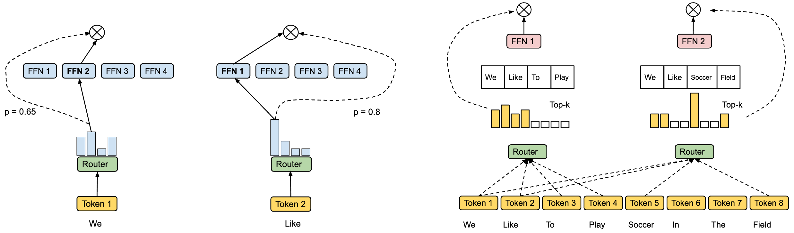
  

  - Authors: Yanqi Zhou, Tao Lei, Hanxiao Liu, Nan Du, Yanping Huang, Vincent Zhao, Andrew Dai, Zhifeng Chen, Quoc Le, and James Laudon (Google, Mountain View, CA, USA)
  - Link: https://arxiv.org/pdf/2202.09368
  - Summary: This paper introduces a novel **expert choice** routing method for **Mixture-of-Experts (MoE)** models to improve training efficiency and downstream performance. Unlike traditional MoE where each **token** selects its top-k **experts**, this method allows each expert to select its top-k tokens. This approach addresses the problem of **load imbalance** in conventional MoE, where some experts are under-trained while others are over-trained, leading to suboptimal performance. The proposed method inherently guarantees **load balancing** without requiring auxiliary loss functions. Experiments show that the expert choice method achieves more than 2x faster training convergence compared to Switch Transformer's top-1 and GShard's top-2 gating strategies in an 8B/64E (8 billion parameters, 64 experts) model. Furthermore, it demonstrates strong scaling with increasing numbers of experts (16 to 128) and superior performance on 11 downstream tasks from GLUE and SuperGLUE benchmarks, outperforming a T5 11B dense model in 7 out of these 11 tasks, even with lower activation costs. The paper highlights the **pitfalls of conventional MoE routing strategies**, focusing on the issue of **imbalanced expert utilization**, and proposes a solution that leads to significant improvements in both training speed and final model accuracy. The key contribution is the **heterogeneous expert choice routing**, which dynamically allocates **model parameters** based on learned token-to-expert importance.
  - 摘要：本文介绍了一种用于**混合专家（MoE）**模型的新型**专家选择**路由方法，以提高训练效率和下游性能。与传统的 MoE 模型中每个**token**选择其前 k 个**专家**不同，该方法允许每个专家选择其前 k 个 token。这种方法解决了传统 MoE 模型中**负载不平衡**的问题，在传统 MoE 模型中，一些专家训练不足，而另一些专家训练过度，导致次优性能。所提出的方法固有地保证了**负载平衡**，无需使用辅助损失函数。实验表明，与 Switch Transformer 的 top-1 和 GShard 的 top-2 门控策略相比，专家选择方法在 8B/64E（80 亿参数，64 个专家）模型中实现了超过 2 倍的训练收敛速度。此外，它还展示了随着专家数量（16 到 128）的增加而具有强大的扩展性，并在 GLUE 和 SuperGLUE 基准测试的 11 个下游任务中表现出优异的性能，即使在较低的激活成本下，也优于 T5 11B 密集模型中的 7 个任务。本文重点介绍了**传统 MoE 路由策略的缺陷**，重点关注**专家利用不平衡**的问题，并提出了一种解决方案，该解决方案可以显著提高训练速度和最终模型精度。其主要贡献是**异构专家选择路由**，它基于学习到的 token 到专家的重要性动态分配**模型参数**。
  - Note: EC Routing 可以不引入额外辅助 loss。

- ST-MoE: Designing Stable and Transferable Sparse Expert Models

  

    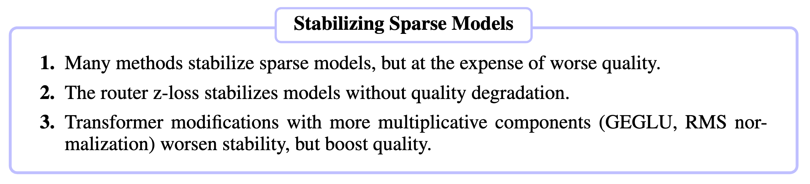
  

  - Authors: Barret Zoph*, Irwan Bello*†, Sameer Kumar, Nan Du, Yanping Huang, Jeff Dean, Noam Shazeer†, William Fedus\*
  - Link: https://arxiv.org/pdf/2202.08906
  - Code: https://github.com/tensorflow/mesh/blob/master/mesh_tensorflow/transformer/moe.py
  - Summary: This paper addresses the instability and uncertain fine-tuning quality issues hindering the advancement of **Mixture-of-Experts (MoE)** and **Switch Transformers** in natural language processing. The authors propose design guidelines for creating **stable and transferable sparse models**, focusing on improving training stability and fine-tuning performance. They investigate various techniques to enhance stability, including managing multiplicative interactions, noise addition, activation and gradient constraints, and precision format selection. The research also explores fine-tuning strategies specific to sparse models, such as fine-tuning a subset of parameters and handling dropped tokens. Ultimately, they scale a sparse model to 269B parameters (**ST-MoE-32B**), achieving comparable computational cost to a 32B dense encoder-decoder Transformer. This 269B parameter model achieves **state-of-the-art** performance on various transfer learning tasks including **reasoning**, **summarization**, **question answering**, and **adversarial tasks**, demonstrating the efficacy of their proposed design principles for building robust and high-performing sparse models. The paper further analyzes expert specialization within the model, observing specialization in encoder experts but a lack thereof in decoder experts. Extensive appendices detail additional experiments and architectural modifications.

  - 摘要：本文解决了阻碍**混合专家模型 (MoE)** 和**开关 Transformer** 在自然语言处理中发展的训练不稳定性和微调质量不确定性问题。作者提出了创建**稳定且可迁移的稀疏模型**的设计指南，重点是提高训练稳定性和微调性能。他们研究了各种增强稳定性的技术，包括管理乘法交互、添加噪声、激活和梯度约束以及精度格式选择。这项研究还探索了特定于稀疏模型的微调策略，例如微调一部分参数和处理丢弃的标记。最终，他们将稀疏模型扩展到 2690 亿个参数（**ST-MoE-32B**），实现了与 320 亿个参数的密集编码器-解码器 Transformer 相当的计算成本。这个 2690 亿参数的模型在各种迁移学习任务中取得了**最先进的**性能，包括**推理**、**摘要**、**问答**和**对抗性任务**，证明了他们提出的用于构建强大且高性能稀疏模型的设计原则的有效性。本文进一步分析了模型中的专家专业化，观察到编码器专家中的专业化，但解码器专家中缺乏专业化。大量的附录详细介绍了额外的实验和架构修改。

- MoCLE:Mixture of Cluster-Conditional LoRA Experts for Vision-Language Instruction Tuning

  

    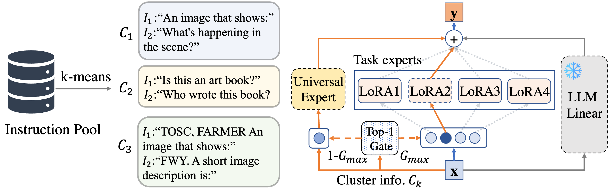
  

  - Authors: Yunhao Gou, Zhili Liu, Kai Chen, Lanqing Hong, Hang Xu, Aoxue Li, Xin Jiang, Zhenguo Li, Dit-Yan Yeung, James T. Kwok, Yu Zhang
  - Link: https://arxiv.org/pdf/2312.12379
  - Code: Not available
  - Summary: This paper addresses the problem of **negative transfer** in **multi-task instruction tuning** of Large Vision-Language Models (LVLMs). Traditional methods, which share all model parameters across diverse tasks, suffer from conflicts between tasks, leading to suboptimal performance. The authors propose **Mixture of Cluster-conditional LoRA Experts (MoCLE)**, a novel **Mixture of Experts (MoE)** architecture to mitigate this issue. MoCLE first clusters similar instructions using a pre-trained clustering model, assigning each cluster to a specialized **LoRA (Low-Rank Adaptation)** expert. This allows for task-specific parameter optimization, avoiding conflicts between dissimilar tasks. A **universal expert** is also included to handle novel, unseen instructions. Experiments on InstructBLIP and LLaVA datasets demonstrate that MoCLE significantly improves performance compared to training on the full dataset, showcasing the benefits of specialized experts and the effective handling of task diversity. The authors highlight that their approach automatically partitions tasks, overcoming the limitations of manual partitioning methods which require human expertise and struggle with generalization to unseen tasks. The results show that task experts trained on subsets of data outperform the model trained on the full dataset for the majority of downstream tasks, indicating the effectiveness of the proposed clustering and expert specialization.
  - 摘要：本文解决了大型视觉语言模型 (LVLMs) **多任务指令微调**中的**负迁移**问题。传统的共享所有模型参数的方法在处理不同任务时会产生冲突，导致性能欠佳。作者提出了**混合集群条件 LoRA 专家 (MoCLE)**，这是一种新颖的**混合专家 (MoE)** 架构，用于缓解这个问题。MoCLE 首先使用预训练的聚类模型对相似的指令进行聚类，并将每个集群分配给一个专门的**LoRA (低秩自适应)**专家。这允许进行特定于任务的参数优化，避免不同任务之间的冲突。还包括一个**通用专家**来处理新的、未见过的指令。在 InstructBLIP 和 LLaVA 数据集上的实验表明，与在完整数据集上训练相比，MoCLE 显著提高了性能，展示了专业专家和有效处理任务多样性的好处。作者强调，他们的方法自动划分任务，克服了手动划分方法的局限性，这些方法需要人工专业知识并且难以泛化到未见的任务。结果表明，在数据子集上训练的任务专家在大多数下游任务上的性能优于在完整数据集上训练的模型，这表明所提出的聚类和专家专业化的有效性。

- REMOE: Fully Differentiable Mixture-of-Experts with ReLU Routing

  

    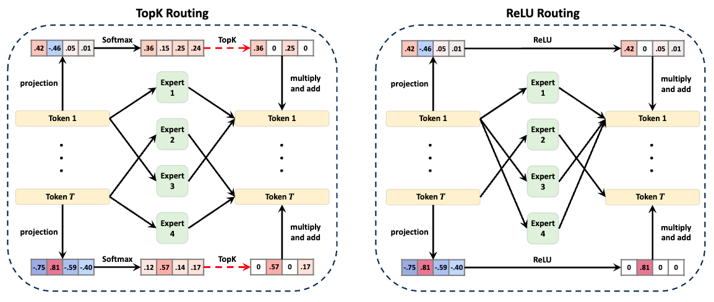
  

    
  

  - Authors: Xudong Lu, Qi Liu, Yuhui Xu, Aojun Zhou, Siyuan Huang, Bo Zhang, Junchi Yan, Hongsheng Li
  - Link: https://arxiv.org/pdf/2402.14800
  - Code: https://github.com/Lucky-Lance/Expert_Sparsity
  - Summary: This paper addresses the deployment challenges of Mixture-of-Experts (MoE) Large Language Models (LLMs) due to their large parameter size, even though they achieve high performance with fewer active parameters than traditional LLMs. Instead of relying on specialized hardware, the authors propose post-training expert-level sparsification techniques for improved deployment efficiency. They introduce two novel methods: **task-agnostic and task-specific expert pruning**, which permanently removes less important experts by minimizing token reconstruction loss layer-by-layer, and **dynamic expert skipping**, which allows for on-the-fly selection of active experts during inference to accelerate speed. The expert pruning method systematically explores combinations of experts to find the optimal set that minimizes loss. The dynamic skipping method complements pruning by further reducing active experts during inference. Experiments on Mixtral 8x7B (Instruct) models demonstrate significant reductions in memory usage and increases in inference speed while maintaining satisfactory performance. The paper claims to be the first to introduce task-specific expert pruning for MoE LLMs.
  - 摘要：本文解决了混合专家（MoE）大型语言模型（LLM）的部署挑战，尽管它们比传统的 LLM 使用更少的活动参数就能达到更高的性能，但其巨大的参数规模仍然难以部署。该论文没有依赖专门的硬件，而是提出了训练后专家级稀疏化技术，以提高部署效率。他们引入了两种新颖的方法：**任务无关和任务相关的专家剪枝**，通过逐层最小化标记重建损失来永久移除不太重要的专家；以及**动态专家跳过**，允许在推理过程中动态选择活动专家以加快速度。专家剪枝方法系统地探索专家的组合，以找到最小化损失的最佳集合。动态跳过方法通过在推理过程中进一步减少活动专家来补充剪枝。在 Mixtral 8x7B (Instruct) 模型上的实验表明，在保持令人满意的性能的同时，显着减少了内存使用量并提高了推理速度。本文声称是第一个为 MoE LLM 引入任务特定专家剪枝的论文。

- SEER-MoE: Sparse Expert Efficiency through Regularization for Mixture-of-Experts

  

    
  

  - Authors: Alexandre Muzio, Alex Sun, Churan He
  - Link: https://arxiv.org/pdf/2404.05089
  - Summary: SEER-MoE is a two-stage framework designed to improve the memory and computational efficiency of pre-trained Mixture-of-Experts (MoE) models. The first stage employs expert pruning guided by a "heavy-hitters counting" strategy, identifying and removing less crucial experts to reduce the model's size. The second stage uses a regularization-based fine-tuning approach to mitigate accuracy loss from pruning and simultaneously decrease the number of activated experts during inference (reducing the Top-K). This fine-tuning adapts the top-K routing mechanism. The method is evaluated on the Mixtral 8x7b MoE model using SST-5 and MMLU benchmarks, demonstrating significant reductions in memory footprint and computational requirements with minimal accuracy degradation. The paper includes an ablation study analyzing design choices within each stage. The core innovation lies in the combined approach of heavy-hitters counting for pruning and regularization-based fine-tuning for Top-K adaptation, resulting in a more efficient and memory-friendly MoE model for inference.
  - 摘要：SEER-MoE 是一个两阶段框架，旨在提高预训练混合专家（MoE）模型的内存和计算效率。第一阶段采用专家剪枝，其指导策略为“高频计数”，识别并去除不太重要的专家以减小模型规模。第二阶段采用基于正则化的微调方法来减轻剪枝造成的精度损失，同时减少推理过程中激活的专家数量（减少 Top-K）。这种微调会调整 Top-K 路由机制。该方法在 Mixtral 8x7b MoE 模型上使用 SST-5 和 MMLU 基准进行了评估，证明了在内存占用和计算需求方面显著减少，同时精度下降最小。本文包括一个消融研究，分析了每个阶段的设计选择。核心创新在于将高频计数用于剪枝和基于正则化的微调用于 Top-K 自适应相结合的方法，从而产生一个更高效且更节省内存的 MoE 推理模型。

- MC-MoE: Mixture Compressor for Mixture-of-Experts LLMs Gains More

  

    
  

  - Authors: Wei Huang, Yue Liao, Jianhui Liu, Ruifei He, Haoru Tan, Shiming Zhang, Hongsheng Li, Si Liu, Xiaojuan Qi
  - Link: https://arxiv.org/html/2410.06270
  - Code: https://github.com/Aaronhuang-778/MC-MoE
  - Summary: This paper introduces MC-MoE, a training-free compression method for Mixture-of-Experts (MoE) Large Language Models (LLMs) that addresses the challenges of high memory consumption and computational overhead associated with MoE architectures. MC-MoE achieves extreme compression by leveraging the varying importance of experts and tokens. It employs a two-phase approach: 1) **Pre-Loading Mixed-Precision Quantization (PMQ):** This phase uses a Linear Programming (LP) problem to determine the optimal bit-width allocation for each expert based on factors reflecting their importance (activation reconstruction error, routing scores, and activated frequencies). This allows for efficient storage and loading of expert parameters. 2) **Online Dynamic Pruning (ODP):** During inference, ODP identifies and retains only the most important tokens, dynamically selecting activated experts for the remaining tokens. This further reduces the number of active parameters. Experiments show that MC-MoE achieves significant compression with minimal accuracy loss. For instance, at 2.54 bits per parameter, it compresses 76.6% of the model with only a 3.8% average accuracy drop. Dynamic inference further reduces activated parameters by 15% with less than a 0.6% performance decrease. Notably, MC-MoE even outperforms some 13B parameter dense LLMs, demonstrating the potential of mixture compression in surpassing both comparable and larger dense models.
  - 摘要：本文介绍了 MC-MoE，这是一种针对混合专家（MoE）大型语言模型（LLM）的免训练压缩方法，它解决了与 MoE 架构相关的内存消耗大和计算开销大的问题。MC-MoE 通过利用专家和标记的不同重要性来实现极端压缩。它采用两阶段方法：1) **预加载混合精度量化 (PMQ)：**此阶段使用线性规划 (LP) 问题来确定每个专家的最佳位宽分配，其依据是反映其重要性的因素（激活重建误差、路由分数和激活频率）。这允许高效地存储和加载专家参数。2) **在线动态剪枝 (ODP)：**在推理过程中，ODP 识别并仅保留最重要的标记，动态地为其余标记选择激活的专家。这进一步减少了活动参数的数量。实验表明，MC-MoE 在精度损失最小的前提下实现了显著的压缩。例如，在每个参数 2.54 位时，它压缩了 76.6% 的模型，平均精度仅下降了 3.8%。动态推理进一步将激活参数减少了 15%，性能下降不到 0.6%。值得注意的是，MC-MoE 甚至优于一些 130 亿参数的密集 LLM，这证明了混合压缩在超越同等规模和更大规模的密集模型方面的潜力。

- Mixture-of-Experts Meets Instruction Tuning for LLMs

  

    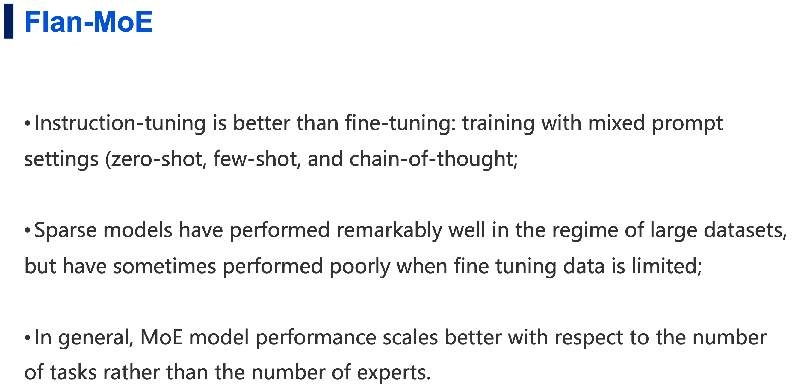
  

  - Authors: Sheng Shen, Le Hou, Yanqi Zhou, Nan Du, Shayne Longpre, Jason Wei, Hyung Won Chung, Barret Zoph, William Fedus, Xinyun Chen, Tu Vu, Yuexin Wu, Wuyang Chen, Albert Webson, Yunxuan Li, Vincent Zhao, Hongkun Yu, Kurt Keutzer, Trevor Darrell, Denny Zhou
  - Link: https://arxiv.org/pdf/2305.14705
  - Code: Not available
  - Summary: This paper investigates the combination of **Mixture-of-Experts (MoE)** and **instruction tuning** for **Large Language Models (LLMs)**. The authors find that MoE models, which reduce computational cost by using sparsely activated experts, benefit significantly more from instruction tuning than dense models. They conduct experiments across three setups: (i) direct **finetuning** on downstream tasks without instruction tuning; (ii) instruction tuning followed by in-context few-shot or zero-shot generalization; and (iii) instruction tuning followed by task-specific finetuning. Results show that while MoE models underperform dense models in the first setup, they surpass dense models of the same computational capacity in the latter two, especially when combined with instruction tuning. Their best model, **FLAN-MoE32B**, outperforms **FLAN-PALM 62B** on four benchmark tasks while using only one-third of the FLOPs. This demonstrates the crucial role of instruction tuning in enabling efficient scaling of MoE-based LLMs and suggests a reevaluation of design principles for high-performance language models using a task-agnostic learning framework.
  - 摘要：本文研究了**混合专家模型 (MoE)** 和**指令微调**结合用于**大型语言模型 (LLM)** 的方法。作者发现，通过使用稀疏激活的专家来降低计算成本的 MoE 模型比密集模型从指令微调中受益更多。他们进行了三种设置的实验：(i) 在没有指令微调的情况下直接对下游任务进行**微调**；(ii) 指令微调之后进行上下文少量样本或零样本泛化；以及 (iii) 指令微调之后进行特定任务的微调。结果表明，虽然在第一种设置下 MoE 模型的性能不如密集模型，但在后两种设置下，尤其是在结合指令微调的情况下，它们的性能超过了相同计算能力的密集模型。他们最好的模型 **FLAN-MoE32B** 在四个基准测试任务上优于 **FLAN-PALM 62B**，同时仅使用了三分之一的 FLOPs。这证明了指令微调在实现基于 MoE 的 LLM 的高效扩展中的关键作用，并建议重新评估使用任务无关学习框架的高性能语言模型的设计原则。

- MoE-I2: Compressing Mixture of Experts Models through Inter-Expert Pruning and Intra-Expert Low-Rank Decomposition

  

    
  

  - Authors: Cheng Yang, Yang Sui, Jinqi Xiao, Lingyi Huang, Yu Gong, Yuanlin Duan, Wenqi Jia, Miao Yin, Yu Cheng, Bo Yuan
  - Link: https://arxiv.org/abs/2411.01016
  - Code: https://github.com/xiaochengsky/MoEI-2
  - Summary: The emergence of Mixture of Experts (MoE) LLMs has significantly advanced the development of language models. Compared to traditional LLMs, MoE LLMs outperform traditional LLMs by achieving higher performance with considerably fewer activated parameters. Despite this efficiency, their enormous parameter size still leads to high deployment costs. In this paper, we introduce a two-stage compression method tailored for MoE to reduce the model size and decrease the computational cost. First, in the inter-expert pruning stage, we analyze the importance of each layer and propose the Layer-wise Genetic Search and Block-wise KT-Reception Field with the non-uniform pruning ratio to prune the individual expert. Second, in the intra-expert decomposition stage, we apply the low-rank decomposition to further compress the parameters within the remaining experts. Extensive experiments on Qwen1.5-MoE-A2.7B, DeepSeek-V2-Lite, and Mixtral-8×7B demonstrate that our proposed methods can both reduce the model size and enhance inference efficiency while maintaining performance in various zero-shot tasks.
  - 摘要：混合专家（MoE）大语言模型的出现显著推进了语言模型的发展。与传统的大语言模型相比，MoE 大语言模型通过较少的激活参数实现了更高的性能。尽管具有这种效率，但其庞大的参数规模仍然导致部署成本高昂。在本文中，我们引入了一种专门针对 MoE 的两阶段压缩方法，以减少模型大小并降低计算成本。首先，在专家间剪枝阶段，我们分析每一层的重要性，并提出了具有非均匀剪枝比率的层级遗传搜索和块级 KT 感受野，用于剪枝单个专家。其次，在专家内分解阶段，我们应用低秩分解进一步压缩剩余专家中的参数。在 Qwen1.5-MoE-A2.7B、DeepSeek-V2-Lite 和 Mixtral-8×7B 上的大量实验表明，我们提出的方法既可以减少模型大小，又可以提高推理效率，同时在各种零样本任务中保持性能。

- Demystifying the Compression of Mixture-of-Experts Through a Unified Framework

  

    
  

  - Authors: Shwai He, Daize Dong, Liang Ding, Ang Li
  - Link: https://arxiv.org/pdf/2406.02500
  - Code: https://github.com/DaizeDong/Unified-MoE-Compression
  - Summary: This paper proposes a unified framework for compressing **Mixture-of-Experts (MoE)** models in large language models (LLMs). The framework addresses the redundancy and computational overhead inherent in MoE by integrating two complementary compression strategies: **Expert Slimming** and **Expert Trimming**. **Expert Slimming** focuses on compressing individual experts using techniques like **network pruning** and **quantization**. **Expert Trimming** involves structurally removing entire experts or groups of experts. The authors introduce novel aggressive **Expert Trimming** methods: **Layer Drop** (removing entire MoE layers) and **Block Drop** (removing both attention and MoE layers within transformer blocks). These methods are motivated by the observation that communication overhead and computation within MoE layers are significant bottlenecks. The framework is evaluated on Mixtral-8x7B and DeepSeek-MoE-16B, demonstrating significant improvements. **Quantization** is shown to be the most effective **Expert Slimming** technique, while **Layer Drop** and **Block Drop** outperform **Expert Drop** (removing individual experts) in terms of speed and memory reduction. The combined approach achieves a 6.05x speedup and reduces memory usage to 20.0GB while maintaining over 92% of the original performance on Mixtral-8x7B. The paper provides a comprehensive recipe for effectively compressing MoE models.

  - 摘要：本文提出了一种用于压缩大型语言模型（LLM）中**混合专家（MoE）**模型的统一框架。该框架通过整合两种互补的压缩策略来解决 MoE 模型中固有的冗余和计算开销：**专家精简（Expert Slimming）**和**专家修剪（Expert Trimming）**。**专家精简**侧重于使用**网络剪枝**和**量化**等技术来压缩单个专家。**专家修剪**涉及结构化地移除整个专家或专家组。作者引入了新颖的积极**专家修剪**方法：**层丢弃（Layer Drop）**（移除整个 MoE 层）和**块丢弃（Block Drop）**（移除 Transformer 块中的注意力层和 MoE 层）。这些方法的动机是观察到 MoE 层中的通信开销和计算是重要的瓶颈。该框架在 Mixtral-8x7B 和 DeepSeek-MoE-16B 上进行了评估，证明了显著的改进。结果表明，**量化**是最有效的**专家精简**技术，而**层丢弃**和**块丢弃**在速度和内存减少方面优于**专家丢弃（Expert Drop）**（移除单个专家）。组合方法在 Mixtral-8x7B 上实现了 6.05 倍的加速，并将内存使用量减少到 20.0GB，同时保持了 92%以上的原始性能。本文提供了一个有效压缩 MoE 模型的综合方案。

- Merge, then compress: demystify efficient sparse mixture-of-experts with hints from its routing policy

  

    
  

  - Authors: Pingzhi Li, Zhenyu Zhang, Prateek Yadav, Yi-Lin Sung, Yu Cheng, Mohit Bansal, Tianlong Chen
  - Link: https://arxiv.org/pdf/2310.01334
  - Code: https://github.com/UNITES-Lab/MC-SMoE
  - Summary: This paper addresses the limitations of **Sparse Mixture-of-Experts (SMoE)** models, namely high memory usage due to expert duplication and redundancy due to representational collapse in learning-based routing policies. The authors propose **MC-SMoE (Merge, then Compress SMoE)**, a novel method to create more compact and efficient SMoE models. MC-SMoE consists of two stages: **expert merging** and **compression**. The merging stage uses routing statistics to guide the consolidation of experts. It begins by aligning neurons across experts through permutation, then groups experts based on their routing policies, finally merging each group into a single expert weighted by activation frequency. This process reduces the impact of insignificant experts. Interestingly, this merging leads to a lower dimensionality in the merged expert's weight space, enabling further compression. The compression stage decomposes the merged experts using low-rank and structural sparse techniques. Experiments across 8 benchmarks show that MC-SMoE achieves up to **80% memory reduction** and **20% FLOPs reduction** with minimal performance loss. The paper highlights that conventional model merging techniques are ineffective for SMoE due to redundant information overshadowing critical experts and the lack of appropriate neuron permutation alignment. The authors demonstrate the effectiveness of their approach by comparing MC-SMoE to standard SMoE and other baselines, showcasing significant improvements in memory efficiency without sacrificing accuracy. The core innovation lies in leveraging routing statistics to intelligently merge experts, followed by a compression step that capitalizes on the lower dimensionality resulting from the merging process.
  - 摘要：本文解决了**稀疏专家混合模型 (SMoE)** 的局限性，即由于专家复制导致的高内存使用率以及基于学习的路由策略中由于表示崩溃导致的冗余。作者提出了**MC-SMoE（合并，然后压缩 SMoE）**，这是一种创建更紧凑和高效的 SMoE 模型的新方法。MC-SMoE 包括两个阶段：**专家合并**和**压缩**。合并阶段使用路由统计信息来指导专家的整合。它首先通过置换来对齐专家之间的神经元，然后根据其路由策略对专家进行分组，最后将每个组合并成一个由激活频率加权的单个专家。此过程减少了不重要专家的影响。有趣的是，这种合并导致合并专家权重空间的维数降低，从而实现进一步的压缩。压缩阶段使用低秩和结构化稀疏技术分解合并的专家。在 8 个基准测试中的实验表明，MC-SMoE 在性能损失最小的前提下，实现了高达**80% 的内存减少**和**20% 的 FLOPs 减少**。本文强调，由于冗余信息掩盖了关键专家以及缺乏适当的神经元置换对齐，因此传统的模型合并技术对于 SMoE 是无效的。作者通过将 MC-SMoE 与标准 SMoE 和其他基线进行比较，展示了其方法的有效性，在内存效率方面取得了显著改进，而不会牺牲准确性。核心创新在于利用路由统计信息智能地合并专家，然后进行压缩步骤，利用合并过程产生的较低维数。

- Efficient Expert Pruning for Sparse Mixture-of-Experts Language Models: Enhancing Performance and Reducing Inference Costs

  

    
  

  - Authors: Anonymous authors
  - Link: https://openreview.net/pdf?id=TTUtPIpaol
  - Code: Not available in the provided text.
  - Summary: This paper introduces **Efficient Expert Pruning (EEP)**, a **gradient-free evolutionary strategy** for pruning **Sparse Mixture-of-Experts (SMoE)** language models. The large parameter count and high GPU memory requirements of SMoE models hinder their widespread deployment, despite their efficiency in activating only a subset of parameters per token. EEP addresses this by employing a novel **expert merging** technique to efficiently fine-tune the pruned model. Unlike gradient-based methods, EEP relies solely on model inference, making it computationally less expensive. The method searches for optimal pruning patterns by manipulating **expert merging matrices (WEM)** and **router mapping matrices (WRM)**. One-hot vectors in these matrices represent pruning, while continuous values represent aggregation of routing weights and experts. Experiments on four different model sizes (from Mixtral, Qwen1.5, and Qwen2) and over 10 datasets demonstrate that EEP significantly outperforms baseline methods. Specifically, it achieves substantial parameter reduction in **Mixtral 8 × 7B-Instruct** with minimal performance loss (e.g., pruning up to 75% of experts), or a 1.41x speedup by pruning 50% of experts and activating one fewer expert. The results highlight EEP's effectiveness in reducing both the total number of experts (saving GPU memory) and the number of active experts (accelerating inference). The authors claim reproducibility with code provided in supplementary material (not included in the provided text).

  - 摘要：本文介绍了一种名为**高效专家剪枝 (EEP)** 的方法，这是一种**无梯度进化策略**，用于剪枝**稀疏专家混合 (SMoE)** 大型语言模型。尽管 SMoE 模型每次只激活一部分参数，从而提高了效率，但其大量的参数数量和对 GPU 内存的巨大需求阻碍了其广泛部署。EEP 通过采用一种新颖的**专家合并**技术来有效地微调剪枝后的模型，解决了这个问题。与基于梯度的方法不同，EEP 仅依赖于模型推理，因此计算成本更低。该方法通过操作**专家合并矩阵 (WEM)** 和**路由映射矩阵 (WRM)** 来搜索最佳剪枝模式。这些矩阵中的一热向量表示剪枝，而连续值表示路由权重和专家的聚合。在四种不同模型大小（来自 Mixtral、Qwen1.5 和 Qwen2）和超过 10 个数据集上的实验表明，EEP 显著优于基线方法。具体来说，它在**Mixtral 8 × 7B-Instruct** 中实现了大量的参数减少，而性能损失最小（例如，剪枝高达 75% 的专家），或者通过剪枝 50% 的专家并激活一个更少的专家来实现 1.41 倍的加速。结果突出了 EEP 在减少专家总数（节省 GPU 内存）和减少活动专家数量（加速推理）方面的有效性。作者声称可以使用补充材料中提供的代码（在提供的文本中未包含）重现结果。

### Quantization

- QMoE: Practical Sub-1-Bit Compression of Trillion-Parameter Models

  

    
  

  - Authors: Elias Frantar, Dan Alistarh
  - Link: https://arxiv.org/pdf/2310.16795
  - Code: github.com/IST-DASLab/qmoe
  - Summary: This paper introduces QMoE, a framework for compressing and efficiently inferencing massive Mixture-of-Experts (MoE) models to less than 1 bit per parameter. QMoE addresses the memory challenges of trillion-parameter models like SwitchTransformer-c2048, achieving 10-20x compression (e.g., compressing the 1.6 trillion parameter model to under 160GB) with minimal accuracy loss and runtime overhead (under 5%). This is accomplished through a scalable compression algorithm, a custom compression format, and bespoke GPU decoding kernels for fast inference. The framework enables running trillion-parameter models on affordable commodity hardware. QMoE also presents a cuda kernel for fast decoding. It also allows for the offloading execution, which can dynamically load and unload experts from the GPU memory.
  - 摘要：本文介绍了 QMoE，这是一个用于压缩和高效推理大型混合专家（MoE）模型的框架，其压缩率低于每参数 1 比特。QMoE 解决了像 SwitchTransformer-c2048 这样万亿参数模型的内存挑战，实现了 10-20 倍的压缩（例如，将 1.6 万亿参数模型压缩到 160GB 以下），同时精度损失和运行时间开销最小（低于 5%）。这是通过可扩展的压缩算法、自定义压缩格式和用于快速推理的定制 GPU 解码内核来实现的。该框架能够在价格合理的消费级硬件上运行万亿参数模型。QMoE 还提出了一个用于快速解码的 CUDA Kernel。它还允许执行的卸载，可以动态加载和卸载专家到 GPU 内存中。

- Examining Post-Training Quantization for Mixture-of-Experts: A Benchmark

  

    
  

  - Authors: Pingzhi Li, Xiaolong Jin, Yu Cheng, Tianlong Chen
  - Link: https://arxiv.org/pdf/2406.08155
  - Code: https://github.com/UNITES-Lab/moe-quantization
  - Summary: This paper benchmarks post-training quantization techniques for Mixture-of-Experts (MoE) models, addressing the challenge of their high memory consumption despite computational efficiency. Direct application of existing quantization methods to MoE models yields suboptimal results due to the inherent sparsity of MoE's architecture. The authors explore several MoE structure-aware quantization heuristics with varying granularity (from MoE block to individual linear weights), finding that different MoE structures require different bit precisions for optimal performance. Key findings highlight that effective quantization necessitates considering the sparsity of MoE. The research introduces novel enhancements, a linear weight outlier scorer and an MoE block scorer, to better identify critical weights requiring higher bit allocation. Extensive benchmarking across two MoE models and six tasks validates these findings for both weight and activation quantization. Expert usage is a good heuristic to analyze the performance of MoE models. The authors also proposed a metric called `outlier-score` by estimating the relative importance of experts and then assigning different bit precisions to different experts.
  - 摘要：本文对混合专家（MoE）模型的训练后量化技术进行了基准测试，解决了尽管计算效率高但内存消耗大的挑战。由于 MoE 架构固有的稀疏性，直接将现有的量化方法应用于 MoE 模型会产生次优结果。作者探索了几种具有不同粒度的 MoE 结构感知量化启发式方法（从 MoE 块到单个线性权重），发现不同的 MoE 结构需要不同的位精度才能获得最佳性能。关键发现强调，有效的量化需要考虑 MoE 的稀疏性。该研究引入了新的增强功能，即线性权重异常值评分器和 MoE 块评分器，以更好地识别需要更高位分配的关键权重。在两个 MoE 模型和六个任务上的大量基准测试验证了这些发现对于权重量化和激活量化。专家使用情况是分析 MoE 模型性能的良好启发式方法。作者还提出了一种称为 `outlier-score` 的指标，通过估计专家的相对重要性并为其分配不同的位精度，从而更好地识别需要更高位分配的关键权重。

- MC-MoE: Mixture Compressor for Mixture-of-Experts LLMs Gains More

  

    
  

  - Authors: Wei Huang, Yue Liao, Jianhui Liu, Ruifei He, Haoru Tan, Shiming Zhang, Hongsheng Li, Si Liu, Xiaojuan Qi
  - Link: https://arxiv.org/html/2410.06270
  - Code: https://github.com/Aaronhuang-778/MC-MoE
  - Summary: This paper introduces MC-MoE, a training-free compression method for Mixture-of-Experts (MoE) Large Language Models (LLMs) that addresses the challenges of high memory consumption and computational overhead associated with MoE architectures. MC-MoE achieves extreme compression by leveraging the varying importance of experts and tokens. It employs a two-phase approach: 1) **Pre-Loading Mixed-Precision Quantization (PMQ):** This phase uses a Linear Programming (LP) problem to determine the optimal bit-width allocation for each expert based on factors reflecting their importance (activation reconstruction error, routing scores, and activated frequencies). This allows for efficient storage and loading of expert parameters. 2) **Online Dynamic Pruning (ODP):** During inference, ODP identifies and retains only the most important tokens, dynamically selecting activated experts for the remaining tokens. This further reduces the number of active parameters. Experiments show that MC-MoE achieves significant compression with minimal accuracy loss. For instance, at 2.54 bits per parameter, it compresses 76.6% of the model with only a 3.8% average accuracy drop. Dynamic inference further reduces activated parameters by 15% with less than a 0.6% performance decrease. Notably, MC-MoE even outperforms some 13B parameter dense LLMs, demonstrating the potential of mixture compression in surpassing both comparable and larger dense models.
  - 摘要：本文介绍了 MC-MoE，这是一种针对混合专家（MoE）大型语言模型（LLM）的免训练压缩方法，它解决了与 MoE 架构相关的内存消耗大和计算开销大的问题。MC-MoE 通过利用专家和标记的不同重要性来实现极端压缩。它采用两阶段方法：1) **预加载混合精度量化 (PMQ)：**此阶段使用线性规划 (LP) 问题来确定每个专家的最佳位宽分配，其依据是反映其重要性的因素（激活重建误差、路由分数和激活频率）。这允许高效地存储和加载专家参数。2) **在线动态剪枝 (ODP)：**在推理过程中，ODP 识别并仅保留最重要的标记，动态地为其余标记选择激活的专家。这进一步减少了活动参数的数量。实验表明，MC-MoE 在精度损失最小的前提下实现了显著的压缩。例如，在每个参数 2.54 位时，它压缩了 76.6% 的模型，平均精度仅下降了 3.8%。动态推理进一步将激活参数减少了 15%，性能下降不到 0.6%。值得注意的是，MC-MoE 甚至优于一些 130 亿参数的密集 LLM，这证明了混合压缩在超越同等规模和更大规模的密集模型方面的潜力。

### Decomposition

- MoE-I2: Compressing Mixture of Experts Models through Inter-Expert Pruning and Intra-Expert Low-Rank Decomposition

  

    
  

  - Authors: Cheng Yang, Yang Sui, Jinqi Xiao, Lingyi Huang, Yu Gong, Yuanlin Duan, Wenqi Jia, Miao Yin, Yu Cheng, Bo Yuan
  - Link: https://arxiv.org/abs/2411.01016
  - Code: https://github.com/xiaochengsky/MoEI-2
  - Summary: The emergence of Mixture of Experts (MoE) LLMs has significantly advanced the development of language models. Compared to traditional LLMs, MoE LLMs outperform traditional LLMs by achieving higher performance with considerably fewer activated parameters. Despite this efficiency, their enormous parameter size still leads to high deployment costs. In this paper, we introduce a two-stage compression method tailored for MoE to reduce the model size and decrease the computational cost. First, in the inter-expert pruning stage, we analyze the importance of each layer and propose the Layer-wise Genetic Search and Block-wise KT-Reception Field with the non-uniform pruning ratio to prune the individual expert. Second, in the intra-expert decomposition stage, we apply the low-rank decomposition to further compress the parameters within the remaining experts. Extensive experiments on Qwen1.5-MoE-A2.7B, DeepSeek-V2-Lite, and Mixtral-8×7B demonstrate that our proposed methods can both reduce the model size and enhance inference efficiency while maintaining performance in various zero-shot tasks.
  - 摘要：混合专家（MoE）大语言模型的出现显著推进了语言模型的发展。与传统的大语言模型相比，MoE 大语言模型通过较少的激活参数实现了更高的性能。尽管具有这种效率，但其庞大的参数规模仍然导致部署成本高昂。在本文中，我们引入了一种专门针对 MoE 的两阶段压缩方法，以减少模型大小并降低计算成本。首先，在专家间剪枝阶段，我们分析每一层的重要性，并提出了具有非均匀剪枝比率的层级遗传搜索和块级 KT 感受野，用于剪枝单个专家。其次，在专家内分解阶段，我们应用低秩分解进一步压缩剩余专家中的参数。在 Qwen1.5-MoE-A2.7B、DeepSeek-V2-Lite 和 Mixtral-8×7B 上的大量实验表明，我们提出的方法既可以减少模型大小，又可以提高推理效率，同时在各种零样本任务中保持性能。

- Merge, then compress: demystify efficient sparse mixture-of-experts with hints from its routing policy

  

    
  

  - Authors: Pingzhi Li, Zhenyu Zhang, Prateek Yadav, Yi-Lin Sung, Yu Cheng, Mohit Bansal, Tianlong Chen
  - Link: https://arxiv.org/pdf/2310.01334
  - Code: https://github.com/UNITES-Lab/MC-SMoE
  - Summary: This paper addresses the limitations of **Sparse Mixture-of-Experts (SMoE)** models, namely high memory usage due to expert duplication and redundancy due to representational collapse in learning-based routing policies. The authors propose **MC-SMoE (Merge, then Compress SMoE)**, a novel method to create more compact and efficient SMoE models. MC-SMoE consists of two stages: **expert merging** and **compression**. The merging stage uses routing statistics to guide the consolidation of experts. It begins by aligning neurons across experts through permutation, then groups experts based on their routing policies, finally merging each group into a single expert weighted by activation frequency. This process reduces the impact of insignificant experts. Interestingly, this merging leads to a lower dimensionality in the merged expert's weight space, enabling further compression. The compression stage decomposes the merged experts using low-rank and structural sparse techniques. Experiments across 8 benchmarks show that MC-SMoE achieves up to **80% memory reduction** and **20% FLOPs reduction** with minimal performance loss. The paper highlights that conventional model merging techniques are ineffective for SMoE due to redundant information overshadowing critical experts and the lack of appropriate neuron permutation alignment. The authors demonstrate the effectiveness of their approach by comparing MC-SMoE to standard SMoE and other baselines, showcasing significant improvements in memory efficiency without sacrificing accuracy. The core innovation lies in leveraging routing statistics to intelligently merge experts, followed by a compression step that capitalizes on the lower dimensionality resulting from the merging process.

  - 摘要：本文解决了**稀疏专家混合模型 (SMoE)** 的局限性，即由于专家复制导致的高内存使用率以及基于学习的路由策略中由于表示崩溃导致的冗余。作者提出了**MC-SMoE（合并，然后压缩 SMoE）**，这是一种创建更紧凑和高效的 SMoE 模型的新方法。MC-SMoE 包括两个阶段：**专家合并**和**压缩**。合并阶段使用路由统计信息来指导专家的整合。它首先通过置换来对齐专家之间的神经元，然后根据其路由策略对专家进行分组，最后将每个组合并成一个由激活频率加权的单个专家。此过程减少了不重要专家的影响。有趣的是，这种合并导致合并专家权重空间的维数降低，从而实现进一步的压缩。压缩阶段使用低秩和结构化稀疏技术分解合并的专家。在 8 个基准测试中的实验表明，MC-SMoE 在性能损失最小的前提下，实现了高达**80% 的内存减少**和**20% 的 FLOPs 减少**。本文强调，由于冗余信息掩盖了关键专家以及缺乏适当的神经元置换对齐，因此传统的模型合并技术对于 SMoE 是无效的。作者通过将 MC-SMoE 与标准 SMoE 和其他基线进行比较，展示了其方法的有效性，在内存效率方面取得了显著改进，而不会牺牲准确性。核心创新在于利用路由统计信息智能地合并专家，然后进行压缩步骤，利用合并过程产生的较低维数。

- MODEGPT: Modular Decomposition for Large Language Model Compression

  

    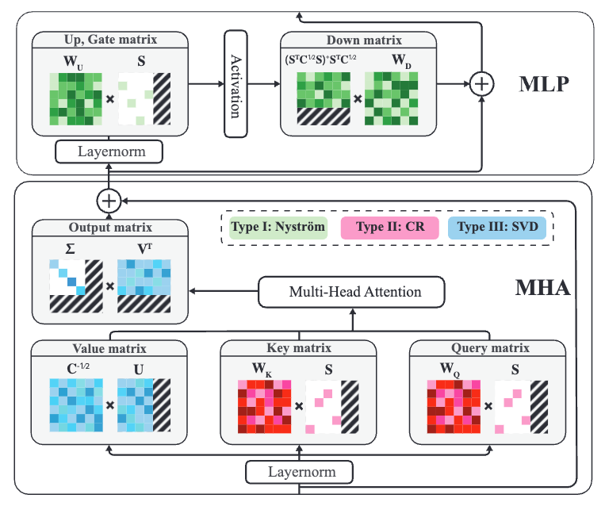
  

  - Link: https://openreview.net/pdf?id=8EfxjTCg2k
  - Code: Not available
  - Summary: This paper introduces **MoDeGPT**, a novel and efficient **structured compression framework** for **Large Language Models (LLMs)**. Unlike existing methods like SVD which suffer from accuracy loss due to stringent rank requirements or methods like SliceGPT which introduce significant parameter overhead, MoDeGPT employs a **modular decomposition** approach. It jointly decomposes consecutive subcomponents within Transformer blocks, achieving **dimensionality reduction** on a larger structural scale. The method leverages three classical matrix decomposition algorithms—**Nyström approximation**, **CR decomposition**, and **Singular Value Decomposition (SVD)**—to ensure bounded errors within its novel decomposition scheme. Crucially, MoDeGPT doesn't require **backward propagation**, unlike many competing techniques relying on gradient information. Experimental results demonstrate MoDeGPT's ability to match or exceed the performance of gradient-based methods, achieving a **98% reduction in compute costs** when compressing a 13B-parameter model. On LLaMA-2/3 and OPT models, it maintains 90-95% of zero-shot performance with compression rates of 25-30%, and the compression process is achievable on a single GPU within a few hours, leading to up to a 46% boost in inference throughput. The key innovation lies in its joint decomposition of multiple matrices within modules, eliminating the need for additional adapters that inflate parameter counts in alternative methods.

  - 摘要：本文介绍了**MoDeGPT**，这是一种用于**大型语言模型（LLMs）**的新型高效**结构化压缩框架**。与现有的方法（如由于严格的秩要求而导致精度损失的 SVD，或引入大量参数开销的 SliceGPT）不同，MoDeGPT 采用**模块化分解**方法。它联合分解 Transformer 块中连续的子组件，在更大的结构尺度上实现**降维**。该方法利用三种经典的矩阵分解算法——**Nyström 近似**、**CR 分解**和**奇异值分解（SVD）**——来确保其新颖的分解方法中的误差是有界的。至关重要的是，MoDeGPT 不需要**反向传播**，这与许多依赖于梯度信息的竞争技术不同。实验结果表明，MoDeGPT 能够匹配或超过基于梯度的方法的性能，在压缩 130 亿参数的模型时，计算成本降低了**98%**。在 LLaMA-2/3 和 OPT 模型上，它在压缩率为 25-30%的情况下保持了 90-95%的零样本性能，并且压缩过程可以在几小时内在一台 GPU 上完成，从而将推理吞吐量提高了多达 46%。其关键创新在于其对模块内多个矩阵的联合分解，消除了替代方法中导致参数计数膨胀的附加适配器的需求。

## Distillation

- One Student Knows All Experts Know: From Sparse to Dense

  

    
  

  - Authors: Fuzhao Xue, Xiaoxin He, Xiaozhe Ren, Yuxuan Lou, Yang You
  - Link: https://arxiv.org/pdf/2201.10890
  - Code: Not available
  - Summary: This paper proposes a novel method for training a **dense** student model that matches the performance of a **sparse Mixture-of-Experts (MoE)** model. Inspired by the human education system where a student learns from multiple experts, the authors introduce a **knowledge integration** framework. This framework consists of two stages: **knowledge gathering** and **knowledge distillation**. In the knowledge gathering stage, four methods are explored to extract knowledge from the pre-trained MoE experts: summation, averaging, **Top-K Knowledge Gathering (Top-KG)**, and **Singular Value Decomposition Knowledge Gathering (SVD-KG)**. Top-KG and SVD-KG aim to select the most crucial knowledge from each expert. The gathered knowledge is then used to initialize the feed-forward network (FFN) layers of a dense student model. Subsequently, **knowledge distillation** is employed to refine the student model using the entire MoE as a teacher, mitigating noise introduced during the knowledge gathering phase. Experiments on ImageNet and four natural language processing datasets demonstrate that the resulting OneS (One Student) model achieves significant performance gains compared to dense baselines, retaining a substantial portion of the MoE's performance (61.7% on ImageNet and 88.2% on NLP datasets) while offering a 3.7x inference speedup due to its **hardware-friendly** dense architecture. The OneS model significantly outperforms the best baseline by 51.7% on NLP tasks with the same architecture and training data.
  - 摘要：本文提出了一种新颖的方法，用于训练一个能够匹敌**稀疏专家混合模型 (MoE)** 性能的**稠密**学生模型。受人类教育体系（学生向多个专家学习）的启发，作者提出了一个**知识整合**框架。该框架包含两个阶段：**知识收集**和**知识蒸馏**。在知识收集阶段，探索了四种从预训练的 MoE 专家中提取知识的方法：求和、平均、**Top-K 知识收集 (Top-KG)** 和**奇异值分解知识收集 (SVD-KG)**。Top-KG 和 SVD-KG 旨在从每个专家中选择最关键的知识。然后，收集到的知识用于初始化稠密学生模型的前馈网络 (FFN) 层。随后，使用整个 MoE 作为教师进行**知识蒸馏**，以改进学生模型，减轻知识收集阶段引入的噪声。在 ImageNet 和四个自然语言处理数据集上的实验表明，生成的 OneS（一位学生）模型与稠密基线相比取得了显著的性能提升，保留了 MoE 很大一部分性能（ImageNet 上为 61.7%，NLP 数据集上为 88.2%），同时由于其**硬件友好型**稠密架构，推理速度提高了 3.7 倍。OneS 模型在 NLP 任务上使用相同的架构和训练数据，比最佳基线高出 51.7%。

- LLaVA-MoD: Making LLaVA Tiny via MoE-Knowledge Distillation

  

    
  

  

    
  

  - Authors: Fangxun Shu, Yue Liao, Le Zhuo, Chenning Xu, Lei Zhang, Guanghao Zhang, Haonan Shi, Long Chen, Tao Zhong, Wanggui He, Siming Fu, Haoyuan Li, Bolin Li, Zhelun Yu, Si Liu, Hongsheng Li, Hao Jiang
  - Link: https://arxiv.org/pdf/2408.15881
  - Code: https://github.com/shufangxun/LLaVA-MoD
  - Summary: This paper introduces LLaVA-MoD, a novel framework for efficiently training **small-scale Multimodal Language Models (s-MLLMs)** by distilling knowledge from a **large-scale MLLM (l-MLLM)**. LLaVA-MoD addresses two key challenges in MLLM distillation: architecture design and effective knowledge transfer. To address the architectural challenge, it integrates a **sparse Mixture of Experts (MoE)** architecture into the s-MLLM, balancing computational efficiency with model expressiveness. Multiple feedforward networks (FFNs) act as experts, and a linear gate dynamically selects the top-k experts for optimal knowledge transfer. For effective knowledge transfer, LLaVA-MoD employs a **progressive knowledge transfer strategy**. This begins with **mimic distillation**, minimizing the Kullback-Leibler (KL) divergence between the output distributions of the s-MLLM and l-MLLM. It then proceeds to **preference distillation** using **Preference Optimization (PO)**, treating the l-MLLM as a reference model. This enhances the s-MLLM's ability to discriminate between good and bad examples, often surpassing the l-MLLM's performance, particularly in hallucination benchmarks. Experiments show LLaVA-MoD outperforms existing methods across various benchmarks with minimal activated parameters and low computational costs. Specifically, LLaVA-MoD-2B surpasses Qwen-VL-Chat-7B by an average of 8.8% using only 0.3% of the training data and 23% of the trainable parameters. The results highlight LLaVA-MoD's effectiveness in distilling knowledge from a teacher model, enabling the development of efficient MLLMs.
  - 摘要：本文介绍了 LLaVA-MoD，这是一个新颖的框架，通过从大型多模态语言模型（**l-MLLM**）中蒸馏知识来高效训练**小型多模态语言模型（s-MLLMs）**。LLaVA-MoD 解决了 MLLM 蒸馏中的两个关键挑战：架构设计和有效的知识转移。为了解决架构挑战，它将**稀疏专家混合（MoE）**架构集成到 s-MLLM 中，平衡了计算效率和模型表达能力。多个前馈网络（FFNs）充当专家，线性门动态选择前 k 个专家以实现最佳的知识转移。为了有效地转移知识，LLaVA-MoD 采用**渐进式知识转移策略**。这从**模仿蒸馏**开始，最小化 s-MLLM 和 l-MLLM 输出分布之间的 Kullback-Leibler (KL) 散度。然后，它继续使用**偏好优化（PO）**进行**偏好蒸馏**，将 l-MLLM 作为参考模型。这增强了 s-MLLM 区分好坏示例的能力，通常超过 l-MLLM 的性能，尤其是在幻觉基准测试中。实验表明，LLaVA-MoD 在各种基准测试中都优于现有方法，同时具有最少的激活参数和较低的计算成本。具体而言，LLaVA-MoD-2B 使用仅 0.3%的训练数据和 23%的可训练参数，其性能优于 Qwen-VL-Chat-7B，平均提高了 8.8%。结果突出了 LLaVA-MoD 在从教师模型中蒸馏知识方面的有效性，从而能够开发高效的 MLLMs。

- Dense Training, Sparse Inference: Rethinking Training of Mixture-of-Experts Language Models

  

    
  

  - Authors: Bowen Pan, Yikang Shen, Haokun Liu, Mayank Mishra, Gaoyuan Zhang, Aude Oliva, Colin Raffel, Rameswar Panda
  - Link: https://arxiv.org/html/2404.05567
  - Code: Not available
  - Summary: This paper proposes a novel hybrid training framework, **DS-MoE (Dense training, Sparse Inference Mixture-of-Experts)**, for Mixture-of-Experts (MoE) language models to improve both **computational** and **parameter efficiency**. Unlike traditional sparse MoE training which only activates a subset of experts during training, DS-MoE utilizes **dense computation** across all experts during training, followed by **sparse inference**. This approach addresses the issue of MoE models requiring 2-4x more parameters than dense models for comparable performance, a problem particularly pronounced in I/O-bounded scenarios like autoregressive generation. The authors incorporate a **Mutual Information (MI) loss** to balance expert usage and encourage sparse activation during inference. During inference, the top K experts (either a fixed number or dynamically determined by a threshold) are activated per layer based on router scores. Experimental results demonstrate that DS-MoE achieves performance comparable to dense models of the same size, while activating only 30-40% of the parameters during inference. Specifically, the DS-MoE-6B model shows a speedup of up to 1.86x compared to Mistral-7B and 1.50x to 1.71x compared to DeepSeekMoE-16B and Qwen1.5-MoE-A2.7B, showcasing significant improvements in inference speed and parameter efficiency. The paper highlights that this method effectively bridges the gap between dense and sparse MoE models, offering a more efficient and practical solution for large language model training and deployment.

  - 摘要：本文提出了一种新颖的混合训练框架**DS-MoE（密集训练，稀疏推理混合专家）**，用于混合专家（MoE）大型语言模型，以提高**计算**和**参数效率**。与传统稀疏 MoE 训练只在训练期间激活一部分专家不同，DS-MoE 在训练期间对所有专家使用**密集计算**，然后进行**稀疏推理**。这种方法解决了 MoE 模型为了获得可比的性能而需要比密集模型多 2-4 倍参数的问题，这个问题在像自回归生成这样的 I/O 受限场景中尤其突出。作者引入了**互信息（MI）损失**来平衡专家使用，并在推理过程中鼓励稀疏激活。在推理过程中，根据路由器分数，每层激活前 K 个专家（固定数量或由阈值动态确定）。实验结果表明，DS-MoE 实现了与相同大小的密集模型相当的性能，同时在推理过程中只激活了 30%-40%的参数。具体来说，DS-MoE-6B 模型与 Mistral-7B 相比速度提高了高达 1.86 倍，与 DeepSeekMoE-16B 和 Qwen1.5-MoE-A2.7B 相比速度提高了 1.50 倍到 1.71 倍，展示了推理速度和参数效率的显著改进。本文强调，这种方法有效地弥合了密集型和稀疏型 MoE 模型之间的差距，为大型语言模型的训练和部署提供了一种更有效和实用的解决方案。

### System Optimization

- Fast Inference of Mixture-of-Experts Language Models with Offloading

  

    
  

  - Authors: Artyom Eliseev, Denis Mazur
  - Link: https://arxiv.org/pdf/2312.17238
  - Code: Not available in the provided text.
  - Summary: This paper addresses the challenge of running large Mixture-of-Experts (MoE) language models on consumer hardware with limited GPU memory. MoE models, while offering faster token generation than dense models, are significantly larger due to their multiple "expert" layers. The authors focus on improving inference speed (token generation) for Mixtral-8x7B-Instruct, a MoE-based chat assistant, on desktop-grade hardware. Their approach leverages two key observations about MoE LLM behavior: 1) expert reuse between adjacent tokens, and 2) early layers' hidden states predicting subsequent layer expert usage. Based on these observations, they propose a novel offloading strategy that incorporates an LRU cache to minimize GPU-RAM communication and a predictive mechanism to overlap expert loading with computation. This strategy, combined with mixed quantization, enables interactive inference (2-3 tokens per second) of Mixtral-8x7B-Instruct on hardware like a T4, RTX 3060, and RTX 3080 Mobile. The paper details the implementation and its performance on various hardware configurations.
  - 摘要：本文解决了在具有有限 GPU 内存的消费级硬件上运行大型混合专家（MoE）语言模型的挑战。MoE 模型虽然比密集模型具有更快的令牌生成速度，但由于其多个“专家”层而规模显著更大。作者专注于提高 Mixtral-8x7B-Instruct（一个基于 MoE 的聊天助手）在桌面级硬件上的推理速度（令牌生成）。他们的方法利用了对 MoE LLM 行为的两个关键观察结果：1）相邻令牌之间专家重用，以及 2）早期层的隐藏状态预测后续层的专家使用情况。基于这些观察结果，他们提出了一种新颖的卸载策略，该策略结合了 LRU 缓存以最大限度地减少 GPU-RAM 通信，以及一种预测机制以将专家加载与计算重叠。这种策略与混合量化相结合，使得能够在 T4、RTX 3060 和 RTX 3080 Mobile 等硬件上进行交互式推理（每秒 2-3 个令牌）。本文详细介绍了该实现及其在各种硬件配置上的性能。

- MoNDE: Mixture of Near-Data Experts for Large-Scale Sparse Models

  

    
  

  - Authors: Taehyun Kim, Kwanseok Choi, Youngmock Cho, Jaehoon Cho, Hyuk-Jae Lee, Jaewoong Sim
  - Link: https://arxiv.org/pdf/2405.18832
  - Code: Not available
  - Pub: DAC2024
  - Summary: This paper introduces Mixture of Near-Data Experts (MoNDE), a near-data processing (NDP) solution designed to improve the inference efficiency of Mixture-of-Experts (MoE) large language models (LLMs). MoE LLMs often suffer from excessive memory requirements, forcing costly parameter transfers between secondary memory (CPU or SSD) and the GPU. MoNDE addresses this by transferring only the "hot" experts (frequently used) to the GPU, while processing "cold" experts (infrequently used) within the host memory's MoNDE NDP units. This shifts the data movement from large expert parameter transfers to smaller activation transfers, significantly reducing communication overhead. MoNDE employs an "Activation Movement" paradigm, where instead of moving entire expert parameters, only the activations from the attention layers are transferred to the MoNDE units for computation. The results are then transferred back to the GPU. A novel GPU-MoNDE load-balancing scheme further enhances performance by concurrently executing expert computations on both the GPU and MoNDE, exploiting the skewed activation distribution inherent in MoE. Experimental results demonstrate that MoNDE outperforms existing parameter offloading frameworks by up to 7.5x and 3.7x for encoder and decoder operations respectively, with a reported area overhead of 3.0 mm² for the MoNDE NDP units. The key is leveraging the observation that many experts process few tokens, making activation transfer far more efficient than parameter transfer in these cases.
  - 摘要：本文介绍了混合近数据专家（MoNDE），这是一种近数据处理（NDP）解决方案，旨在提高混合专家（MoE）大型语言模型（LLM）的推理效率。MoE LLM 通常存在内存需求过大的问题，导致在辅助内存（CPU 或 SSD）和 GPU 之间进行代价高昂的参数传输。MoNDE 通过仅将“热门”专家（频繁使用）传输到 GPU 来解决这个问题，同时在主机内存的 MoNDE NDP 单元中处理“冷门”专家（不频繁使用）。这将数据移动从大型专家参数传输转移到较小的激活传输，从而显著减少了通信开销。MoNDE 采用“激活移动”范例，其中，它不移动整个专家参数，而只将来自注意力层的激活传输到 MoNDE 单元进行计算。然后将结果传输回 GPU。一种新颖的 GPU-MoNDE 负载平衡方案通过同时在 GPU 和 MoNDE 上执行专家计算来进一步提高性能，利用了 MoE 中固有的倾斜激活分布。实验结果表明，MoNDE 在编码器和解码器操作方面的性能分别比现有的参数卸载框架高出 7.5 倍和 3.7 倍，MoNDE NDP 单元的面积开销为 3.0 mm²。关键在于利用这样的观察结果：许多专家处理的标记数量很少，在这种情况下，激活传输比参数传输效率高得多。

### Sparse Upcycling

- Branch-Train-MiX: Mixing Expert LLMs into a Mixture-of-Experts LLM

  

    
  

  - Authors: Sainbayar Sukhbaatar, Olga Golovneva, Vasu Sharma, Hu Xu, Xi Victoria Lin, Baptiste Rozière, Jacob Kahn, Daniel Li, Wen-tau Yih, Jason Weston, Xian Li
  - Link: https://arxiv.org/pdf/2403.07816v1
  - Code: Not available
  - Summary: This paper introduces **Branch-Train-MiX (BTX)**, a novel method for training **Large Language Models (LLMs)** with expertise in multiple specialized domains (e.g., coding, math reasoning, world knowledge). BTX leverages the advantages of both **Branch-Train-Merge (BTM)** and **Mixture-of-Experts (MoE)** approaches while mitigating their drawbacks. The method begins by branching from a **seed LLM**, creating multiple copies that are trained asynchronously and in parallel on different datasets, resulting in specialized **expert LLMs**. Unlike BTM, which simply merges these experts, BTX integrates the expert LLMs' **feedforward (FF)** parameters into a single MoE layer, averaging the remaining parameters (e.g., self-attention layers). A subsequent MoE-finetuning stage optimizes the **token-level routing** within the MoE layer. This approach achieves efficient training due to the embarrassingly parallel nature of expert training, reducing communication costs and improving throughput. Furthermore, the resulting unified model allows for further **supervised fine-tuning (SFT)** or **reinforcement learning from human feedback (RLHF)**, which are typically impossible with the BTM approach. The authors claim BTX achieves the best **accuracy-efficiency tradeoff** compared to alternative methods.
  - 摘要：本文介绍了一种新颖的训练大型语言模型（LLM）的方法，名为**Branch-Train-MiX (BTX)**，该方法旨在使 LLM 具备多个专业领域的专业知识（例如，编码、数学推理、世界知识）。BTX 结合了**Branch-Train-Merge (BTM)**和**Mixture-of-Experts (MoE)**方法的优点，同时减轻了它们的缺点。该方法首先从一个**种子 LLM**开始分支，创建多个副本，这些副本在不同的数据集上异步并行训练，从而产生专门的**专家 LLM**。与简单地合并这些专家的 BTM 不同，BTX 将专家 LLM 的**前馈(FF)**参数集成到单个 MoE 层中，对其余参数（例如，自注意力层）进行平均。随后的 MoE 微调阶段优化了 MoE 层中的**令牌级路由**。这种方法由于专家训练的并行性而实现了高效的训练，降低了通信成本并提高了吞吐量。此外，生成的统一模型允许进行进一步的**监督微调(SFT)**或**来自人类反馈的强化学习(RLHF)**，而这在 BTM 方法中通常是不可能的。作者声称，BTX 实现了最佳的**精度-效率权衡**，与其他方法相比。

- Branch-Train-Merge (BTM): Embarrassingly Parallel Training of Expert Language Models

  

    
  

  

    
  

  - Authors: Margaret Li, Suchin Gururangan, Tim Dettmers, Mike Lewis, Tim Althoff, Noah A. Smith, Luke Zettlemoyer
  - Link: https://arxiv.org/pdf/2208.03306
  - Code: Not available
  - Summary: This paper introduces **Branch-Train-Merge (BTM)**, a communication-efficient algorithm for training large language models (LLMs) in an **embarrassingly parallel** manner. Instead of training a single monolithic model, BTM trains a collection of independent **Expert Language Models (ELMs)**, each specialized in a different textual domain (e.g., scientific or legal text). These ELMs are trained independently on different subsets of data, eliminating the need for massive multi-node synchronization typical in traditional LLM training. The BTM process involves three steps: **Branching**, where a new ELM is initialized using a weighted average of parameters from existing, relevant ELMs; **Training**, where the new ELM is trained on data from its specialized domain using standard cross-entropy loss; and **Merging**, where the newly trained ELM is added to the existing set of ELMs. This allows for incremental model expansion and adaptation to new domains. The resulting model, termed **ELM FOREST**, can be used as an ensemble, averaging the predictions of all ELMs, or through parameter averaging to create a single, efficient inference model. Experiments demonstrate that ELM FORESTs trained with BTM outperform GPT-style Transformer LMs in both in-domain and out-of-domain perplexity, while controlling for training cost. The improvements are more pronounced in ELM FOREST ensembles but are also present when using parameter averaging. The study also highlights the importance of domain specialization; random data splits do not yield good results. Scaling BTM to 64 domains (192B tokens) resulted in a 22.4B parameter model that performed comparably to a Transformer LM trained with 2.5x more compute, suggesting significant potential for scaling to even larger models with increased parallelism. The paper includes detailed ablation studies analyzing different aspects of BTM and ELM initialization.

  - 摘要：本文介绍了**Branch-Train-Merge (BTM)**，一种用于以**高度并行**方式训练大型语言模型 (LLM) 的通信效率高的算法。BTM 不训练单个整体模型，而是训练一系列独立的**专家语言模型 (ELM)**，每个模型专门处理不同的文本领域（例如，科学或法律文本）。这些 ELM 在数据的不同子集上独立训练，消除了传统 LLM 训练中通常需要的海量多节点同步。BTM 过程包括三个步骤：**分支 (Branching)**，其中使用现有相关 ELM 的参数加权平均值来初始化新的 ELM；**训练 (Training)**，其中使用标准交叉熵损失在新 ELM 的专业领域数据上训练新 ELM；以及**合并 (Merging)**，其中将新训练的 ELM 添加到现有的 ELM 集中。这允许对模型进行增量扩展并适应新的领域。生成的模型，称为**ELM FOREST**，可以用作集成模型，平均所有 ELM 的预测，或者通过参数平均来创建单个高效的推理模型。实验表明，使用 BTM 训练的 ELM FOREST 在域内和域外困惑度方面都优于 GPT 风格的 Transformer LLM，同时控制了训练成本。改进在 ELM FOREST 集成模型中更为明显，但在使用参数平均时也存在。该研究还强调了领域专业化的重要性；随机数据分割不会产生良好的结果。将 BTM 扩展到 64 个领域（192B 个标记）产生了 22.4B 参数的模型，其性能与使用 2.5 倍计算量训练的 Transformer LLM 相当，这表明了通过增加并行性扩展到更大模型的巨大潜力。本文还包括详细的消融研究，分析了 BTM 和 ELM 初始化的不同方面。

- Skywork-MoE: A Deep Dive into Training Techniques for Mixture-of-Experts Language Models

  

    
  

  - Authors: Tianwen Wei, Bo Zhu, Liang Zhao, Cheng Cheng, Biye Li, Weiwei Lü, Peng Cheng, Jianhao Zhang, Xiaoyu Zhang, Liang Zeng, Xiaokun Wang, Yutuan Ma, Rui Hu, Shuicheng Yan, Han Fang, Yahui Zhou   Skywork Team, Kunlun Inc
  - Link: https://arxiv.org/html/2406.06563v1
  - Summary: This technical report details the training methodologies behind Skywork-MoE, a 146-billion parameter **Mixture-of-Experts (MoE)** large language model (LLM) with 16 experts. The model is **upcycled** from the authors' pre-existing Skywork-13B model, and the paper explores the comparative advantages of upcycling versus training from scratch. The authors find that the optimal approach depends on both the performance of the existing dense checkpoints and the available training budget. Two key novel training techniques are introduced: **gating logit normalization**, which improves expert diversification, and **adaptive auxiliary loss coefficients**, enabling layer-specific adjustment of auxiliary losses. Skywork-MoE was trained on a condensed subset of the SkyPile corpus and demonstrates strong performance across various benchmarks, showcasing the effectiveness of the proposed techniques. The architecture builds upon the **Switch Transformer** design, utilizing MoE to replace some or all feed-forward networks (FFNs) within the transformer architecture. The **gating mechanism**, employing a softmax function, dynamically routes tokens to the most relevant experts based on their embeddings.
  - 摘要：这份技术报告详细介绍了 Skywork-MoE 的训练方法，Skywork-MoE 是一个具有 1460 亿参数和 16 个专家的高性能**混合专家（MoE）**大型语言模型（LLM）。该模型是从作者先前开发的 Skywork-13B 模型**升级**而来的，本文探讨了升级与从头开始训练的比较优势。作者发现，最佳方法取决于现有密集检查点的性能和可用的训练预算。报告介绍了两种关键的新型训练技术：**门控 logit 归一化**，它提高了专家的多样性，以及**自适应辅助损失系数**，它能够对不同层的辅助损失进行特定层的调整。Skywork-MoE 在 SkyPile 语料库的精简子集上进行了训练，并在各种基准测试中表现出强大的性能，这展示了所提出技术的有效性。该架构建立在**Switch Transformer**设计的基礎上，利用 MoE 替换 Transformer 架构中部分或全部的前馈神经网络（FFNs）。**门控机制**采用 softmax 函数，根据词嵌入动态地将词元路由到最相关的专家。

- Sparse Upcycling: Training Mixture-of-Experts from Dense Checkpoints

  

    
  

  - Authors: Aran Komatsuzaki, Joan Puigcerver, James Lee-Thorp, Carlos Riquelme, Basil Mustafa, Joshua Ainslie, Yi Tay, Mostafa Dehghani, Neil Houlsby
  - Link: https://arxiv.org/pdf/2212.05055
  - Code: https://github.com/google-research/vmoe (Vision) and https://github.com/google-research/t5x/tree/main/t5x/contrib/moe (Language)
  - Pub: ICLR2023
  - Summary: This paper introduces **sparse upcycling**, a method for efficiently training **Mixture-of-Experts (MoE)** models by initializing them from pre-trained **dense** checkpoints. Instead of training large models from scratch, which is computationally expensive, this technique leverages the knowledge embedded in existing dense models to significantly reduce training costs. The authors demonstrate that by upcycling pre-trained T5 (**language**) and Vision Transformer (**vision**) models, they achieve superior performance compared to both their dense counterparts and sparse models trained from scratch, using only approximately 50% of the original training cost. The method involves a "model surgery" process to effectively transfer knowledge from the dense model to the sparse MoE architecture, mitigating the performance drop typically associated with architectural changes. Experiments on SuperGLUE (language) and ImageNet (vision) benchmarks show substantial performance gains with a modest increase in training budget (between 10% and 60% of the original training cost). This technique is particularly beneficial when resources are limited or when exploring the trade-offs between dense and MoE models, allowing for efficient exploration of large-scale model architectures.
  - 摘要：本文介绍了一种高效训练**混合专家（MoE）**模型的方法——**稀疏升级**，该方法通过从预训练的**密集**检查点初始化 MoE 模型来实现。与从头开始训练大型模型（计算成本很高）相比，这种技术利用现有密集模型中嵌入的知识来显著降低训练成本。作者证明，通过升级预训练的 T5（**语言**）和 Vision Transformer（**视觉**）模型，他们实现了优于其密集对应模型和从头开始训练的稀疏模型的性能，而仅使用了大约 50% 的原始训练成本。该方法涉及一个“模型手术”过程，以有效地将知识从密集模型转移到稀疏 MoE 架构，从而减轻通常与架构更改相关的性能下降。在 SuperGLUE（语言）和 ImageNet（视觉）基准测试上的实验表明，在训练预算增加适度的情况下（原始训练成本的 10% 到 60% 之间），性能有了显著提高。当资源有限或探索密集模型和 MoE 模型之间的权衡时，这种技术特别有用，允许高效地探索大型模型架构。

- MoE-LLaVA: Mixture of Experts for Large Vision-Language Models

  

    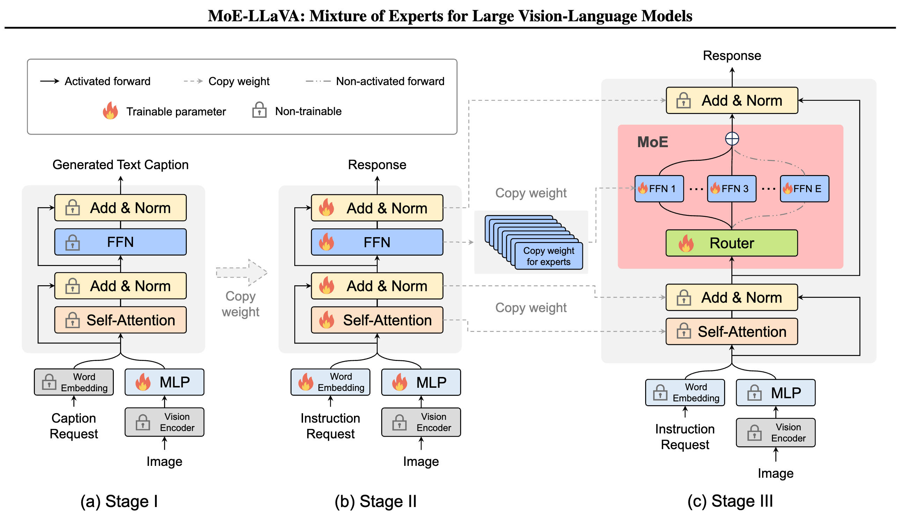
  

  - Authors: Bin Lin, Zhenyu Tang, Yang Ye, Jiaxi Cui, Bin Zhu, Peng Jin, Jinfa Huang, Junwu Zhang, Yatian Pang, Munan Ning, Li Yuan
  - Link: https://arxiv.org/pdf/2401.15947
  - Code: https://github.com/PKU-YuanGroup/MoE-LLaVA
  - Summary: This paper introduces MoE-LLaVA, a **Mixture of Experts (MoE)**-based sparse Large Vision-Language Model (LVLM). Addressing the high computational cost of large LVLMs where all parameters are active for every token, MoE-LLaVA employs a novel training strategy called **MoE-Tuning**. MoE-Tuning consists of three stages: (1) training only the Multi-Layer Perceptron (MLP); (2) training all parameters except the Vision Encoder (VE); and (3) training only the MoE layers, activating only the top-k experts via routers during inference. This results in a sparse model with a significantly large number of parameters but maintains constant computational cost. Experiments demonstrate MoE-LLaVA's strong performance on various visual understanding and object hallucination benchmarks. Specifically, with approximately 3 billion sparsely activated parameters, MoE-LLaVA achieves comparable performance to LLaVA-1.5-7B on visual understanding datasets and surpasses LLaVA-1.5-13B in object hallucination (using the POPE benchmark). The authors posit MoE-LLaVA as a strong baseline for sparse LVLMs, paving the way for more efficient multi-modal learning systems. The architecture leverages existing large language models and incorporates a visual encoder and projection layers to improve visual perception capabilities. The paper compares MoE-LLaVA to several other state-of-the-art LVLMs, highlighting its efficiency and effectiveness.

  - 摘要：本文介绍了 MoE-LLaVA，一个基于**混合专家（MoE）**的稀疏大型视觉语言模型（LVLM）。为了解决大型 LVLM 中所有参数对每个 token 都处于活动状态的高计算成本问题，MoE-LLaVA 采用了一种名为**MoE-Tuning**的新型训练策略。MoE-Tuning 包括三个阶段：（1）仅训练多层感知器（MLP）；（2）训练除视觉编码器（VE）之外的所有参数；以及（3）仅训练 MoE 层，在推理过程中通过路由器仅激活 top-k 专家。这导致了一个具有非常多参数的稀疏模型，但保持了恒定的计算成本。实验表明，MoE-LLaVA 在各种视觉理解和物体幻觉基准测试中表现出强大的性能。具体来说，MoE-LLaVA 大约有 30 亿个稀疏激活参数，在视觉理解数据集上的性能与 LLaVA-1.5-7B 相当，在物体幻觉方面（使用 POPE 基准测试）甚至超过了 LLaVA-1.5-13B。作者认为 MoE-LLaVA 是稀疏 LVLM 的一个强大基线，为更有效的多模态学习系统铺平了道路。该架构利用现有的大型语言模型，并结合视觉编码器和投影层来提高视觉感知能力。本文将 MoE-LLaVA 与其他几种最先进的 LVLM 进行了比较，突出了其效率和有效性。

- Stacking Your Transformers: A Closer Look at Model Growth for Efficient LLM Pre-Training

  

    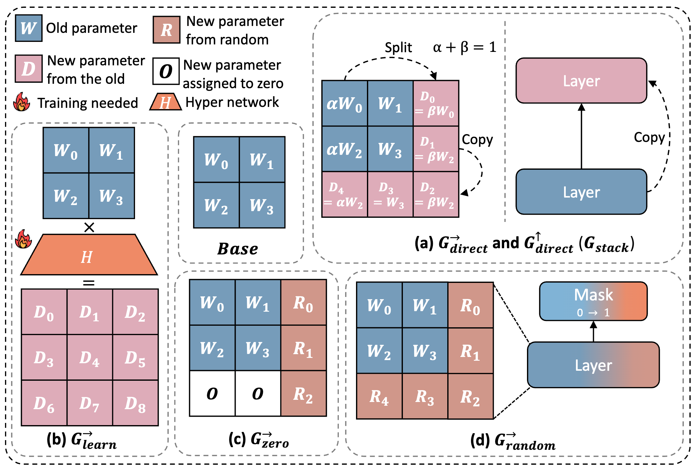
  

  - Authors: Wenyu Du, Tongxu Luo, Zihan Qiu, Zeyu Huang, Yikang Shen, Reynold Cheng, Yike Guo, Jie Fu
  - Link: https://arxiv.org/pdf/2405.15319
  - Code: https://llm-stacking.github.io/
  - Summary: This paper focuses on improving the efficiency of pre-training Large Language Models (LLMs) through **model growth** techniques. It identifies three main obstacles hindering the adoption of model growth in LLM pre-training: **(O1) lack of comprehensive evaluation**, **(O2) untested scalability**, and **(O3) lack of empirical guidelines**. To address these, the authors summarize existing model growth methods into four atomic growth operators and evaluate them in a standardized LLM pre-training setting. They find that a depth-wise stacking operator, named **Gstack**, significantly accelerates training, leading to lower loss and improved performance on eight standard NLP benchmarks compared to strong baselines. Further experiments demonstrate that **Gstack** is scalable, maintaining its effectiveness in experiments up to 7B LLMs and with pre-training data up to 750B tokens. For instance, a **Gstack** model achieved the same loss as a conventionally trained 7B model with 300B tokens using only 194B tokens, resulting in a 54.6% speedup. The paper also provides empirical guidelines for determining the growth timing and growth factor for **Gstack**, making it practical for general LLM pre-training.
  - 摘要：本文专注于通过**模型增长**技术提高大型语言模型 (LLM) 的预训练效率。它指出了阻碍在 LLM 预训练中采用模型增长的三个主要障碍：**(O1) 缺乏全面的评估**，**(O2) 未经测试的可扩展性**，以及 **(O3) 缺乏经验指导**。为了解决这些问题，作者将现有的模型增长方法总结为四个原子增长算子，并在标准化的 LLM 预训练环境中对它们进行了评估。他们发现，一种名为 **Gstack** 的深度堆叠算子可以显著加速训练，与强基线相比，在八个标准 NLP 基准测试中实现了更低的损失和更好的性能。进一步的实验表明，**Gstack** 具有可扩展性，在高达 7B LLM 的实验和高达 750B 令牌的预训练数据中都保持了其有效性。例如，一个使用 **Gstack** 的模型仅使用 194B 令牌就达到了与使用 300B 令牌的传统训练的 7B 模型相同的损失，从而实现了 54.6% 的加速。本文还提供了确定 **Gstack** 增长时机和增长因子的经验指导，使其在一般的 LLM 预训练中具有实用性。

- MASKED STRUCTURAL GROWTH FOR 2X FASTER LANGUAGE MODEL PRE-TRAINING
  - Label: 
  - Authors: Yiqun Yao, Zheng Zhang, Jing Li, Yequan Wang
  - Link: https://openreview.net/pdf?id=rL7xsg1aRn
  - Code: https://github.com/cofe-ai/MSG
  - Summary: This paper introduces **Masked Structural Growth (MSG)**, a novel method to accelerate language model pre-training by progressively growing the Transformer model's structure. MSG addresses two key challenges in progressive growth: **growth schedule** optimization and efficient **growth operator** design. It proposes growth schedules involving all possible dimensions (**layer number**, **hidden dimension**, **FFN dimension**, **head number**) and strictly **function-preserving growth operators**. These operators use a masking mechanism that is independent of new weight initialization, ensuring the enlarged model initially behaves identically to the smaller model, and then gradually integrates the new neurons. MSG achieves up to a **2.2x speedup** in pre-training **Bert** and **1.4x** for **GPT-2**, while maintaining comparable or better downstream performance. The method solves a dilemma caused by **Layer Normalization**, achieving strict function preservation in arbitrary cases. It outperforms existing methods like **Stacking**, **CompoundGrow**, **Staged**, **Bert2BERT**, and **LiGO** in terms of speedup ratio and performance.
  - 摘要：本文提出了一种名为**掩码结构增长（Masked Structural Growth, MSG）**的新方法，通过逐步增长 Transformer 模型的结构来加速语言模型的预训练。MSG 解决了渐进式增长中的两个关键挑战：**增长计划**优化和高效的**增长算子**设计。它提出了涉及所有可能维度（**层数**、**隐藏维度**、**FFN 维度**、**头数**）的增长计划，以及严格的**函数保持增长算子**。这些算子使用独立于新权重初始化的掩码机制，确保扩大的模型最初与较小的模型行为相同，然后逐渐整合新的神经元。MSG 在预训练 **Bert** 时实现了高达 **2.2 倍的加速**，在预训练 **GPT-2** 时实现了 **1.4 倍的加速**，同时保持相当或更好的下游性能。该方法解决了由**层归一化**引起的困境，在任意情况下实现了严格的函数保持。在加速比和性能方面，MSG 优于现有的方法，如 **Stacking**、**CompoundGrow**、**Staged**、**Bert2BERT** 和 **LiGO**。

### Sparse Splitting

- LLaMA-MoE: Building Mixture-of-Experts from LLaMA with Continual Pre-training

  

    
  

  - Authors: Tong Zhu, Xiaoye Qu, Daize Dong, Jiacheng Ruan, Jingqi Tong, Conghui He, Yu Cheng
  - Link: https://arxiv.org/pdf/2406.16554
  - Code: https://github.com/pjlab-sys4nlp/llama-moe
  - Pub: EMNLP 2024 main
  - Summary: This paper presents LLaMA-MoE, a novel approach to building **Mixture-of-Experts (MoE)** models from existing dense large language models (LLMs), specifically using the LLaMA-2 7B model as a base. Instead of training an MoE model from scratch, which is computationally expensive and unstable, the authors propose a two-stage process: (1) **Expert Construction**, where the **Feed-Forward Networks (FFNs)** of the LLaMA model are partitioned into multiple **experts**, and (2) **Continual Pre-training**, where the resulting MoE model and additional **gate networks** (which route input tokens to the appropriate experts) are further trained on a large dataset (200B tokens). The paper explores various methods for expert construction, focusing on different **splitting methods** for the FFNs (including non-overlapping random splitting, which proved most effective), and different **data sampling strategies** for continual pre-training (comparing **dynamic** and **static** approaches, with static domain weight proportion proving superior). The resulting LLaMA-MoE models, such as LLaMA-MoE-3.5B, achieve performance superior to dense models with a similar number of activated parameters, demonstrating the effectiveness of this approach to building efficient and powerful MoE LLMs. The key innovation lies in adapting MoE to a decoder-only architecture (like LLaMA) and employing continual pre-training to overcome the performance drop often associated with converting a dense model to a sparse MoE model.

  - 摘要：本文提出了 LLaMA-MoE，一种从现有的稠密大型语言模型（LLM）构建**混合专家（MoE）**模型的新方法，特别地，使用 LLaMA-2 7B 模型作为基础。该方法并非从头开始训练 MoE 模型（这在计算上代价高昂且不稳定），而是提出了一个两阶段的过程：（1）**专家构建**，其中 LLaMA 模型的**前馈网络（FFN）**被划分为多个**专家**；（2）**持续预训练**，其中生成的 MoE 模型和额外的**门网络**（将输入 token 路由到合适的专家）在大型数据集（2000 亿个 token）上进行进一步训练。本文探讨了各种专家构建方法，重点关注 FFN 的不同**分割方法**（包括非重叠随机分割，证明最有效），以及持续预训练的不同**数据采样策略**（比较**动态**和**静态**方法，静态域权重比例证明更优）。生成的 LLaMA-MoE 模型，例如 LLaMA-MoE-3.5B，其性能优于具有相似激活参数数量的稠密模型，证明了这种构建高效强大 MoE LLM 的方法的有效性。关键创新在于将 MoE 应用于解码器专用架构（如 LLaMA）并采用持续预训练来克服将稠密模型转换为稀疏 MoE 模型时经常出现的性能下降。

- MoEfication: Transformer Feed-forward Layers are Mixtures of Experts

  

    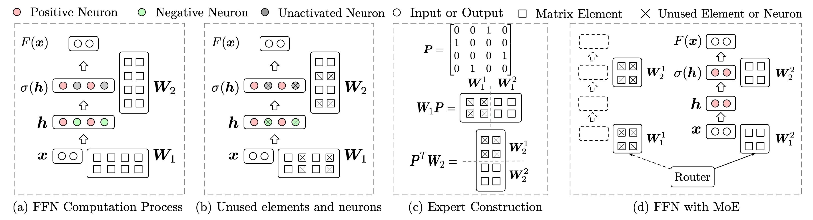
  

  - Authors: Zhengyan Zhang, Yankai Lin, Zhiyuan Liu, Peng Li, Maosong Sun, Jie Zhou
  - Link: https://arxiv.org/pdf/2110.01786
  - Code: https://github.com/thunlp/MoEfication
  - Summary: This paper investigates the computational patterns of **feed-forward networks (FFNs)** in pre-trained **Transformers**. The authors observe that a small percentage of neurons in FFNs are activated for most inputs, a phenomenon similar to the sparsity of the human brain. Inspired by this, they propose **MoEfication**, a method to convert FFNs into **Mixture-of-Experts (MoE)** models. MoEfication consists of two phases: (1) **Expert Construction**: splitting the FFN parameters into multiple "experts," grouping neurons frequently activated together; and (2) **Expert Selection**: a routing mechanism to select the most relevant experts for each input. Experiments on GLUE and QA benchmarks using T5 and BERT models demonstrate that MoEfication can achieve over 95% of the original performance using only 10% to 30% of the FFN parameters. This leads to significant inference speedups (2x on CPU, 1.2x on GPU with 25% of FFN parameters) and provides a fine-grained perspective for understanding FFN inner workings by analyzing the routing patterns. The core finding is that pre-trained Transformers exhibit **functional partitions** within their FFNs, mirroring the structure of the human brain.

  - 摘要：本文研究了预训练**Transformer**中**前馈网络(FFNs)**的计算模式。作者观察到，对于大多数输入，FFNs 中只有一小部分神经元被激活，这种现象类似于人脑的稀疏性。受此启发，他们提出了**MoEfication**，这是一种将 FFNs 转换为**混合专家(MoE)**模型的方法。MoEfication 包括两个阶段：(1)**专家构建**：将 FFN 参数分成多个“专家”，将经常一起激活的神经元分组；(2)**专家选择**：一种路由机制，为每个输入选择最相关的专家。使用 T5 和 BERT 模型在 GLUE 和 QA 基准测试上的实验表明，MoEfication 可以使用仅 10%到 30%的 FFN 参数就能达到超过 95%的原始性能。这导致了显著的推理加速(使用 25%的 FFN 参数，CPU 上速度提高 2 倍，GPU 上速度提高 1.2 倍)，并通过分析路由模式，为理解 FFN 的内部工作机制提供了细粒度的视角。核心发现是，预训练的 Transformer 在其 FFNs 中表现出**功能分区**，这反映了人脑的结构。

- Upcycling Large Language Models into Mixture of Experts

  

    
  

  - Authors: Ethan He, Abhinav Khattar, Ryan Prenger, Vijay Korthikanti, Zijie Yan, Tong Liu, Shiqing Fan, Ashwath Aithal, Mohammad Shoeybi, Bryan Catanzaro
  - Link: https://arxiv.org/html/2410.07524
  - Code: Not available
  - Summary: This paper explores efficient methods for **upcycling** pre-trained dense large language models (LLMs) into sparse **Mixture-of-Experts (MoE)** models. The authors conduct a large-scale study on billion-parameter LLMs, focusing on optimizing upcycling techniques and hyperparameters. Key contributions include: a novel "**virtual group**" initialization scheme and weight scaling approach improving loss by 1.5%; a comparison of **softmax-then-topK** and **topK-then-softmax** expert routing methods, favoring the former; an analysis of the benefits of higher granularity MoEs and higher topK values; and a demonstration that upcycling outperforms continued dense model training. Specifically, upcycling the Nemotron-4 15B model on 1 trillion tokens yielded a 67.6% MMLU score, surpassing the 65.3% achieved by continued training of the same model on the same data. The work utilizes Megatron-LM4 for upcycling and training, focusing on MoEs applied to the transformer's MLP layer to maximize efficiency. The paper provides practical recommendations and best practices for upcycling billion-parameter LLMs, contributing to the advancement of large-scale MoE model development.
  - 摘要：本文探讨了将预训练的密集型大型语言模型（LLM）高效地升级到稀疏**混合专家（MoE）**模型的方法。作者对数十亿参数的 LLM 进行了大规模研究，重点是优化升级技术和超参数。主要贡献包括：一种新颖的“**虚拟组**”初始化方案和权重缩放方法，将损失提高了 1.5%；比较了**softmax-then-topK**和**topK-then-softmax**专家路由方法，前者更胜一筹；分析了更高粒度 MoE 和更高 topK 值的优势；以及证明了升级优于持续密集模型训练。具体来说，在 1 万亿个 token 上对 Nemotron-4 15B 模型进行升级，获得了 67.6%的 MMLU 分数，超过了在相同数据上持续训练该模型所获得的 65.3%。这项工作利用 Megatron-LM4 进行升级和训练，重点是应用于 Transformer 的 MLP 层的 MoE，以最大限度地提高效率。本文为升级数十亿参数的 LLM 提供了实用建议和最佳实践，推动了大规模 MoE 模型发展。

- LLaVA-MoD: Making LLaVA Tiny via MoE-Knowledge Distillation

  

    
  

  - Authors: Fangxun Shu, Yue Liao, Le Zhuo, Chenning Xu, Lei Zhang, Guanghao Zhang, Haonan Shi, Long Chen, Tao Zhong, Wanggui He, Siming Fu, Haoyuan Li, Bolin Li, Zhelun Yu, Si Liu, Hongsheng Li, Hao Jiang
  - Link: https://arxiv.org/pdf/2408.15881
  - Code: https://github.com/shufangxun/LLaVA-MoD
  - Summary: This paper introduces LLaVA-MoD, a novel framework for efficiently training **small-scale Multimodal Language Models (s-MLLMs)** by distilling knowledge from a **large-scale MLLM (l-MLLM)**. LLaVA-MoD addresses two key challenges in MLLM distillation: architecture design and effective knowledge transfer. To address the architectural challenge, it integrates a **sparse Mixture of Experts (MoE)** architecture into the s-MLLM, balancing computational efficiency with model expressiveness. Multiple feedforward networks (FFNs) act as experts, and a linear gate dynamically selects the top-k experts for optimal knowledge transfer. For effective knowledge transfer, LLaVA-MoD employs a **progressive knowledge transfer strategy**. This begins with **mimic distillation**, minimizing the Kullback-Leibler (KL) divergence between the output distributions of the s-MLLM and l-MLLM. It then proceeds to **preference distillation** using **Preference Optimization (PO)**, treating the l-MLLM as a reference model. This enhances the s-MLLM's ability to discriminate between good and bad examples, often surpassing the l-MLLM's performance, particularly in hallucination benchmarks. Experiments show LLaVA-MoD outperforms existing methods across various benchmarks with minimal activated parameters and low computational costs. Specifically, LLaVA-MoD-2B surpasses Qwen-VL-Chat-7B by an average of 8.8% using only 0.3% of the training data and 23% of the trainable parameters. The results highlight LLaVA-MoD's effectiveness in distilling knowledge from a teacher model, enabling the development of efficient MLLMs.
  - 摘要：本文介绍了 LLaVA-MoD，这是一个新颖的框架，通过从大型多模态语言模型（**l-MLLM**）中蒸馏知识来高效训练**小型多模态语言模型（s-MLLMs）**。LLaVA-MoD 解决了 MLLM 蒸馏中的两个关键挑战：架构设计和有效的知识转移。为了解决架构挑战，它将**稀疏专家混合（MoE）**架构集成到 s-MLLM 中，平衡了计算效率和模型表达能力。多个前馈网络（FFNs）充当专家，线性门动态选择前 k 个专家以实现最佳的知识转移。为了有效地转移知识，LLaVA-MoD 采用**渐进式知识转移策略**。这从**模仿蒸馏**开始，最小化 s-MLLM 和 l-MLLM 输出分布之间的 Kullback-Leibler (KL) 散度。然后，它继续使用**偏好优化（PO）**进行**偏好蒸馏**，将 l-MLLM 作为参考模型。这增强了 s-MLLM 区分好坏示例的能力，通常超过 l-MLLM 的性能，尤其是在幻觉基准测试中。实验表明，LLaVA-MoD 在各种基准测试中都优于现有方法，同时具有最少的激活参数和较低的计算成本。具体而言，LLaVA-MoD-2B 使用仅 0.3%的训练数据和 23%的可训练参数，其性能优于 Qwen-VL-Chat-7B，平均提高了 8.8%。结果突出了 LLaVA-MoD 在从教师模型中蒸馏知识方面的有效性，从而能够开发高效的 MLLMs。

- D2DMoE: Exploiting Activation Sparsity with Dense to Dynamic-k Mixture-of-Experts Conversion

  

    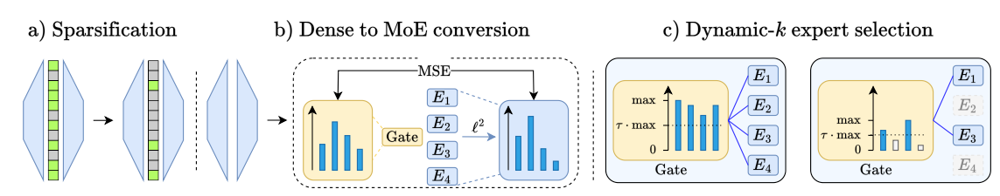
  

  - Authors: Filip Szatkowski, Bartosz Wójcik, Mikołaj Piórczyński, Simone Scardapane
  - Link: https://arxiv.org/pdf/2310.04361
  - Code: https://github.com/bartwojcik/D2DMoE
  - Pub: NeurIPS 2024
  - Summary: This paper proposes **D2DMoE (Dense to Dynamic-k Mixture-of-Experts)**, a novel method for improving the efficiency of Transformer models by leveraging their inherent **activation sparsity**. The core idea is to convert dense Transformer layers (specifically Feed-Forward Networks (FFNs) and Multi-Head Attention (MHA) projections) into **Mixture-of-Experts (MoE)** layers. The authors make several key contributions: 1) They demonstrate that **regularizing the activation sparsity** of the base model before conversion significantly enhances the efficiency of the resulting MoE model. 2) They introduce a **dynamic-k expert selection rule**, which adaptively adjusts the number of activated experts per token, addressing the high variance in activated neuron counts across different inputs. This improves efficiency by allocating compute resources more effectively. 3) They extend the conversion method to **MHA projections**, a significant source of computation in Transformers, using a two-layer MLP approximation. 4) They provide an efficient GPU implementation. Experiments across NLP and vision tasks show that D2DMoE achieves up to a 60% reduction in inference cost without substantial performance degradation, outperforming existing MoEfication techniques. The method involves fine-tuning the base model for increased sparsity, reformulating router training as a regression problem to predict expert output norms, and utilizing the dynamic-k selection strategy for optimized resource allocation.

  - 摘要：本文提出了一种名为**D2DMoE（Dense to Dynamic-k Mixture-of-Experts）**的新方法，通过利用 Transformer 模型固有的**激活稀疏性**来提高其效率。其核心思想是将密集的 Transformer 层（特别是前馈网络（FFNs）和多头注意力（MHA）投影）转换为**混合专家（MoE）**层。作者做出了几个关键贡献：1）他们证明了在转换之前**正则化基本模型的激活稀疏性**会显著提高生成的 MoE 模型的效率。2）他们引入了一种**动态 k 专家选择规则**，该规则自适应地调整每个标记的激活专家数量，解决了不同输入中激活神经元数量的高方差。这通过更有效地分配计算资源来提高效率。3）他们使用两层 MLP 近似法将转换方法扩展到**MHA 投影**（Transformer 中重要的计算来源）。4）他们提供了一个高效的 GPU 实现。在 NLP 和视觉任务上的实验表明，D2DMoE 在不显著影响性能的情况下，实现了高达 60%的推理成本降低，优于现有的 MoE 化技术。该方法包括对基本模型进行微调以提高稀疏性，将路由器训练重新表述为回归问题以预测专家输出范数，以及利用动态 k 选择策略进行优化的资源分配。

- MoE Jetpack: From Dense Checkpoints to Adaptive Mixture of Experts for Vision Tasks

  

    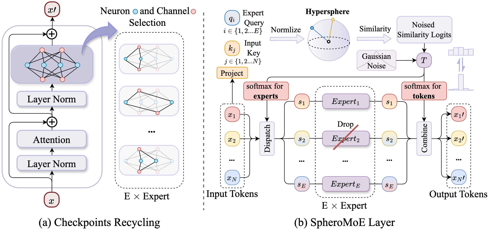
  

  - Authors: Xingkui Zhu, Yiran Guan, Dingkang Liang, Yuchao Chen, Yuliang Liu, Xiang Bai
  - Link: https://arxiv.org/pdf/2406.04801
  - Code: https://github.com/Adlith/MoE-Jetpack
  - Summary: This paper introduces **MoE Jetpack**, a novel method for efficiently fine-tuning pre-trained **dense** checkpoints into **Mixture of Experts (MoE)** models for vision tasks. Training MoE models from scratch is computationally expensive and data-intensive, while readily available pre-trained models are predominantly dense models. MoE Jetpack addresses this by employing two key techniques: (1) **Checkpoint Recycling**: This technique repurposes weights from pre-trained dense models to initialize the MoE model, significantly accelerating convergence and improving accuracy compared to training from random initialization. It goes beyond simply copying weights, offering flexibility in weight selection from multiple dense checkpoints. (2) **Hyperspherical Adaptive MoE (SpheroMoE) Layer**: This novel layer optimizes the MoE architecture for better integration with the recycled dense checkpoints, further enhancing fine-tuning performance. It addresses challenges encountered when directly adapting existing MoE architectures (like Switch Transformers and Soft MoE) to pre-trained weights. The SpheroMoE layer incorporates normalized token mixing and expert regularization for improved stability and performance. Experiments demonstrate that MoE Jetpack achieves superior convergence speed and accuracy compared to training MoE models from scratch or using other methods, showcasing the effectiveness of leveraging pre-trained dense models for efficient MoE training. The method maintains comparable **FLOPs** (floating point operations per second) to dense models while achieving improved performance.

  - 摘要：本文介绍了一种新颖的方法**MoE Jetpack**，用于高效地将预训练的**密集型**检查点微调到用于视觉任务的**混合专家 (MoE)** 模型中。从头开始训练 MoE 模型在计算上代价高昂且需要大量数据，而现成的预训练模型主要是密集型模型。MoE Jetpack 通过采用两种关键技术来解决这个问题：(1) **检查点循环利用**: 此技术将预训练的密集型模型的权重用于初始化 MoE 模型，与从随机初始化训练相比，它大大加快了收敛速度并提高了准确性。它不仅仅是简单地复制权重，还在多个密集型检查点中提供了权重选择的灵活性。(2) **超球面自适应 MoE (SpheroMoE) 层**: 这个新颖的层优化了 MoE 架构，以便更好地与循环利用的密集型检查点集成，进一步增强了微调性能。在将现有的 MoE 架构（如 Switch Transformers 和 Soft MoE）直接应用于预训练权重时，它解决了遇到的挑战。SpheroMoE 层结合了归一化的标记混合和专家正则化，以提高稳定性和性能。实验表明，与从头开始训练 MoE 模型或使用其他方法相比，MoE Jetpack 实现了优越的收敛速度和准确性，展示了利用预训练密集型模型进行高效 MoE 训练的有效性。该方法保持了与密集型模型相当的**FLOPs**（每秒浮点运算次数），同时实现了改进的性能。

- FactorLLM: Factorizing Knowledge via Mixture of Experts for Large Language Models

  

    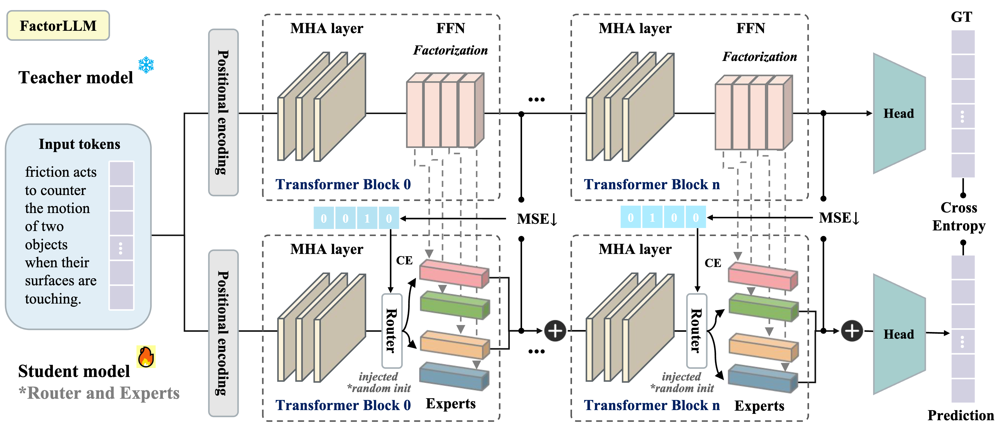
  

- Authors: Zhongyu Zhao, Menghang Dong, Rongyu Zhang, Wenzhao Zheng, Yunpeng Zhang, Huanrui Yang, Dalong Du, Kurt Keutzer, Shanghang Zhang
- Link: https://arxiv.org/pdf/2408.11855
- Code: https://github.com/zhenwuweihe/FactorLLM
- Summary: This paper introduces **FactorLLM**, a novel method for improving the efficiency and performance of **Large Language Models (LLMs)**. It addresses the issue of **knowledge confusion** and redundancy in the **Feed-Forward Networks (FFNs)** within LLMs, which are responsible for storing and processing vast amounts of information. FactorLLM decomposes the dense FFNs into sparse sub-networks (**experts**) without retraining the entire model. This factorization is achieved by leveraging a **Mixture-of-Experts (MoE)** architecture, incorporating a **router** to dynamically select which experts to activate for a given task. A novel **Prior-Approximate (PA)** loss function is introduced to guide the training process and facilitate efficient knowledge adaptation with minimal training data and fine-tuning. The approach is inspired by the human brain's ability to segment tasks functionally. Experimental results show that FactorLLM achieves comparable performance to the original model (up to 85% performance retention) while significantly increasing inference speed (over 30%). The method offers a balance between efficiency, training costs, and model performance, making it suitable for resource-constrained settings. The core innovation lies in the factorization of FFNs and the use of the router and PA loss to enable efficient knowledge utilization and dynamic expert activation.
- 摘要：本文介绍了一种名为**FactorLLM**的新方法，用于提高**大型语言模型（LLMs）**的效率和性能。它解决了 LLMs 中**前馈网络（FFNs）**存在的**知识混淆**和冗余问题，而 FFNs 负责存储和处理大量信息。FactorLLM 将密集的 FFNs 分解成稀疏的子网络（**专家**），无需重新训练整个模型。这是通过利用**混合专家（MoE）**架构实现的，该架构包含一个**路由器**，用于动态选择为给定任务激活哪些专家。引入了一种新颖的**先验近似（PA）**损失函数来指导训练过程，并利用最少的训练数据和微调步骤来促进有效的知识适应。该方法的灵感来自于人脑将任务功能性分割的能力。实验结果表明，FactorLLM 达到了与原始模型相当的性能（高达 85%的性能保持率），同时显著提高了推理速度（超过 30%）。该方法在效率、训练成本和模型性能之间取得了平衡，使其适用于资源受限的环境。核心创新在于 FFNs 的分解以及路由器和 PA 损失的使用，从而实现了高效的知识利用和动态专家激活。

### Merging

- Model-GLUE: Democratized LLM Scaling for A Large Model Zoo in the Wild

  

    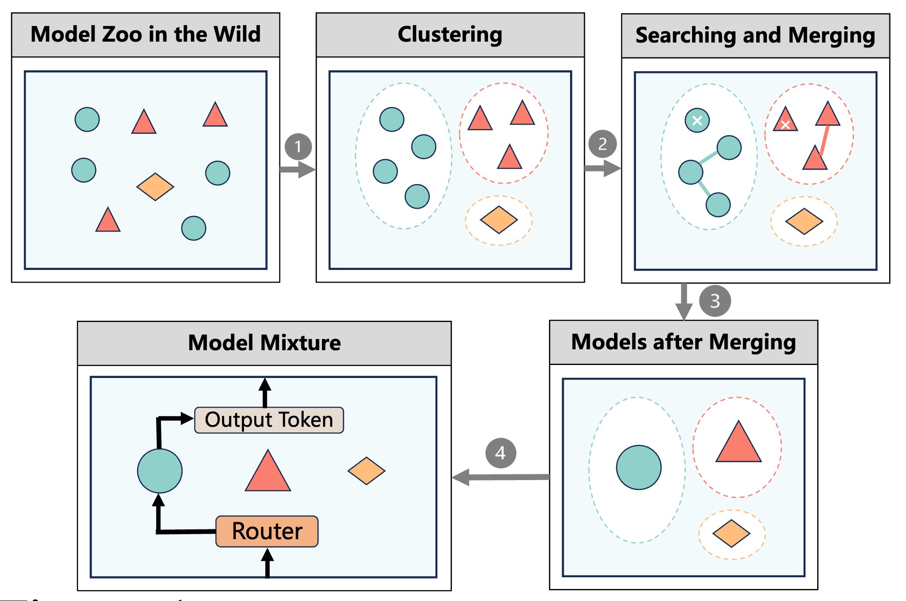
  

  - Authors: Xinyu Zhao, Guoheng Sun, Ruisi Cai, Yukun Zhou, Pingzhi Li, Peihao Wang, Bowen Tan, Yexiao He, Li Chen, Yi Liang, Beidi Chen, Binhang Yuan, Hongyi Wang, Ang Li, Zhangyang Wang, Tianlong Chen
  - Link: https://arxiv.org/pdf/2410.05357
  - Code: https://github.com/Model-GLUE/Model-GLUE
  - Summary: This paper introduces **Model-GLUE**, a holistic guideline for scaling **Large Language Models (LLMs)** by efficiently aggregating existing models. Addressing the challenge of decreased performance when combining disparate models, Model-GLUE benchmarks existing LLM scaling techniques, focusing on **model merging** and **Mixture-of-Experts (MoE)**. The authors find that simply averaging weights (a common merging technique) isn't optimal for diverse model zoos. Their proposed method involves: 1) **Clustering** similar models based on architecture and weight similarity; 2) **Filtering** and selecting models for merging within each cluster, using a strategic approach to avoid including "harmful" models; 3) Employing **optimal merging strategies** within each cluster; and 4) Integrating the merged clusters via a **model mixture** (akin to MoE). Experiments on a diverse Llama-2-based model zoo demonstrate an average performance improvement of 5.61% without additional training, showcasing the effectiveness of Model-GLUE's approach to democratize LLM scaling. The paper also discusses the limitations of existing merging techniques and the potential synergies between merging and mixing methods.
  - 摘要：本文介绍了**Model-GLUE**，这是一种通过有效聚合现有模型来扩展**大型语言模型 (LLM)** 的整体指南。为了解决组合不同模型时性能下降的挑战，Model-GLUE 对现有的 LLM 扩展技术进行了基准测试，重点是**模型合并**和**混合专家 (MoE)**。作者发现，简单地平均权重（一种常见的合并技术）对于不同的模型库来说并非最佳选择。他们提出的方法包括：1）根据架构和权重相似性对类似模型进行**聚类**；2）在每个集群内对模型进行**过滤**和选择以进行合并，使用一种策略性方法来避免包含“有害”模型；3）在每个集群内采用**最佳合并策略**；以及 4）通过**模型混合**（类似于 MoE）来集成合并的集群。在基于 Llama-2 的多样化模型库上的实验表明，在没有额外训练的情况下，平均性能提高了 5.61%，这展示了 Model-GLUE 方法在使 LLM 扩展民主化方面的有效性。本文还讨论了现有合并技术的局限性以及合并和混合方法之间可能的协同作用。

## MoE Survey

- [A Survey on Mixture of Experts](https://arxiv.org/pdf/2407.06204)

## MoE Resources

- [Mixture of Experts (MoE) Explained(Blog)](https://huggingface.co/blog/moe): A blog post from Hugging Face explaining MoE.
- [Awesome list of MoE(Repo)](https://github.com/withinmiaov/A-Survey-on-Mixture-of-Experts): A survey on Mixture of Experts.
- [ICML 2024 Tutorial on MoE(PPT)](https://icml.cc/media/icml-2024/Slides/35222_1r94S59.pdf): A tutorial on Mixture of Experts from ICML 2024.

  

- [What is Mixture of Experts (MoE)? (Video)](https://www.youtube.com/watch?v=sYDlVVyJYn4): Video by IBM.
- [Introduction to Mixture-of-Experts (MoE)](https://www.youtube.com/watch?v=kb6eH0zCnl8): Video by AI Papers Academy.
- [Mixtral of Experts (Paper Explained)](https://www.youtube.com/watch?v=mwO6v4BlgZQ): Video by Yannic Kilcher.
- [Stanford CS25: V1 I Mixture of Experts (MoE) paradigm and the Switch Transformer](https://www.youtube.com/watch?v=U8J32Z3qV8s): Video by Stanford CS25.
- [A Visual Guide to Mixture of Experts (MoE) in LLMs(Video)](https://www.youtube.com/watch?v=sOPDGQjFcuM): Video by Maarten Grootendorst.

## FAQ

> Q: What is a Mixture of Experts (MoE) model?

A: A MoE model is a machine learning architecture that combines multiple "expert" neural networks, each specializing in different aspects of a task, with a gating network that routes inputs to the most appropriate experts.

> Q: What are the main advantages of MoE models?

A: Key advantages include:

- **Pretrained faster than dense model**
- Have **faster inference** compared to a model with the same number of parameters
- Increased model **capacity** without proportional compute costs
- Better task **specialization** through expert specialization
- **Faster training** and **better inference** under high-load scenarios

> Q: What are the challenges in implementing MoE models?

A: Common challenges include:

- Require high VRAM as all experts are loaded in memory
- Complex routing mechanisms and load balancing
- Training instability
- Communication overhead in distributed settings

> Q: How do MoE models compare to dense transformers?

A: MoE models can achieve better performance with similar or lower computational costs, but require more memory and have more complex training dynamics.

> Q: Why MoE can be pretrained faster than dense model?

A: From my experience in NAS, MoE can be treated as a way to decouple the weights. The more weights shared, the faster the model can be pretrained. Additionally, decoupling the weights can increase the model capacity.

Okay, here are the one-paragraph answers:

> **Q: How to choose the number of experts?**

A: The number of experts in a Mixture of Experts (MoE) model should be chosen by balancing several factors. Consider the complexity of the task, with more complex tasks potentially benefiting from a larger number of experts, but also the amount and diversity of the training data, where limited data might lead to overfitting with too many experts. Furthermore, consider the available computational resources, as a larger number of experts leads to higher training costs. Finally, empirical evaluation, through techniques like grid search, is crucial to determine the optimal number of experts for a given scenario.

> **Q: Why MoE is suitable for high-load scenarios? How does it work when inference?**

A: MoE models are well-suited for high-load scenarios due to their conditional computation and parallelizability. During inference, a router network determines which experts are most relevant to an input, activating only a subset of them. This sparse activation reduces the computational cost compared to dense models, and the activated experts can process their inputs in parallel, leading to faster inference times and increased throughput, making MoE models effective under heavy loads.

## Contributing

We welcome contributions to this repository! If you have any resources, papers, or insights related to Mixture-of-Experts (MoE) models and their efficient variants, please consider contributing to this repository.

To contribute, please follow these steps:

1. Fork the repository.
2. Create a new branch for your changes.
3. Make your changes and ensure they are well-documented.
4. Submit a pull request with your changes.
